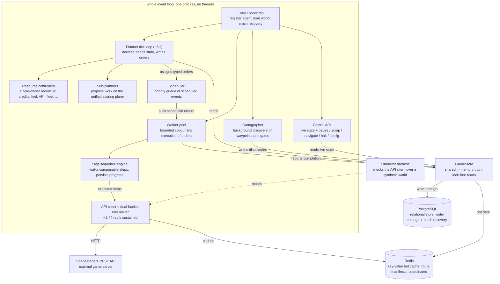
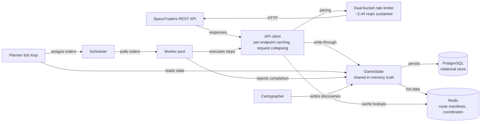
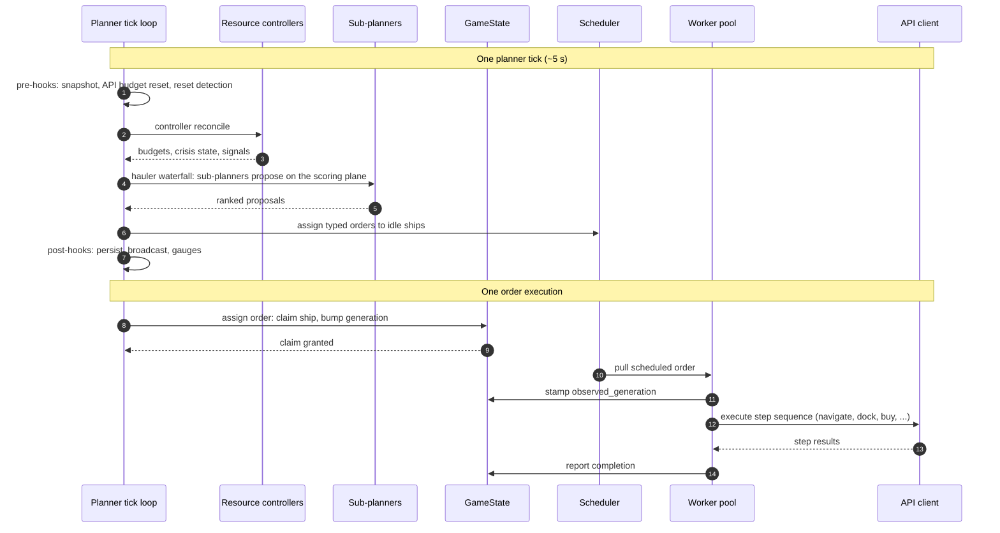
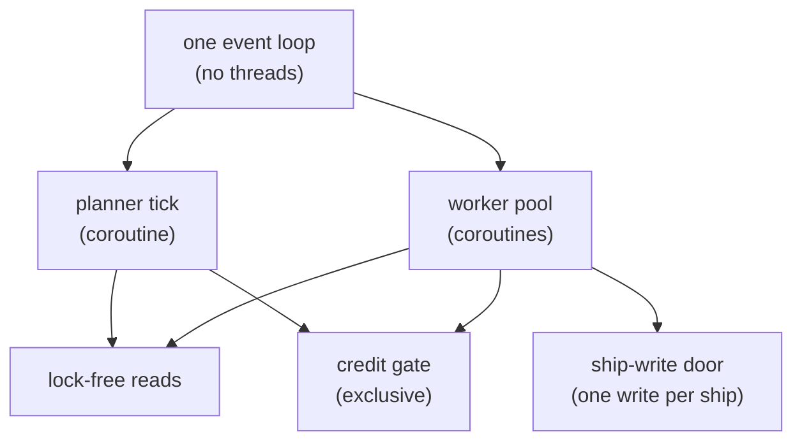

# SpaceTraders Client — Technical Specification

A language-agnostic technical specification for a high-concurrency, autonomous
SpaceTraders.io fleet client. This document is reverse-engineered from the
existing system documentation and implementation; it describes domain logic,
state models, protocol interactions, and concurrency requirements without
binding them to any particular implementation language.

**Status:** Step 1 of 5 — document scaffold + System Architecture & Data Flow.
Sections 2–4 are stubs to be completed by subsequent steps.

## Purpose & Scope

**Purpose.** Specify, completely and unambiguously, the behavior of an
autonomous agent that operates a fleet of ships in the SpaceTraders.io game:
it grows its fleet, trades goods between markets, mines and siphons resources,
charts unexplored systems, and completes its home jump gate — hands-off,
across the roughly-weekly server resets.

**Scope.**

- In scope: system architecture and data flow; entity and state definitions;
  process and workflow specifications for every automation routine; external
  dependencies and I/O protocols (REST endpoints, rate limiting, retry and
  backoff, persistence, control API).
- Out of scope: dashboard presentation details; deployment topology beyond
  what the architecture requires; game-server internals beyond the observable
  API contract.

**Constraints.**

- The specification is language-agnostic: it names concepts (event loop,
  typed records, asynchronous HTTP client, relational store, key-value cache),
  not implementation idioms.
- All diagrams use Mermaid.
- Every automation routine is specified with inputs, outputs, state-machine
  steps, and error conditions.
- Atomic vs. eventually-consistent state updates are stated explicitly.

## Glossary

| Term | Definition |
|------|------------|
| **Agent** | The player identity in the game; owns credits, ships, and contracts. The system operates exactly one agent. |
| **Ship** | A game entity with a frame (hull class), navigation state, cargo, fuel, mounts, and modules. |
| **System** | A star system: a set of waypoints connected by local navigation, optionally linked to other systems by jump gates. |
| **Waypoint** | An addressable location within a system (star, planet, asteroid, gas giant, jump gate, shipyard, market, construction site). |
| **Market** | A waypoint that lists goods for purchase/sale with prices, supply, and trade volume. |
| **Jump gate** | A waypoint that, when complete, links two systems; travel between systems requires a jump. |
| **Planner** | The decision component: on a fixed tick (~5 s) it evaluates global state and assigns typed orders to idle ships. |
| **Worker pool** | The execution component: a bounded set of concurrent workers that pull scheduled orders and execute them step by step against the API. |
| **GameState** | The single in-memory shared state container — the system's source of truth — with write-through persistence to the relational store. |
| **Order** | A typed work item (e.g., a composable step sequence) assigned by the planner to a ship and executed by the worker pool. |
| **Step sequence** | An ordered list of atomic steps (navigate, dock, buy, sell, refuel, jump, ...) with per-step progress tracking and crash-recovery persistence. |
| **Resource controller** | A single-owner component for one scarce resource (credits, jump fuel, API budget, ...); spenders ask it by purpose, and a reconcile loop converges actual state to declared desired state each tick. |
| **Claim** | An ownership assertion over an object (ship or system) by exactly one controller; claims are re-checked immediately before the write they guard. |
| **Condition** | A typed, persisted label on a ship, system, or waypoint: `{type, status, reason, message, last_transition_ts, observed_generation, details}`. `status` is a tri-state (true/false/unknown); `message` is prose for a human, `details` is structured and queryable. |
| **Phase** | A ship's coarse execution state: HOLDING (parked/scanning — preemptible) vs. RUNNING (executing a real plan). |
| **Generation / observed generation** | `generation` bumps when a ship's intent (order) changes; `observed_generation` is stamped by the worker when it begins executing. `observed < generation` means the assignment never arrived. |
| **API budget** | The rate-limited allowance of game API calls (~2.44 req/s sustained); the binding resource at fleet scale. |
| **Pull model** | Demand-driven market data: probes park 1:1 at markets and refresh only when a hauler in that system wants a route. |
| **Crisis mode** | A solvency state (hysteretic thresholds) in which discretionary spend is zeroed and only income-generating work proceeds. |
| **Reset** | The roughly-weekly game-server reset that invalidates the agent token and clears per-reset state. |

## 1. System Architecture & Data Flow

### 1.1 Architectural Overview

The system is a **single-process, fully asynchronous** application. All
components — planner, worker pool, scheduler, background discovery, API
client, and control API — run as concurrent tasks on **one event loop**.
There are no threads; all I/O (HTTP, relational store, key-value cache) is
asynchronous, and the single-writer property of the event loop is what makes
the shared state container safe to read without locks.

The core division of labor is **planner decides, worker acts**:

- The **planner** runs a tick loop (~5 s). Each tick it evaluates global
  state — credits, markets, ship positions, last results — and assigns typed
  orders to idle ships. It never executes work itself; it only reads state
  and writes orders.
- The **worker pool** is a bounded set of concurrent workers. It pulls
  scheduled orders and executes them step by step against the game API,
  reporting completion back into shared state. Workers are stateless with
  respect to policy: all decisions live in the planner.
- The **scheduler** is a priority queue of scheduled events, persisted to the
  relational store so that in-flight work survives a crash.

**Shared truth.** `GameState` is the single in-memory source of truth: ships,
markets, waypoints, systems, contracts, the gate graph, and the ownership
substrate. Reads are lock-free (safe because the event loop is single-writer);
the only lock-protected mutations are credit reservations. Every durable
change is **write-through** to the relational store (PostgreSQL), which is
also the crash-recovery substrate; a **key-value hot cache** (Redis) holds
high-churn, low-durability data — trade-route manifests and coordinate
lookups.

**The binding resource is the API budget, not credits.** The game server
allows ~2 req/s sustained plus a paced 30-req/60s burst pool; the client's
dual-bucket priority rate limiter paces itself to **~2.44 req/s sustained**.
Every component is sized against this budget: market data is pulled on demand
(pull model), probes park idle, and both the rate limiter and the worker pool
admit work by measured marginal value per API call rather than arrival order.

### 1.2 Resource-Controller Pattern

Beyond per-tick order assignment, the system is organized around a set of
**resource controllers** built to one pattern — *tight control loops, promise
theory, intent*:

1. **Single owner.** Every scarce resource has exactly one owner. Spenders
   never re-derive their own limits; they **ask the owner, by purpose**
   ("can I spend, on what?").
2. **Declared desired state.** Desired state is declared, not computed ad hoc
   at each spend site.
3. **Reconcile loop.** A reconcile loop runs every tick and converges actual
   state toward declared desired state. It is idempotent and safe to run
   repeatedly.

The controllers and the resources they own:

| Controller | Resource owned | Asked by |
|------------|----------------|----------|
| Capital | credits (by purpose: trade / gate investment / expansion / recon) | every spend site; owns the crisis judgment and its enforcement |
| Antimatter | jump fuel (one shared earn-derived ceiling) | every cross-system jump |
| API | the ~2.44 req/s API budget (by call purpose) | every API call (classified by purpose); observe-only — it publishes the gauges but the explore↔exploit allocation is a deferred future capability, not decided here |
| Fleet | ship roles and composition | role lifecycle, charter scaling |
| Exploit | hauler deployment | per-system trader targets |
| Placement | "ship S belongs in system X" (durable intent) | new-buy ferries, rebalance, relocate, spread |
| Travel | cross-system ship movement | placement convergence, role reversion |
| Probe census | how many probes belong in each system | probe placement, procurement, eviction |
| ProbeFleet | probe procurement | coverage, expansion, frontier-spread requests |
| Frontier yield | "is the frontier still worth taking?" | chart-pump exit, frontier-spread on/off |
| Reachability | "the reachable gate graph is fully discovered" | background discovery |
| MarketIntel | market-scan cadence | route-scoring freshness |
| Viability | the viability judgment's memory | system classification |
| Gate | the Phase-0 objective ("home gate complete") | construction and supply-chain escalation |
| Intent | per-ship activity ("what is X doing") | cross-tick exclusion for drain jobs |
| Ramp | the Phase-0 bootstrap doctrine (probe batch → freighters to the live depth-scaled target → support cells; purchase seniority) | the Capital controller and the home trader target |

The **explore arm** (frontier coverage) and the **exploit arm** (income
haulers) run in parallel, each with its own capital and jump-fuel budget so
neither starves the other.

### 1.3 Ownership Substrate

Controllers do not just own resources; they own **objects**. The state layer
enforces single ownership, borrowing the shape of Kubernetes-style
declarative control:

- **Ship claims.** Assigning an order to a ship claims it for one controller.
  A second controller is refused unless the ship is idle or in the HOLDING
  phase (parked/scanning is preemptible capacity — otherwise one owner could
  hold the whole fleet). The claim is re-checked immediately before the
  write, because the intervening cancellation is an asynchronous call.
  Callers that reserve credits or record a pending purchase alongside the
  assignment must check the result and unwind on refusal.
- **System claims.** A system is owned by one controller until it releases
  it; the claim carries its bound ships as *holders* (the reverse index of
  the ship's target system), so neither side is reconstructed by scanning the
  fleet. Only the owner may release.
- **Three condition planes.** Ships, systems, and waypoints each carry a
  `{type → Condition}` map (`type`, `status`, `reason`, `message`,
  `last_transition_ts`, `observed_generation`, `details`), written through one
  door per plane and persisted. `status` is a tri-state (true/false/unknown);
  `message` is prose for a human, `details` is structured and queryable.
  Derived state is written down at the level it describes, by the controller
  that owns it, instead of being re-derived by every asker.
- **Version / generation / observed generation.** `version` bumps on every
  ship write and backs optimistic concurrency on updates. `generation` bumps
  only when intent changes (a new order); the worker stamps
  `observed_generation` when it begins executing. `observed < generation`
  means the assignment never arrived — the stale-order signal, without
  timeouts. `phase` (HOLDING vs. RUNNING) is a real field, replacing label
  parsing to answer "is this ship parked or working?".

### 1.4 Component Inventory

| Component | Responsibility |
|-----------|----------------|
| Entry point | Registers the agent, bootstraps world data, launches all concurrent tasks on one event loop, performs crash recovery |
| Planner (tick loop) | Evaluates global state each tick; runs pre-hooks, controller reconciles, the hauler assignment pipeline, and post-hooks |
| Resource controllers | Single-owner policy for credits, jump fuel, API budget, fleet composition, placement, probes, frontier, gate, intent |
| Sub-planners | Propose work on the unified scoring plane: trades, expansion, construction, contracts, probes, mining/siphoning, supply chain, exploit |
| Worker pool | Bounded concurrent execution of orders; admission by work class (measured marginal value), not arrival order |
| Step-sequence engine | Walks composable steps, persisting progress after each for crash recovery; injects fuel-hop sub-steps |
| Scheduler | Priority queue of scheduled events, persisted for crash recovery |
| API client | Asynchronous HTTP client with dual-bucket priority rate limiting, per-endpoint caching, and request collapsing |
| GameState | Shared truth: ships, markets, waypoints, systems, contracts, gate graph, ownership substrate; write-through persistence |
| Relational store | Durable state: ships, events, markets, decisions, API log, config overrides, competitor sightings |
| Key-value cache | Hot data: trade-route manifests (atomic claiming), coordinate cache, tuned cache TTLs |
| Cartographer | Background discovery of waypoints, shipyards, gate connections, and construction status, scoped to the discovered gate graph |
| Control API | Live in-memory state (limiter counters, planner state, scheduler queue) and control (pause/scrap/navigate/halt/config) |
| Simulator | Runs the production planner + worker against a mocked API client over a synthetic or historical world for A/B testing |

### 1.5 System Architecture Diagram

**Figure 1.1 — System architecture.** Every component runs as a concurrent task on a single event loop (no threads). The planner decides and writes orders; the worker pool acts. GameState is the shared in-memory truth with write-through to PostgreSQL and a Redis hot cache; the API client paces all game traffic through the dual-bucket rate limiter. The simulator harness substitutes a mocked API client for the same planner and worker.

### 1.6 Data Flow Diagram

**Figure 1.2 — Data flow.** Game API responses flow through the API client into GameState (write-through) and are persisted to PostgreSQL; high-churn data (route manifests, coordinates) is kept in the Redis hot cache. The planner reads GameState, assigns orders to the scheduler, and the worker pool pulls them and executes steps back through the API client, which the rate limiter paces to the game API. Workers report completion and the cartographer writes discoveries back into GameState.

### 1.7 Planner Tick Loop (Sequence)

**Figure 1.3 — Planner tick and order execution.** One tick runs pre-hooks, then each resource controller's reconcile loop, then the hauler waterfall (sub-planners propose on the unified scoring plane and orders are assigned to idle ships), then post-hooks. Separately, an order is executed when the planner claims a ship (bumping its generation), the worker pool pulls the scheduled order, stamps `observed_generation` on start, walks the step sequence against the API client, and reports completion back into GameState.

## 2. Entity & State Definitions

_To be completed in Step 2._

### 2.1 API-Facing Entities

The API-facing entities are the typed records the client reads from and writes
to the game API. Each is a flat, serializable record with a stable field set:
the client hydrates them from API responses and projects them back into shared
state. Where an entity is mutable across frames, the schema separates the
**static profile** (fields that do not change for the life of the object) from
the **volatile state** (fields that change every frame).

Types are language-agnostic: `string`, `integer`, `boolean`, `timestamp` (an
ISO-8601 instant), `enum` (a closed set of named values), `list<T>`, and
`map<K, V>`. A trailing `| null` marks a nullable field.

#### Ship

A ship is the unit of work the planner assigns orders to and the worker pool
executes. Its schema is split into a **static profile** (immutable for the life
of the hull) and a **volatile state** (refreshed every frame from the API and
by the worker).

**Static profile (immutable per frame):**

| Attribute | Type | Meaning | Constraints |
|-----------|------|---------|-------------|
| frame_symbol | string | Hull class (frame) the ship was built from | Stable for the ship's life |
| engine | string | Engine symbol | May be empty if not reported |
| reactor | string | Reactor symbol | May be empty if not reported |
| modules | list\<Module\> | Fitted modules | See Module |
| mounts | list\<Mount\> | Fitted weapon mounts | See Mount |

**Volatile state (changes every frame):**

| Attribute | Type | Meaning | Constraints |
|-----------|------|---------|-------------|
| symbol | string | Unique ship identifier | Primary key |
| nav | Navigation | Current navigation state | See Navigation |
| cargo | Cargo | Cargo hold | See Cargo |
| fuel | Fuel | Fuel tank | See Fuel |
| cooldown | Cooldown \| null | Active cooldown, if any | Null when none |
| status | enum | Coarse execution state | `idle` / `idle_wait` / `executing` / `transit` |
| current_event | string \| null | label of the order being executed | Null when idle |
| owner | string \| null | Controller that owns the current order | Null = unowned, freely claimable |
| phase | enum | Plan phase | `HOLDING` / `RUNNING` |
| version | integer | Monotonic write counter | Bumped on every applied write; backs optimistic concurrency |
| generation | integer | Intent generation | Bumped only when a new order is assigned |
| observed_generation | integer | Generation the worker has begun executing | `observed < generation` ⇒ the assignment never arrived |
| conditions | map\<string, Condition\> | Controller assessments, keyed by type | Written only by the owning controller |

**Status transitions.** `idle` → `executing` when an order is assigned;
`executing` → `idle` when the order completes; `executing` → `idle_wait` when
the ship arrives and parks (a HOLDING position); `idle_wait` → `executing` when
the parked ship is repurposed. `idle` and `idle_wait` are distinct states: a
parked ship is `idle_wait` (HOLDING), not `idle`. `transit` is a fourth,
in-flight status: it is set when a ship is detected in flight at registration
and while a navigate step is running mid-order, and it resolves to `idle`,
`executing`, or `idle_wait` on arrival. The full transition set is given in
§2.4. `phase` is derived from the current order — HOLDING for park/scan/idle
orders, RUNNING for everything else.

#### Navigation

The ship's current position and in-flight route.

| Attribute | Type | Meaning | Constraints |
|-----------|------|---------|-------------|
| status | enum | Docking / flight state | `DOCKED` / `IN_ORBIT` / `IN_TRANSIT` |
| waypoint_symbol | string | Waypoint the ship is at (or last left) | — |
| system_symbol | string | System the ship is in | — |
| flight_mode | enum | How the ship is flying | `CRUISE` / `DRIFT` / `BURN` / `STEALTH` |
| arrival | timestamp \| null | Predicted arrival at the destination | Null when not in transit |
| departure_time | timestamp \| null | Scheduled departure time | Null when not scheduled |
| destination | string \| null | Waypoint symbol of the route destination | Null when no route |
| origin | string \| null | Waypoint symbol of the route origin | Null when no route |

**Status transitions.** `DOCKED` → `IN_ORBIT` on undock; `IN_ORBIT` →
`IN_TRANSIT` when a route is set; `IN_TRANSIT` → `IN_ORBIT` on arrival;
`IN_TRANSIT` → `DOCKED` on dock. `flight_mode` is orthogonal: `BURN` while
accelerating, `CRUISE` while coasting, `DRIFT` when coasting with no burn
budget, `STEALTH` when cloaked.

#### Cargo

The ship's cargo hold. The hold carries a total unit count and a per-item
inventory; each **cargo item** is a record of one good and how many units of it
are aboard.

| Attribute | Type | Meaning | Constraints |
|-----------|------|---------|-------------|
| capacity | integer | Maximum units the hold can carry | ≥ 0 |
| units | integer | Total units currently loaded | 0 ≤ units ≤ capacity |
| inventory | list\<cargo item\> | Per-good breakdown | Sum of item units = units |

**Cargo item (per-item record):**

| Attribute | Type | Meaning | Constraints |
|-----------|------|---------|-------------|
| symbol | string | Good symbol | — |
| name | string | Display name | Defaults to symbol |
| description | string | Free-text description | May be empty |
| units | integer | Units of this good aboard | ≥ 0 |

#### Fuel

The ship's fuel tank.

| Attribute | Type | Meaning | Constraints |
|-----------|------|---------|-------------|
| current | integer | Fuel units remaining | 0 ≤ current ≤ capacity |
| capacity | integer | Maximum fuel the tank holds | ≥ 0 |

#### Cooldown

A ship's active cooldown (e.g., after a jump or a docked action).

| Attribute | Type | Meaning | Constraints |
|-----------|------|---------|-------------|
| total_seconds | integer | Full cooldown duration | ≥ 0 |
| remaining_seconds | integer | Seconds left on the cooldown | 0 ≤ remaining ≤ total |
| expiration | timestamp \| null | Instant the cooldown lifts | Null when not set |

#### Mount

A weapon mount fitted to a ship.

| Attribute | Type | Meaning | Constraints |
|-----------|------|---------|-------------|
| symbol | string | Mount symbol | — |
| name | string | Display name | May be empty |
| strength | integer \| null | Weapon strength | Null when not reported |

#### Module

A module fitted to a ship (cargo hold, fuel tank, engine, reactor, ...).

| Attribute | Type | Meaning | Constraints |
|-----------|------|---------|-------------|
| symbol | string | Module symbol | — |
| name | string | Display name | May be empty |
| capacity | integer \| null | Capacity the module provides | Null when not applicable |
| range | integer \| null | Range the module provides | Null when not applicable |

#### Waypoint

An addressable location within a system (star, planet, asteroid, gas giant,
jump gate, shipyard, market, construction site).

| Attribute | Type | Meaning | Constraints |
|-----------|------|---------|-------------|
| symbol | string | Unique waypoint identifier | Primary key |
| type | string | Waypoint kind | star / planet / asteroid / gas giant / jump gate / shipyard / market / construction site |
| system_symbol | string | System the waypoint belongs to | — |
| x | integer | X coordinate within the system | — |
| y | integer | Y coordinate within the system | — |
| traits | map\<string, WaypointTrait\> | Traits, keyed by trait symbol | Keyed for O(1) `has_trait` lookups |
| under_construction | boolean | Whether the waypoint is under construction | — |
| charted | boolean | Whether the waypoint has been charted | Authoritative; independent of the UNCHARTED trait |
| conditions | map\<string, Condition\> | Controller assessments, keyed by namespaced type | The waypoint condition plane |

#### WaypointTrait

A trait attached to a waypoint. The API's trait list can carry **duplicates**
of a symbol (e.g. INDUSTRIAL observed more than once on one waypoint), so the
record carries a multiplicity count rather than collapsing to a boolean.

| Attribute | Type | Meaning | Constraints |
|-----------|------|---------|-------------|
| symbol | string | Trait symbol | — |
| name | string | Display name | May be empty |
| description | string | Free-text description | May be empty |
| count | integer | API-list multiplicity of the trait | Typically 1; >1 for observed duplicates |

#### MarketGood

One good listed on a market, with its current price and supply.

| Attribute | Type | Meaning | Constraints |
|-----------|------|---------|-------------|
| symbol | string | Good symbol | — |
| trade_volume | integer | Recent trade volume | ≥ 0 |
| supply | string | Supply band | e.g. SCARCE / LOW / STABLE / HIGH / SURPLUS |
| purchase_price | integer | Price to buy one unit | ≥ 0 |
| sell_price | integer | Price to sell one unit | ≥ 0 |
| type | string | Good category | May be empty |
| activity | string | Market activity band | May be empty |

#### Contract

A trade contract offered by or held with a faction.

| Attribute | Type | Meaning | Constraints |
|-----------|------|---------|-------------|
| id | string | Unique contract identifier | Primary key |
| faction_symbol | string | Offering faction | — |
| type | string | Contract type | e.g. DELIVER |
| accepted | boolean | Whether the contract is accepted | — |
| fulfilled | boolean | Whether the contract is fulfilled | — |
| deadline | timestamp | Contract deadline | — |
| on_accepted | integer | Payment on acceptance | ≥ 0 |
| on_fulfilled | integer | Payment on fulfillment | ≥ 0 |
| deliver | list\<DeliverTerm\> | Delivery terms | See DeliverTerm |

**Transitions.** `accepted` flips false → true when the contract is accepted
(paying `on_accepted`); `fulfilled` flips false → true when all delivery terms
are met (paying `on_fulfilled`). A contract is actionable only while accepted
and not yet fulfilled and before its deadline.

#### DeliverTerm

One delivery obligation within a contract.

| Attribute | Type | Meaning | Constraints |
|-----------|------|---------|-------------|
| trade_symbol | string | Good to deliver | — |
| destination_symbol | string | Waypoint to deliver to | — |
| units_required | integer | Units required | ≥ 0 |
| units_fulfilled | integer | Units delivered so far | 0 ≤ units_fulfilled ≤ units_required |

#### AgentData

The agent's own identity and standing.

| Attribute | Type | Meaning | Constraints |
|-----------|------|---------|-------------|
| symbol | string | Agent symbol | Primary key |
| headquarters | string | Home system symbol | — |
| credits | integer | Credit balance | ≥ 0 |
| starting_faction | string | Starting faction symbol | May be empty |
| ship_count | integer | Number of ships owned | ≥ 0 |
| account_id | string | Account identifier | May be empty |

#### Condition

A controller's assessment of one aspect of an object (ship, system, or
waypoint), following the Kubernetes condition pattern. `status` is a
**tri-state**, not a boolean: `Unknown` is a real answer, and conflating it
with `False` is how a controller that has not looked yet gets mistaken for one
that looked and found a problem.

| Attribute | Type | Meaning | Constraints |
|-----------|------|---------|-------------|
| type | string | Condition type (namespaced by the owner's concern) | — |
| status | enum | Tri-state assessment | `True` / `False` / `Unknown` |
| reason | string | Machine-readable reason code | May be empty |
| message | string | Prose for a human | May be empty |
| last_transition_ts | timestamp | Last instant `status` flipped | Moves **only** when `status` changes |
| observed_generation | integer | Generation the assessment was made against | A condition observed against an older generation is stale by construction |
| details | map\<string, value\> | Structured, queryable facts | Keys namespaced by the owner's concern; a change forces a durable write |

**Status transitions.** Any of `True` / `False` / `Unknown` may transition to
any other; `last_transition_ts` advances only on a real flip, so "how long has
it been like this" is answerable and a controller can re-assert its view every
tick without a durable write unless the status actually changed. `reason` and
`message` may be refreshed freely without disturbing `last_transition_ts`; a
`details` change, by contrast, is a content change and does force a durable
write.

### 2.2 Shared-State Structures

`GameState` is the single in-memory source of truth. It is not one blob but a
set of named registries, each with a single owner and a single write path. This
section defines the structure of each registry: what it keys on, what it holds,
who owns it, and whether it is durable (write-through to the relational store)
or in-memory only. The registries fall into thematic families: the **ship
registries**, the **agent registry**, the **spatial and market data**, the
**per-system derived state**, the **gate graph and exploration**, and the
**ownership, reservation, and telemetry** structures.

#### Ship registries

A ship is stored as four parallel registries keyed by ship symbol, so that the
immutable profile, the per-frame state, the role, and the owning agent can each
be read and written independently.

| Registry | Key | Value | Owner | Durable |
|----------|-----|-------|-------|---------|
| ship volatile registry | ship symbol | the per-frame state (nav, cargo, fuel, cooldown, status, owner, phase, version, generation, observed_generation, conditions) | the worker pool, via the single ship-write door | yes |
| ship static registry | ship symbol | the immutable profile (frame, engine, reactor, modules, mounts) | registration | yes |
| ship role registry | ship symbol | the role (HAULER / SATELLITE / MINER / SHUTTLE / ...) | the fleet controller | yes |
| ship agent registry | ship symbol | the agent prefix the ship belongs to | registration | yes |

The volatile registry is the one that changes every frame; the static registry
is written once at registration and never again. The role and agent registries
are separate so that a role reassignment or an agent re-parent does not touch
the per-frame state.

#### Agent registry

| Registry | Key | Value | Owner | Durable |
|----------|-----|-------|-------|---------|
| agent registry | agent prefix | the agent's identity and standing (symbol, headquarters, credits, starting faction, ship count, account id) | registration / credit updates | yes |
| token registry | agent prefix | the API token for the agent | registration | no (secret) |
| contracts | agent prefix | the list of contracts held by the agent | registration / contract updates | yes |

The token registry is in-memory only: it is the credential the API client uses
to sign requests and is never persisted.

#### Spatial and market data

| Registry | Key | Value | Owner | Durable |
|----------|-----|-------|-------|---------|
| market price data | waypoint | the goods listed at that market (symbol, price, supply, trade volume) | the market-intel controller (probe scans) | yes |
| market price freshness | waypoint | the timestamp of the last price refresh | the market-intel controller | no |
| market topology | waypoint | the remote imports / exports / exchange lists | the cartographer | yes |
| market equilibrium | (waypoint, good) | the resting buy/sell price a stale quote recovers toward | the relational store (loaded at boot, TTL-refreshed) | yes |
| market backoff | (waypoint, good) | the expiry timestamp of a price/margin backoff | the worker pool (sets) / planner (reads) | no |
| market failure ladder | (waypoint, good) | (consecutive failure count, last failure ts) | the worker pool | no |
| supply chain | export good | the list of input goods that feed it | startup (from the API) | yes |
| waypoints | system | the list of waypoints in the system | the cartographer | yes |
| system coordinates | system | the (x, y) galaxy coordinates | the key-value cache | no |

The **market price data** and the **market topology** are deliberately separate
registries. The API serves the topology (imports/exports/exchange) for any
charted waypoint with no ship present — it is free and effectively static —
while prices cost a visit and rot in minutes. The topology answers a structural
question ("is a route *possible* here"); the price data answers an economic one
("is a route *profitable* right now").

#### Per-system derived state

Per-system classifications are derived, not stored as facts. Each is keyed by
system and carries a **derived-state generation** — an invalidation token that
bumps whenever the underlying observation changes, so a cached classification
is valid until the state it was derived from changes (not until a wall-clock
TTL expires).

| Registry | Key | Value | Owner | Durable |
|----------|-----|-------|-------|---------|
| per-system derived-state generation | system | the invalidation token (integer) | the observation writers | no |
| system conditions | system | the `{type → Condition}` map for the system | the owning controller per type | yes |
| system exploration | (system, agent) | the per-agent trade/viability record | the exploit arm | yes |
| coverage ledger | system | (first_visited_ts, last_visited_ts, visit_count) | the ship-write door (on nav writes) | yes |
| system saturation | system | the realized/projected $/s saturation tracker | the worker pool (records) / trade planner (reads) | no |
| system profit rates | system | (profit_per_ship_hr, trade_count, hours) | the market-intel controller | no |
| market scores | waypoint | the route-scoring freshness data | the market-intel controller | no |

#### Construction state

| Registry | Key | Value | Owner | Durable |
|----------|-----|-------|-------|---------|
| construction state | system | the per-system construction record (materials, progress) | the construction planner | yes |
| construction funded gate | system | whether the construction budget gate is currently passing (funded to buy gate output) | the construction planner | no |
| construction rush gate | system | whether cash covers the whole remaining gate (all-hands rush) | the construction planner | no |

The **funded** and **rush** gates are per-system booleans published by the
construction planner each tick and read by the supply controller and the
capital controller. A missing entry means "not building."

#### Gate graph and exploration

| Registry | Key | Value | Owner | Durable |
|----------|-----|-------|-------|---------|
| exploration edges | (system, system) | the set of known jump-gate connections (stored both directions) | the cartographer | yes |
| blocked gate edges | {system, system} | the edges that returned a jump-not-connected error (undirected) | the worker pool (marks) / cartographer (clears) | yes |
| gate graph version | — | the version counter bumped by every mutation that can change the gate-jump graph's shape | the gate-graph writers | no |
| gate network (cached) | — | the lazily-computed, cached view of the gate-jump graph | the gate network | no |
| neighbor index (cached) | system | the adjacency list built from the exploration edges | the gate network | no |

The **gate graph version** is the invalidation token for the cached **gate
network** and the **neighbor index**: the cache compares its own version
against the counter and recomputes lazily when they differ. A missed bump costs
one extra recompute; a spurious bump costs nothing.

#### Probe, placement, and intent

| Registry | Key | Value | Owner | Durable |
|----------|-----|-------|-------|---------|
| probe assignments | ship symbol | the probe's assigned system | the probe controller | yes |
| probe target system | ship symbol | the probe's durable target system | the probe controller | yes |
| hauler home override | ship symbol | the system a hauler is "operating out of" even if physically elsewhere | the placement controller | yes |
| ship intent | ship symbol | the per-ship current activity ("what is X doing") | the intent controller | yes |
| ship config | ship symbol | the per-ship API config (frame, engine, reactor, modules, mounts, crew) | registration | yes |

#### System ownership claims

| Registry | Key | Value | Owner | Durable |
|----------|-----|-------|-------|---------|
| system claims | system | the system claim (owner, holders, stage, ts, lease) | the owning controller | yes |

A **system claim** is the system-side twin of a ship's owner reference: one
controller holds a system at a time, and the claim carries its bound ships as
*holders* (the reverse index of the probe target system). See §2.3 for the
claim protocol.

#### Credit reservations

| Registry | Key | Value | Owner | Durable |
|----------|-----|-------|-------|---------|
| credit reservations | ship symbol | the estimated buy cost reserved for the ship's upcoming purchase | the capital controller, via the reservation door | yes (write-only mirror) |
| goods in flight | ship symbol | the `{good → (units, value)}` ledger of cargo already bought against a reservation | the capital controller | no |
| jump-antimatter reservations | ship symbol | the estimated antimatter credit cost for the ship's planned jumps | the antimatter controller | no |

Credit reservations are the only lock-protected mutations in the shared state:
the reservation door takes a lock for in-memory atomicity and keeps the
persisted column in step. The persisted column is a **write-only mirror** — it
is rehydrated at boot but is not a source of truth at runtime.

#### Investment spend ledgers

| Registry | Key | Value | Owner | Durable |
|----------|-----|-------|-------|---------|
| construction spend | agent prefix | the (timestamp, amount) ledger of construction material purchases | the construction planner | no (rehydrated from events) |
| ship spend | agent prefix | the (timestamp, amount) ledger of ship purchases | the expansion planner | no (rehydrated from events) |
| own-buy ledger | (waypoint, good) | the (timestamp, unit_price) ledger of our own buys | the worker pool | no |

The spend ledgers let the capital controller distinguish an investment
drawdown (credits converted into assets) from a trade bleed, so a purchase
burst does not read as a loss and suppress the next investment.

#### Travel and timing

| Registry | Key | Value | Owner | Durable |
|----------|-----|-------|-------|---------|
| travel edges | (from_wp, to_wp, flight_mode, engine_speed) | the observed travel-time statistics (p50, sample count) | the relational store (loaded, periodically refreshed) | yes |
| measured hop seconds | — | the fleet-measured seconds per gate hop | the planner | no |
| antimatter price margin | — | the measured p95/p50 margin over the quoted jump cost | the antimatter controller | no |
| last full refresh | ship symbol | the timestamp of the last successful ship poll | the worker pool | no |

#### Shipyard

| Registry | Key | Value | Owner | Durable |
|----------|-----|-------|-------|---------|
| shipyard listings | waypoint | the `{ship_type → (price, ts)}` inventory | the cartographer | yes |
| shipyard types | waypoint | the set of ship types the yard sells (learned remotely, price-free) | the cartographer | yes |

The **shipyard types** registry is separate from the **shipyard listings**
because it carries no price: the API serves the type list with no ship present
and the priced inventory only with one, so the type list answers "is a probe
sold here" for the yards we have never flown to.

#### Fleet sizing

| Registry | Key | Value | Owner | Durable |
|----------|-----|-------|-------|---------|
| expansion targets | agent prefix | the ordered list of systems we've committed to expanding into | the expansion planner | no |
| hauler bases | agent prefix | the bounded set of hauler-base systems | the fleet controller | no |
| fleet target overrides | system | the per-system `{max_probes, max_haulers}` overrides | the control API (web UI) | yes |
| fleet profit trend | — | the recent fleet profit rate / baseline rate (1.0 = steady) | the market-intel controller | no |
| hauler base gate | — | the last economic-gate value the base-set budget used | the capital controller | no |
| fleet gross profit per hour | — | the realized fleet-wide trade profit per hour | the market-intel controller | no |
| ship recent yield | ship symbol | the cr/hr over the ship's last N completed trades | the market-intel controller | no |

#### Reset and lifecycle

| Registry | Key | Value | Owner | Durable |
|----------|-----|-------|-------|---------|
| next reset timestamp | — | the epoch seconds of the next weekly server reset | startup (from the API) | no |
| resetting flag | — | the server-reset lifecycle gate (every writer is a no-op until reboot) | the reset guard | no |
| drawdown anchor | agent prefix | the timestamp after which the credit history is considered for the highwater | the control API (web UI) | yes |

#### Halts and retirement

| Registry | Key | Value | Owner | Durable |
|----------|-----|-------|-------|---------|
| halts | halt name | the expiry timestamp of a time-boxed strategy halt | the control API (web UI) | yes |
| ignored ships | ship symbol | the set of ships hidden from the planner (retired awaiting manual scrap) | the control API (web UI) | yes |
| permanently retired | ship symbol | the set of ships retired for good (never resumed via UI) | the control API (web UI) | yes |

#### Surveys

| Registry | Key | Value | Owner | Durable |
|----------|-----|-------|-------|---------|
| surveys | waypoint | the list of raw survey records from the survey endpoint | the worker pool (adds) / miner (consumes) | no |

Surveys are ephemeral: a survey can back many extract-with-survey calls until
the API reports it exhausted or its expiration passes. They are not persisted.

#### Competitor intelligence

| Registry | Key | Value | Owner | Durable |
|----------|-----|-------|-------|---------|
| other agents | agent prefix | the last-sighting record (systems, ships, last_seen, last_action, last_wp, first_seen) | the worker pool (from market transactions and ship scans) | yes (24h) |
| competitor quotes | (waypoint, good, side) | the latest competitor transaction price | the worker pool | yes (6h) |

The **competitor quotes** registry overrides a stale market quote when a
competitor traded after our last scan: a "PURCHASE" side means the buy price
walked up, a "SELL" side means the sell price walked down.

#### Telemetry counters

| Registry | Key | Value | Owner | Durable |
|----------|-----|-------|-------|---------|
| ownership conflicts | (claimant, holder) | the count of refused ship claims | the order-assignment door | no |
| stale-write rejections | caller label | the count of writes rejected because the ship moved between read and write | the ship-write door | no |

These are pure telemetry: the refusal or rejection already happened. They are
the signal that says whether the remaining contention is real handoff pressure
or a bug.

#### UI and purchase

| Registry | Key | Value | Owner | Durable |
|----------|-----|-------|-------|---------|
| UI purchase queue | — | the list of UI-triggered ship purchases waiting for an idle buyer | the control API (enqueues) / planner (consumes) | no |
| purchase results | buyer ship | the newly purchased ship symbol | the purchase handler | no |

The **purchase results** registry carries the purchase identity explicitly: the
buyer ship and the ship it bought. This replaces the old fleet-set-diff
re-derivation, which attributed every concurrently-bought ship to every
completing buyer.

### 2.3 Ownership Substrate

The state layer enforces single ownership, borrowing the shape of
Kubernetes-style declarative control: one owner at a time, one write path,
explicit release. This section defines the two claim kinds (ship and system),
the three condition planes, and the version/generation/observed_generation/
phase fields that make ownership and staleness answerable.

#### Ship claims

A **ship claim** is the owner reference on a ship's volatile state: the
controller that owns the ship's current order. The claim protocol:

- **Claim.** Assigning an order to a ship claims it for one controller. The
  claim is granted when the ship is unowned, owned by the same controller
  (re-order), idle, or in the HOLDING phase (parked/scanning is preemptible
  capacity). It is refused when another controller owns a ship that is
  executing a real plan — that is the collision ownership exists to prevent.
- **Re-check before the write.** The claim is re-checked immediately before the
  write, because the intervening cancellation is an asynchronous call: two
  controllers could both pass the initial check and both write. The re-check is
  a re-ask of the ownership question, not a version compare (a version compare
  would reject the assignment whenever any unrelated write landed in the
  window).
- **Release.** The owner reference is cleared when the order completes (the
  completion report) or the ship is reaped. A released ship returns to the free
  pool, so a stuck ship always becomes claimable again — a refusal can delay
  work but cannot deadlock a ship.
- **Unwind on refusal.** Callers that reserve credits or record a pending
  purchase alongside the assignment must check the result and unwind on
  refusal, or they recreate the phantom-pending bug.

#### System claims

A **system claim** is the system-side twin of a ship claim: one controller
holds a system at a time, and the claim carries its bound ships as **holders**
(the reverse index of the probe target system). The claim protocol:

- **Claim.** A controller claims a system for its stage, optionally binding a
  holder (a ship). The claim is granted when the system is unclaimed, claimed
  by the same controller with a free slot, or re-asserted by the same holder.
  It is refused when another controller holds it, or when the owner's own slots
  are full.
- **Lease.** Unlike a ship — which advertises idle/HOLDING when its owner is
  done — a system has no such tell, so a crashed controller would hold one
  forever. The escape is the lease the claimant declared: it sizes the hold
  from its own loop cadence, and a claim the owner stops re-asserting expires
  on its own. A lapsed lease reads as free.
- **Release.** Only the owner may release, so a controller cannot quietly evict
  another's work. Releasing a holder removes just that ship's slot; releasing
  with no holder removes the whole claim.
- **The claim follows the target.** When a probe's target system changes, the
  old claim is released in the same write — the claim is structural, not a rule
  every writer must remember.

The **holders** reverse index is what makes "who is working this system" a
lookup, never a re-derivation: the ship knows its system (the probe target),
and the system knows its ships (the holders), so neither side is reconstructed
by scanning the fleet.

#### The three condition planes

Ships, systems, and waypoints each carry a `{type → Condition}` map — the
**three condition planes**. Each plane is written through one door per plane
and persisted. The rules are identical across the three planes:

- **One owner per condition type.** Only the owning controller asserts a view
  of a given type; the type is namespaced by the owner's concern.
- **Tri-state status.** `status` is `True` / `False` / `Unknown`; `Unknown` is
  a real answer, distinct from `False`.
- **Transition-only persistence.** `last_transition_ts` moves only on a status
  flip, so a controller may assert its view every tick and the relational store
  sees only the changes. A `details` change, by contrast, is a content change
  and forces a durable write even without a status flip.
- **Derived state lives at the level it describes.** A fact is written down at
  the level of the thing it describes, by the controller that owns it, instead
  of being re-derived by every asker. A system does not know whether its gate
  is queryable; it asks its gate.

| Plane | Key | Door | Example types |
|-------|-----|------|---------------|
| ship plane | ship symbol | the ship-condition door | Owned, Placed |
| system plane | system | the system-condition door | Viable, GateQueryable, Vacated |
| waypoint plane | waypoint | the waypoint-condition door | gate/queryable, shipyard/blacklisted, asteroid/exhausted |

#### Version, generation, observed_generation, phase

These four fields on the ship's volatile state make ownership and staleness
answerable without timeouts:

| Field | Bumps when | Answers |
|-------|-----------|---------|
| version | every applied ship write | "did anything happen to this ship since I looked?" — backs optimistic concurrency on updates |
| generation | only when intent changes (a new order is assigned) | "which order is this ship supposed to be running?" |
| observed_generation | stamped by the worker when it begins executing | "has the assignment arrived?" — `observed < generation` means it never did |
| phase | set with the order (HOLDING for park/scan/idle orders, RUNNING for everything else) | "is this ship parked or working?" |

**Optimistic concurrency.** A write may carry an `if_version` — the version the
caller saw when it made the decision. If the ship moved in between (the version
no longer matches), the write is refused and counted in the stale-write
rejections telemetry. The window is real: every suspension point between a read
and its write is a chance for the ship to move.

**The stale-order signal.** `observed_generation < generation` means the
assignment never arrived — the ship is sitting on an order it has not begun.
This is the stale-order signal without timeouts: the worker stamps
`observed_generation` when it begins, so a ship that never reaches the worker is
detectable by the gap.

**Phase.** `phase` is a real field, replacing label parsing to answer "is this
ship parked or working?". Both a parked ship and a working ship read
`status = executing`; `phase` is what distinguishes them. HOLDING orders (park,
scan, idle) re-schedule themselves and never complete, so they are preemptible
capacity; RUNNING orders are plans with a result to spoil, and taking them
mid-flight is the collision ownership exists to prevent.

#### Valid transitions

The ownership substrate's valid transitions are:

- **Ship claim:** unowned → claimed (on assignment); claimed → unowned (on
  completion or reap). A claimed ship may be re-claimed by its owner (re-order)
  or by another controller only when idle or HOLDING.
- **System claim:** unclaimed → claimed (on claim); claimed → unclaimed (on
  release or lease expiry). A claimed system may be re-claimed by its owner
  (re-assert) only while slots are free.
- **Condition status:** any of `True` / `False` / `Unknown` may transition to
  any other; `last_transition_ts` advances only on a real flip.
- **Phase:** HOLDING ↔ RUNNING as the order changes; a ship is HOLDING while
  parked/scanning and RUNNING while executing a real plan.

### 2.4 State Transitions

This section gives the valid transitions per entity: the ship status, the
system stage, the condition status, and the crisis state. The ship status
machine is **open** — its table lists every transition that actually occurs in
the reference implementation, but `status` is a coarse projection maintained by
convention rather than a strictly enforced machine, so a re-implementer should
treat the listed edges as the complete observed set, not as a closed
allow-list. The system stage, condition status, and crisis machines are
closed: the transitions listed are the only legal moves.

#### Ship status transitions

The ship's `status` field is the coarse execution state. The table lists every
transition that actually occurs in the reference implementation. It is an
**open** machine: these are the complete observed edges, not a closed
allow-list — `status` is a coarse projection maintained by convention, so a
re-implementer should reproduce these edges and treat any other move as
unexpected rather than as a hard error.

| From | To | Trigger |
|------|----|---------|
| idle | executing | an order is assigned |
| executing | idle | the order completes (the completion report) |
| executing | idle_wait | the ship arrives and parks (a HOLDING position) |
| idle_wait | executing | the parked ship is repurposed |
| idle | transit | the ship is detected in transit at registration |
| executing | transit | a navigate step starts a cross-system jump mid-order |
| transit | idle | arrival with no remaining step sequence |
| transit | executing | arrival mid-order; the step sequence resumes |
| transit | idle_wait | arrival and park (a probe) |
| idle_wait | idle | the parked ship is evicted, demoted, or cancelled off-plan |
| idle | idle_wait | the planner backs the ship off (no work to assign) |

`idle` and `idle_wait` are distinct states: a parked ship is `idle_wait`
(HOLDING), not `idle`. `transit` has two entry edges — at registration (from
`idle`) and mid-order (from `executing`) — and three exit edges, one per
arrival outcome: the sequence resumes (`executing`), the ship parks
(`idle_wait`), or the order is over (`idle`). The `phase` field is derived from
the current order and transitions in lockstep: HOLDING for park/scan/idle
orders, RUNNING for everything else.

#### System stage transitions

A system moves through a pipeline of stages, one owning controller per stage.
The stages are advisory ordering, not an enum the code branches on — a system
skips straight to RETIRED when viability says dead, and the claim protocol is
what actually enforces single ownership.

| Stage | Owner | Meaning |
|-------|-------|---------|
| DISCOVERED | the cartographer | coordinates + waypoints known |
| GATE_SCANNED | the reachability reconciler | the jump-gate read is complete |
| CLAIMED | the probe controller | a named probe holds it |
| ASSESSED | the market-intel / viability controller | viability resolved True or False |
| EXPLOITED | the placement controller | a hauler is based here |
| RETIRED | the viability oracle | released back to the pool |

The valid transitions are forward moves along the pipeline (DISCOVERED →
GATE_SCANNED → CLAIMED → ASSESSED → EXPLOITED → RETIRED) and the skip to
RETIRED from any stage when viability says dead. A stage is entered when the
owning controller claims the system for that stage and exited when it releases
it; the next stage's owner then claims it.

#### Condition status transitions

The condition `status` is a tri-state. Any of `True` / `False` / `Unknown` may
transition to any other; the transitions are unconstrained. `last_transition_ts`
advances only on a real flip, so "how long has it been like this" is answerable
and a controller can re-assert its view every tick without a durable write
unless the status actually changed.

| From | To | Note |
|------|----|------|
| Unknown | True | the controller looked and found it true |
| Unknown | False | the controller looked and found it false |
| True | False | a real flip; `last_transition_ts` advances |
| False | True | a real flip; `last_transition_ts` advances |
| any | same | a re-assertion; no durable write, `last_transition_ts` unchanged |

The distinction between `Unknown` and `False` is load-bearing: `Unknown` is
"the controller has not looked yet," and conflating it with `False` is how a
controller that has not looked yet gets mistaken for one that looked and found
a problem.

#### Crisis state transitions

Crisis mode is a per-agent solvency state with hysteretic thresholds. It is a
two-state machine (normal / crisis) with asymmetric entry and exit thresholds,
so it does not flap at the boundary.

| From | To | Trigger |
|------|----|---------|
| normal | crisis | credits fall below the crisis entry threshold (20,000) |
| crisis | normal | credits recover above the (higher) crisis recovery threshold (50,000) |

The hysteresis is the point: the recovery threshold is higher than the entry
threshold, so an agent that enters crisis at 20,000 credits does not exit and
re-enter on every small fluctuation around that line — it must recover clearly
above the recovery threshold (50,000) before it is out. While in crisis,
discretionary spend (gate investment, expansion, recon) is frozen; trade is
deliberately exempt, because the income engine must keep running below the
crisis threshold ("earn your way out").

## 3. Process & Workflow Specs

_To be completed in Step 3._

### 3.1 Planner Tick Loop

The planner tick is the system's decision cycle: it runs on a fixed interval
(~5 s), reads the shared state, and assigns typed orders to idle ships. It
never executes work itself — it only reads state and writes orders, which the
worker pool then pulls and executes (§3.4).

**Inputs.**

- **Idle ship views** — the ships currently in the idle pool (status `idle` or
  `idle_wait`), projected from the ship volatile registry with their role,
  agent, and current order.
- **Shared state** — the `GameState` container: credits, markets, waypoints,
  the gate graph, the ownership substrate, and every registry in §2.2.
- **The control-loop registry** — the declared list of registered control
  loops, split into a pre-waterfall stage and a post-waterfall stage. The
  registry *is* the priority list: order is priority, and each entry declares
  its cadence (how often it runs) and an optional telemetry gauge.

**Outputs.**

- **Typed orders** assigned to idle ships (step sequences, park orders, idle
  backoff orders), written to the scheduler and stamped with a new generation
  on the ship.
- **Reconciled controller state** — the condition-plane writes, budgets, and
  plans each controller published this tick.
- **Tick telemetry** — the per-phase timing breakdown and the idle-ship count,
  persisted for the steady-state baseline.

**State-machine steps, in order.**

1. **Reset guard.** If a server reset was detected (the token's reset
   generation no longer matches the server's), every writer is a no-op until
   reboot — the tick returns immediately. This is the first gate, before any
   other work.
2. **Drawdown halt.** If a drawdown halt is active (credits fell below the
   highwater-derived floor and the fleet was paused), the tick returns until
   an operator clears the halt. If the drawdown check trips *this* tick, the
   tick also returns — the pause is applied before any assignment.
3. **Pre-waterfall control loops.** The registered pre-waterfall loops run in
   declared order, each cadence-gated and exception-isolated. They refresh the
   oracles and models the waterfall reads (market intel, chain state,
   calibration, construction state, travel edges, hop time), reconcile the
   resource controllers (gate, fleet roles, viability, API budget, capital
   audit, probe census, placement, exploit, coverage), and perform order
   hygiene (stale-order reaping, completed-purchase collection, probe
   rebalancing). A loop that is not yet due on its cadence is skipped; a loop
   that fails is logged and the tick continues (per-loop exception isolation).
4. **Idle pool collection.** The idle ship views are collected. If there are
   **no idle ships**, the tick returns early — the waterfall and the
   post-waterfall controllers are skipped (the pre-waterfall loops already ran,
   so the oracles stay fresh even when the fleet is fully busy).
5. **UI purchase queue drain.** Operator-triggered ship purchases are drained
   first: each queued intent claims the best eligible idle ship (already at the
   target shipyard, then a probe in-system, then an idle empty-cargo hauler as
   a last resort). Unfulfillable intents stay queued for the next tick. The
   idle pool is re-collected afterward; if it is now empty, the tick returns.
6. **Role demotion.** Any lingering SCOUT ships are demoted back to HAULER via
   the role owner, so they re-enter the hauler pool.
7. **Unified hauler waterfall.** The idle haulers (plus shuttles and
   gate-support ships, which join the same pool) pass through an ordered
   pipeline in which each step consumes the ships the previous step left idle:
   stuck-cargo recovery → the **unified assignment plane** (every sub-planner
   proposes scored candidates; a greedy global matcher assigns best-first,
   respecting per-ship exclusivity, constraint keys, and credit budgets) →
   crisis harvest → market refresh → cross-system relocation → scout fallback.
   In crisis mode the spend planners (construction, expansion, pump) skip
   their proposals and the trade planner self-restricts to scrappy routes, so
   the income engine keeps running while discretionary spend is frozen.
8. **Post-waterfall controllers.** The registered post-waterfall controllers
   run in declared order: probe placement, the frontier-spread planner, probe
   procurement, and the land-grab arm. These list their *own* objects rather
   than being handed a slice of the tick's pool — that is what makes them
   controllers rather than waterfall stages. Their ordering relative to the
   waterfall is a real data dependency (procurement executes after all
   requesters have proposed), not incidental sequencing.
9. **Bookkeeping.** Idle and reap streaks are reset for ships that received a
   real order; persistently idle haulers get a progressive backoff (an idle
   order with a growing retry interval); mining and siphoning are dispatched to
   drone extractors at lowest priority.

**Error conditions.**

- **Reset detected.** The tick is a no-op until reboot; no orders are assigned
  and no state is written.
- **Drawdown halt.** The entire fleet is paused and a persistent halt is
  recorded; the tick returns until an operator reviews and clears it.
- **No idle ships.** The tick returns early after the pre-waterfall loops; this
  is a normal condition (a fully busy fleet), not a fault.
- **Per-loop exception isolation.** A failing control loop is logged and the
  tick continues with the next loop — one loop's failure never kills the tick.
  The same isolation applies to the post-waterfall controllers.

### 3.2 Resource Controllers

The resource controllers are the system's single-owner policy layer. Each
scarce resource or strategic concern has **exactly one owner** — a controller
that declares the **desired state** (the promise) and runs a **reconcile**
loop on a fixed **cadence** to converge actual state toward it. Spenders never
re-derive their own limits; they **ask the owner, by purpose** ("can I spend,
on what?"). The reconcile is idempotent and safe to run repeatedly: it reads
the current state, compares it to the declared intent, and writes only the
diff. A controller that has nothing to do times at zero, exactly like one with
no work — so a flag that silently disables a controller is visible in the
telemetry, not hidden in a branch.

The controllers feed the **unified hauler waterfall** (§3.1, step 7): they
publish the budgets, plans, and signals the sub-planners read when proposing
work, but they do not assign ships themselves. Assignment is the waterfall's
job; the controllers own the *policy* the waterfall scores against.

| Controller | Resource owned | Inputs | Outputs | Reconcile step | Cadence | Error conditions |
|------------|----------------|--------|---------|----------------|---------|------------------|
| Capital | credits, by purpose (trade / gate investment / expansion / recon) | credit balance, spend ledgers, crisis state | per-purpose budget headroom; crisis judgment | compare available credits to the declared floor per purpose; publish headroom; own the crisis entry/exit hysteresis | every tick (asked, not ticked) | DB read failure → fail-open (no budget published); crisis entry freezes discretionary spend |
| Antimatter | jump fuel (one shared earn-derived ceiling) | earn rate, last-hour fleet fuel spend, gate fuel prices | over-budget judgment; per-jump defer/allow; journey affordability | compare last-hour fleet spend to the one shared ceiling; defer jumps when over (cheap-gate jumps still pass); the jump purpose is a telemetry label only, never a budget tier | on request (asked per jump, not ticked) | over the shared ceiling → defer jumps (cheap-gate jumps still pass) |
| API | the ~2.44 req/s API budget, by call purpose | realized req/s by purpose, per-purpose queue-wait statistics, the role registry | realized req/s and per-purpose share; the per-purpose queue factor; the probe-arm hold/move split; the per-arm marginal-value signals | observe-only: classify every call into its budget purpose and publish the gauges — it makes no split decision | every 120 s | rollup read failure → the gauges read empty for that pass |
| Fleet | ship roles and composition | role registry, phase targets, gate leases | role assignments; composition deltas | converge the role registry to the phase target (what roles should exist now) | every 300 s | role write refused (optimistic concurrency) → retry next pass |
| Exploit | hauler deployment | per-system viability, trader targets | deployment intent per system | place an income hauler at each viable system's trader target, within its own budget | every tick | no viable system → no deployment (idle is correct) |
| Placement | "ship S belongs in system X" (durable intent) | home overrides, rebalance requests, new-buy ferries | durable placement intent; ferry journeys | converge physical ship positions to the declared home system via the travel owner | every tick | travel plan infeasible (no route) → intent held, not dropped |
| Travel | cross-system ship movement | placement intent, gate graph, fuel | multi-hop journey plans | plan the whole gate-path journey as one step sequence; inject fuel-hop sub-steps | on request (from placement) | gate graph incomplete → journey deferred until reachability catches up |
| Probe census | per-system probe quotas (the structural plan) | structural inputs only (universe graph, market counts, hauler footprint, uncharted chartable bodies, time-to-reset, API budget) | the per-system probe plan (quota + class per system); the coverage phase (growing/saturated) | recompute the plan from structural inputs alone; bump the revision only on a plan change; the two derived governors (finite horizon, API capacity) and the absolute operator override bound it | every tick (per agent) | capital horizon or API telemetry missing → degrade to the held scale (fail-safe), never to a silent 0 |
| ProbeFleet | probe procurement (buy-only) | the per-system deficit (never netted), spare owned hulls, the coverage-saturation phase | probe purchases; relocated spare hulls; the per-purpose dedup/priority gauges | dedupe every request against the real deficit; serve spare owned stock first (exempt from every buying gate); then buy the highest-priority affordable requests (coverage > expansion > spread) | every tick | a request that cannot be delivered to its target → skipped (the placement owner says no), not bought blind; no affordable yard → nothing bought this pass (the request is dropped, not queued) |
| Frontier yield | "is the frontier still worth taking?" | realized chart outcomes, settlement rate | frontier on/off signal | compare the measured yield of charting to the cost; flip the signal when the band is crossed | every tick (asked) | no chart outcomes yet → default on (bootstrap) |
| Reachability | "the reachable gate graph is fully discovered" | gate connections, exploration edges | the complete gate network | fetch gate connections directly; reconcile the discovered graph against the true network | every 60 s | API unreachable → hold last graph (never converge blind) |
| MarketIntel | the shared market view (per-market scores + fleet profit rates) | market data, trade history, measured trade interval | per-market scores (hot/cold); fleet, per-system, and per-ship profit rates | recompute per-market scores and realized profit rates when the shared view is stale (>5 min TTL); publish the fleet-wide model state the trade scorer, placement/viability, and construction bleed guards read | every 300 s | refresh failure → logged, keep last scores (no silent zero) |
| Viability | the viability judgment's memory (observe-only) | territory systems (expansion targets + occupied), the pure viability classifier | per-system "Viable" condition (True/False); transition counters; flap detection; state-count gauges | observe-only pass: consult the pure classifier for each territory system, publish the Viable condition, count transitions and detect flapping — never overrides the classifier, retires nothing | every 120 s | per-agent observe failure → logged, other agents continue (exception-isolated) |
| Gate | the Phase-0 objective ("home gate complete") | construction state, capital budget, supply signals | gate gauges; funded/blocked classification | observe the binding constraint per gate material; publish the gate state; escalate to the supply controller when blocked | every 60 s | capital budget zero → BLOCKED_FUNDS (not a fault) |
| Intent | per-ship activity ("what is X doing") | ship status, drain claims | the per-ship activity overlay | true the overlay against authoritative ship status: idle ships release their drain claim | every tick | ship missing from registry → claim dropped |
| Ramp | the Phase-0 bootstrap doctrine | capital posture, home trader target, purchase seniority | the bootstrap plan (probe batch → freighters → support cells) | sequence the Phase-0 purchases by seniority so the fleet bootstraps in the right order | every tick (asked by Capital) | capital below the bootstrap floor → doctrine paused |

**Cadence.** The cadence column is the loop's declared interval: "every tick"
means the loop runs on every planner tick (~5 s); a numeric value means the
loop runs at most that often (the runner owns the gate). A loop that is not yet
due is skipped without timing, so a disabled or idle loop is indistinguishable
from one with no work — the telemetry, not the timing, is the signal.

**Error conditions, in general.** Every controller's reconcile is
exception-isolated by the loop runner: a failure is logged and the tick
continues. The specific error conditions above are the *expected* failure
modes each controller must handle by policy (fail-open, fail-closed, hold-last,
or queue) rather than by exception. A controller that cannot answer its
question (missing data, unreachable dependency) must publish a safe default —
never a silent zero that reads as "nothing to do."

### 3.2a Capital and Antimatter Controllers

The two money controllers own the fleet's two hard budgets: credits (Capital)
and jump fuel (Antimatter). Both are **asked, not ticked** — there is no
registered reconcile loop for either; every spender calls in by purpose and
gets a deterministic answer computed from live state. Both are stateless over
the shared state (they read live credits, ships, and markets on each call), so
their answer is always current and the act of answering *is* the reconcile.

#### Capital

The Capital controller is the single source of truth for "can I spend, on
what?". Every spender makes the same promise — *I spend only what the
controller grants for my purpose* — and spend is classified by **purpose**,
not by which subsystem asks. The floor and policy that apply follow from the
purpose:

| Purpose | What it funds | Floor applied |
|---------|---------------|---------------|
| trade | working capital for one route | the working-capital floor (minimum trading capital for the system), at least the emergency floor |
| gate investment | gate materials, chain pump | a deliberately low gate-support floor (it only helps during the build), plus a self-clearing reserve for the next still-unbought trade hauler |
| expansion | ship purchases | the per-trader reserve plus a measured working-capital buffer (the rolling peak of actual concurrent trade reservations, not a fleet-size heuristic) |
| recon | probe coverage | the per-trader reserve only (surplus above it) |

The **emergency floor** — the absolute minimum credits to keep — applies to
every purpose regardless of the per-purpose blend.

**Inputs.** Available credits (credits minus reservations); the per-purpose
floor inputs (trading capital, per-trader reserve, shipyard prices, hauler
counts); the crisis state; the growth-freeze postures (operator accumulate
mode, the time-boxed ship-purchase halt); the highwater mark (peak credits
this reset, cached 60 s); and the measured fleet trading rate.

**Outputs.** Per-purpose budget headroom (free-to-spend, never negative); the
per-purpose floor; the crisis judgment; the per-label ship-purchase budget;
and the denial audit (what is binding each purpose, emitted only on change).

**State-machine steps, in order** (per budget ask):

1. **Crisis posture.** If the purpose is discretionary (gate investment,
   expansion, recon) and the agent is in crisis, the budget is zero — the
   owner enforces the posture, so spenders carry no crisis guard of their
   own. **Trade is deliberately exempt**: the income engine must keep running
   below the crisis threshold ("earn your way out").
2. **Growth-freeze posture.** Ship purchases (expansion, recon) are also
   zeroed while a growth-freeze posture is active (operator accumulate mode
   or the time-boxed ship-purchase halt). Gate investment is not frozen — a
   posture must never stall a build.
3. **Floor computation.** The per-purpose floor is computed from live state
   (table above).
4. **Headroom.** Free-to-spend = available credits − floor, floored at zero.
5. **Denial audit.** The binding constraint (crisis / freeze / floor / open)
   is recorded per (agent, purpose) and emitted only when it changes,
   carrying the suppressed ask count — one row per transition, answering
   "what binds, and since when".

**Crisis mode.** The crisis predicate is a **hysteretic** judgment on
credits: enter crisis when credits fall below the entry threshold (20,000);
exit only after recovering above the higher recovery threshold (50,000). The
hysteresis stops flapping at the boundary. While in crisis, the discretionary
purposes are frozen and trade continues (§2.4 states the transitions).

**Solvency-modulated gate floor.** The gate-investment floor for the
*irreversible* drain (construction) is modulated by solvency: when the agent
is earning (net rate ≥ 0) the low gate-support floor applies — a well-funded
agent should finish the gate, not hoard; as the net of investment bleed
deepens, the floor **ratchets** linearly toward the full per-trader reserve,
reaching it at the severe-bleed depth (which scales with hauler count). The
earning rate is corrected for capital converted into assets (hulls and gate
materials are not a bleed) before the ratchet reads it.

**Growth payback gate.** A cost-priced asset (a hull) must repay itself
before the weekly reset: measured fleet trading rate × hours-to-reset ≥ cost
× margin. It is fail-open on missing data (unknown horizon, no trade
history) — the capital floors still gate, so this can never deadlock
bootstrap.

**Error conditions.**

- **Crisis active.** Discretionary budgets are zero; this is a posture, not a
  fault — trade keeps earning.
- **Growth freeze active.** Ship-purchase budgets are zero until the operator
  clears it or the time-box expires.
- **Highwater read failure.** The highwater-derived comfort floor (a
  configured fraction, 60%, of highwater) fails open — treated as no
  highwater — so a transient store failure never blocks spend.
- **Denial-audit write failure.** Losing audit rows must never break the
  spend path; the batch is dropped and logged, not retried into unbounded
  growth.
- **Spending guards disabled (diagnostic).** All cash is spendable, no floor,
  no crisis, no freeze — a diagnostic bypass, not a production posture.

#### Antimatter

The Antimatter controller is the single owner of the gate-jump fuel budget.
Every jumper makes the same promise — *I jump only what the controller
grants* — and it is the only place the per-hour fuel budget lives.

**One shared ceiling.** A single earn-derived ceiling covers every jump
purpose (spread / gate / position alike) — there is **no per-purpose
tiering**. The jump purpose is a **telemetry** label only (so a dashboard can
show the split); it plays no role in the budget decision. One ceiling means
whichever already-vetted request gets there first goes through, up to the
same "don't outspend what we're earning" line for everyone.

**Inputs.** The measured fleet earning rate; the last-hour fleet-wide fuel
spend (split by telemetry class); the source gate's live fuel price; and
available credits.

**Outputs.** The shared ceiling (cr/hr); the over-budget judgment; the
per-jump defer/allow decision; the journey cost estimate; and the full-path
affordability judgment.

**State-machine steps, in order** (per jump ask):

1. **Ceiling.** The shared ceiling = max(a floor, earning rate × earn ratio)
   — the "don't outspend what we're earning" line, with a floor so a fresh
   fleet can still move.
2. **Over-budget check.** True when last-hour fleet-wide spend ≥ the ceiling.
3. **Per-jump defer gate.** Defer only when (a) over budget **and** (b) this
   source gate's effective price is above the per-jump cost. Jumps from cheap
   (abundant/high-supply) gates still pass when over budget, so work keeps
   flowing through un-drained gates while expensive (drained/scarce) gates
   throttle — this prevents stranding ships in dead systems behind the
   scarce-gate jumps that actually blew the budget.
4. **Journey cost.** An n-hop journey is priced at the source gate's live
   price for every hop (downstream gates are mostly unscanned when the
   journey is planned).
5. **Full-path affordability.** Available credits must cover the fuel for
   **every hop**, not just the first — otherwise the ship strands at a
   downstream gate with no fuel money. The check uses the journey cost plus a
   **measured safety margin** (floored at the legacy constant), because fuel
   is an AMM good and its price moves between quote and jump.

**Error conditions.**

- **Over the shared ceiling.** Jumps are deferred (cheap-gate jumps still
  pass); the over/under transition is edge-logged so a fleet that stopped
  moving is distinguishable from one with nothing to do.
- **Audit write failure.** The audit must never decide whether the fleet may
  jump — a failure is logged and swallowed.
- **No earning signal.** The ceiling falls back to its floor, so a fresh
  fleet is not frozen.

### 3.2b API Budget and Fleet Controllers

The API budget controller owns the shared API rate limit and the
classification of every call against it; the Fleet controller owns what
the fleet should *look like* — which roles should exist given the phase
— and the single write path by which any role changes.

#### API budget

The controller is the single owner of the shared ~2.44 req/s API limit —
the **binding** resource at fleet scale (probes saturate it; haulers have
headroom) — and of "what is this API call *for*?". Every call is
classified into a **budget purpose** — trade execution,
probe, intel (market/shipyard scans), gate, poll (bare ship/fleet state
reads), catalog (galaxy enumeration), or other. The call's order **label
wins** (it is the explicit intent); the **endpoint is the fallback** for
label-less polls (market/shipyard → intel; ship/nav reads → poll;
`/systems`-rooted enumeration → catalog).

The reconcile is **observe-only**: it changes no call's priority and
makes no allocation decision. It makes the split *visible* by purpose
before any allocation is touched.

**Inputs.** The API cost rollup (per action + label kind + call count,
scoped to the current reset); the per-purpose queue-wait statistics
drained from the API client; the fleet's role registry (for the
explore-arm signal); the trade below-floor ratio (the exploit arm's
marginal-value signal).

**Outputs.** Realized req/s by purpose and total; the per-purpose share;
the per-purpose **queue factor** (demand over served, 1.0 == not
queuing); the **probe-arm hold/move split** (hold req/s, move req/s);
the explore-arm serving signal (probes serving a live trade vs probes on
the speculative frontier); and, from the off-tick measurement, the
per-arm credits-per-call values handed to the worker pool's admission.

**State-machine steps, in order** (per reconcile, every 120 s):

1. **Kick off the arm-value measurement off the tick.** Spawn it as a
   background task; **never run it inline** and never let two overlap.
   The measurement is a heavy analytic query (~90 s against a live
   server); run inline it stalled the tick completely — zero ticks
   completed for 8 minutes while in-flight work kept the agent looking
   alive. It prices each arm in credits per API call (the pipe is
   saturated, so credits-per-call is the only comparison that means
   anything) and hands the values to the pool's admission; gate work
   rides with trade (it is spend the plan already committed to, not a
   competing arm).
2. **Read the cost rollup, scoped to the current reset.** The reset
   filter is load-bearing: a time-only read walks the whole index across
   every reset (measured 9.7 s cold) and intermittently emptied the
   gauges, flapping the census capacity governor.
3. **Classify and split.** Each rollup row is classified into its
   purpose; the probe arm is split into **move** (navigate/jump/dock/
   orbit/refuel — the *transient* convergence cost) and **hold** (market
   refresh, polls — the *steady* keep-fresh cost). The split is
   load-bearing: the census capacity governor must size the plan on hold
   cost only — per-probe consumption that includes movement spikes ~3x
   during any relocation burst, which the plan change itself causes: an
   undamped feedback loop (observed: capacity flapping 2,240↔6,400 with
   220 frontier systems flapping in and out of the plan).
4. **Drain the queue wait.** Per purpose, the queue factor = 1 +
   (wait / service) — Little's law: offered load over served load. A
   factor of 1.0 is exactly the no-queueing behaviour.
5. **Publish the gauges.** All of the above, plus the two
   marginal-value signals an allocator balances: exploit (margins
   collapsing → trades worth less budget) and explore (probes off on
   speculative frontier → coverage worth less budget).

**Error conditions.**

- **Rollup read failure.** Logged and swallowed; the gauges read empty
  for that pass. The read is scoped to the current reset so a failure
  can never walk the whole index.
- **Arm-value measurement timeout or failure.** The **previous policy is
  kept** — an unmeasured arm must not read as a worthless one. The
  failure is logged loudly (a silent no-op here is exactly how the
  allocator sat inert in production for a week).
- **API client not wired.** A loud warning, not a silent fallback: an
  unwired sensor makes the census capacity governor read consumption as
  demand, which is the feedback loop the queue factor exists to close.
- **Explore-signal read failure.** Swallowed; the signal reads empty for
  that pass.

#### Fleet

The Fleet controller is the **single role write path**. Every other
decision-maker that changes a ship's role — gate leases, mining
couriers, expansion commissioning, the control API, the orchestrator's
scout demotion — goes through its set-role / lease / release
operations. The one exception is the worker applying a purchase order's
role override: a mechanism executing an operator decision carried on the
order, not a competing decision-maker.

**Inputs.** The role registry (ship → role), the ship → agent mapping,
per-agent home-gate completion, the census plan (for sentinel purpose),
and the pathfinder's charter-arm target (when the charter role is
enabled).

**Outputs.** Role changes (each with a reason, counted as the complete
role-lifecycle audit stream); the lease book; the per-ship Purpose
condition; the per-agent composition snapshot (role counts + the income
fraction — income roles are the trade-capable haulers; everything else
is coverage/support/overhead).

**State-machine steps, in order** (per reconcile, every 300 s):

1. **Project the roster.** (ship, role, agent) per ship; compute
   per-agent home-gate completion.
2. **Revert stale gate-support roles.** Roles that exist only to support
   a home-gate build revert to the plain hauler. The **retired
   dedicated-hauler roles** (construction hauler, fab-mats hauler,
   contract runner, ore hauler, gas hauler) revert **unconditionally** —
   the unified plane does their jobs now, so a ship still carrying one
   is a leftover label. A gate-gated branch (revert only once the home
   gate is built) is retained for any future gate-support role that is
   not a unified-plane job. Idempotent: a reverted ship no longer
   matches.
3. **Probe-job balance.** The dedicated **explorer (charter) role is
   retired**: charting is now a **reflex** — every ship charts whatever
   uncharted ground it already stands on — so the desired charter count
   is pinned to 0 and every remaining charter converts back to
   **sentinel** (market sentinel) duty, **idle-first** (interrupting an
   in-flight chart run is wasteful), ties by symbol for determinism.
   When the charter role is enabled, the pathfinder controller is the
   single owner of the arm's size; promotion draws only from *untargeted*
   spare sentinels (never from a probe actually covering a system — the
   point of the charter fleet is to widen coverage, not shrink it), and
   a pathfinder failure **holds the roster** rather than defaulting to
   0 ("the owner could not answer" is not "the arm is not wanted").
4. **Apply the changes.** For each change: set the role, cancel the
   ship's scheduled order, and report completion.
5. **Stamp the Purpose condition on every ship.** Runs *after* the role
   changes so a re-roled ship's purpose reflects its new role in the
   same tick. **Purpose is derived, never authored**: the role fixes it
   (hauler → trade; miners/surveyors/shuttles → extract; construction
   couriers → supply; explorers/scouts → explore; benched → idle), and a
   sentinel's purpose is asked of the census (exploited slot → market
   data; frontier/chart slot → explore; no slot held → idle, *NoTarget*;
   a slot the plan no longer wants → idle, *OffPlan*). The purpose rides
   in the condition's structured **details**, not its tri-state status
   (status answers only "does this ship have a productive purpose at
   all"). The full sweep is cheap by construction: a condition write
   touches the store only when the status actually flips.

**Set-role side effects** (the invariants that make the single write
path safe):

- A ship **leaving the sentinel role releases the system claim it
  held** and clears its probe target — a re-role is precisely the
  moment the claim stops being true, and state is written on update,
  not rediscovered later by whoever trips over the stale claim.
- Any re-role of a leased ship by a different decision **drops the lease
  record** — the lessee reads its leases and **never fights** an
  operator or another owner. Lease reads are pre-swept: records for
  scrapped or externally re-roled ships are dropped, not fought.
- A no-op re-role (same role) writes nothing.

**Error conditions.**

- **Role write refused (optimistic concurrency).** The reconcile is
  idempotent and runs every 300 s — the change is retried on the next
  pass, not forced.
- **Pathfinder target failure.** Hold the roster (see step 3); a bad
  sample must not demote every charter mid-flight.
- **Purpose condition write failure.** Logged; the sweep continues to
  the next ship (per-ship exception isolation).

### 3.2c Exploit, Placement, and Travel Controllers

The exploit, placement, and travel controllers are the fleet's *movement*
layer and form a clean owner chain: the **exploit controller** decides how
much income-hauling capacity each system should hold and converges the fleet
toward it (buying and evicting); the **placement controller** is the single
owner of *where a ship belongs* (durable placement intent) and the actuator
that moves ships to realize it; the **travel controller** is the single owner
of *getting a ship from here to there* (the whole multi-hop journey).

#### Exploit

The exploit controller is the standing loop that converges **actual**
income-hauler deployment to each viable system's trader target — the
promise-theory twin of the probe arm: the explore side floods coverage and the
scorer sets each viable system's target, and this loop makes the fleet match
that target by buying into deficits and evicting from surpluses.

**Inputs.** Per-system trader targets (the fleet-target function's hauler
axis); the deployed-hauler capacity per system; the trade below-floor ratio
(the saturation signal); the measured per-system yield distribution (for the
eviction floor); available capital (asked of the Capital owner, by purpose);
the per-ship yield table.

**Outputs.** Per-agent convergence gauges (deficit, evictions marked, bought,
spare/fleet-surplus, the saturation-brake state, and the per-system yield
distribution with its derived floor); the ranked buy intents dispatched to the
purchase pipeline; the eviction marks (the lowest-yield hull in an
under-performing over-stacked system).

**State-machine steps, in order** (per agent, on its cadence gate):

1. **Gate on readiness.** If the home gate is incomplete (bootstrap), the
   loop does not reconcile — there is no fleet to converge yet.
2. **Measure deployed capacity in cargo units, not hull count.** A frame
   table cannot see module-swapped holds, so a heavy freighter's real
   throughput is read from its actual hold, not rated at 1.0 like a light
   hull; deployed capacity is frame-weighted so a 5-unit hull does not read
   as 1.
3. **Compute the per-system deficit.** Target minus deployed, in units; only
   systems with a positive deficit and a local yard (or probe coverage) are
   buyable this slice (ferry deploys are a later slice — most of the live
   backlog is local-yard).
4. **Apply the margin-saturation brake PER-SYSTEM, not fleet-wide.** When the
   trade scorer rejects most routes for being below the profit floor, the
   *occupied* markets are saturated: adding a hauler to a system we already
   work thins its margin. But the signal is computed only over occupied
   systems, so it says nothing about fresh, untraded territory — a fleet-wide
   brake therefore self-locks (few haulers → tiny occupied footprint → "looks
   saturated" → never expand). The brake suppresses deficits only in
   **already-occupied** systems, so **breadth** into **fresh / unoccupied**
   viable systems always flows.
5. **Apply the fleet-surplus relocation brake.** If hardware already owned
   above its system's target can cover the deficit, procurement pauses: the
   gap is closed by **relocation** (which placement owns and does **for
   free**) **instead** of buying a duplicate. Measured before any early
   return, so "nothing to buy" is never confused with "no surplus."
6. **Bound buys by the exploit arm's OWN per-tick budget.** Its **own
   per-tick** buy cap is independent of the probe purchase pipeline, so
   **neither pipeline** can **starve** the other (the defect that left ~50 of
   100 wanted haulers unbought because probe buys crowded the shared loop).
   The cap is the minimum of its own per-tick limit and what the Capital
   owner grants (affordability).
7. **Rank and dispatch.** Intents are ranked (market count / source
   reachability), hulls picked by capacity, and purchases dispatched within
   the pass's remaining spend.

**Eviction — the twin brake on the over-stacked side.** Marking is
independent of procurement and runs in its own try. In each **over-stacked**
system whose measured yield sits **below the eviction floor**, the
**lowest-yield** hull (and only that one) is marked for relocation — at most
one per system per pass, so a single sweep can never empty a system.

**The eviction floor is a measured percentile, not the median.** It sits at
the **p25** of the live per-system yield distribution (recomputed each call
from systems that actually have a signal), deliberately **not the median**:
half of all systems are below the median *by construction*, so a median floor
churns half the fleet every pass instead of targeting true underperformance.
When too few systems clear the min-data gate for a percentile to mean
anything, the floor is **None** — and **None** means **stand down** (eviction
is a no-op): **fail closed**, not fail busy. A missing floor must never read
as 0.

**Error conditions.**

- **Feature flag off / cadence not yet due.** The loop is a no-op for the
  pass; it times at zero exactly like an idle loop — the disabled state is
  visible in telemetry, not hidden in a branch.
- **Per-agent reconcile failure.** Exception-isolated and logged; other
  agents continue.
- **No floor (too little measured yield).** Eviction marks nothing —
  fail closed.
- **Crisis.** Handled by the owner, not locally: the Capital owner zeroes the
  discretionary (expansion) budget in crisis, so the affordability gate
  already covers it — there is no separate local crisis guard.

#### Placement

The placement controller is the **single owner** of "ship S belongs in system
X." That declaration is a **durable** intent (persisted on the ship's row,
surviving restarts) and it is written **only** through the controller's one
**set-home / clear-home** write path — every relocation policy (rebalance,
relocate, spread, new-buy ferry) stamps intent here rather than jumping ships
directly. Durable intent is what makes a relocating hauler **count at its
target system** (not its current one): a system cannot be **double-fill**ed
by two concurrent relocations, and the exploit arm will not buy a duplicate
into a system a ship is already heading to.

**Inputs.** The durable home-override registry (ship → system); current ship
status/transit; the per-system hauler counts and targets (asked of the
fleet-target owner); the trade owner's "does this system have work for a
hauler" answer (and its unlock ETA); the shared-antimatter budget (asked of
the antimatter owner); the gate graph; the ship's last system (for the
return-trip test).

**Outputs.** Durable placement intent (set-home / clear-home, each with a
reason — the complete placement-audit stream); ferry journeys dispatched
through the travel owner; the per-agent intent count and cumulative
converge-outcome counters (arrived / stranded / in-transit / rehomed /
relocations / returns).

**State-machine steps, in order** (per reconcile, every tick):

1. **Sweep for gone ships.** Clear intent for ships that no longer exist.
2. **Rebalance (surplus → deficit).** For each agent, idle haulers sitting in
   **over-cap**, **zombie** (probed with zero realized trades), or
   **dormancy**-released systems are matched to deficit systems by a
   pure, distance-aware matcher and given a new home. Dormancy-released ships
   must clear a dominance floor (land somewhere with more markets than they
   left) before they may move at all; the over-cap and zombie surplus move
   regardless.
3. **Converge every intent'd ship.** Each durable intent is classified against
   the ship's current position: *in transit* (the **executor** owns the move —
   no-op this pass), *arrived* (home equals the ship's system — clear the
   intent; the ship is adopted as a local hauler), or *ferry* (ask the
   **travel owner** for the **whole journey**). A ferry can *defer* (over the
   shared budget, unaffordable, or the destination gate still unmapped) — the
   intent persists and is retried — or, when the destination is **genuinely
   unreachable** (no gate path at all), the intent is cleared and the ship
   adopted locally rather than a doomed dispatch looping. The controller does
   **not jump** ships **directly**: it delegates the journey to travel, which
   owns path affordability, the antimatter reserve, and the journey itself.

**Relocate / spread (the idle-hauler actuator).** After the unified plane,
idle haulers stuck in over-cap / chain-saturated systems — or released by an
eviction mark — are the **relocation / spread** actuator: they are moved to
the best neighboring system with room (ranked by waiting work, with capacity
as a *gate* not a scoring term) or, speculatively, to the best
probed-but-un-haulered frontier system. Two guards make this terminate
instead of churning:

- **Anti-bounce return-trip test.** A ship is never re-targeted to the system
  it *just came from* — an **A→B→A** **bounce** is rejected, closing the
  residual a vacated-cooldown cannot.
- **AM budget gate at stamp time.** New relocate intent is not stamped while
  the fleet is over the shared **antimatter** budget (travel re-checks at
  dispatch); the **AM** budget is not asked for while the fleet is already
  over it.

**Error conditions.**

- **Journey infeasible — two different outcomes.** A *deferred* journey (over
  the shared budget, unaffordable, or the destination gate still unmapped)
  keeps the intent so it is retried once the conditions clear; a *genuinely
  unreachable* destination (no gate path at all) clears the intent and adopts
  the ship locally rather than looping a doomed dispatch.
- **Per-agent rebalance failure.** Exception-isolated and logged; other
  agents continue.
- **Hauler-jumps halt active.** Intent stays (ships keep trading locally);
  ferries resume when the halt lifts.
- **The spec writer found no homes.** A cadenced board line states *why*
  (no surplus / no deficit / matcher paired none) — "didn't look" is never
  reported as a confident 0.

#### Travel

The travel controller is the **single owner** of "deliver ship S to
destination X." A requester (probe dispatch today; ferries and haulers as
they adopt the owner) declares a travel intent; this controller owns *how*.
It plans the **whole** gate-path journey as **one step sequence** and hands
it to the worker, so the **worker / executor** owns the multi-hop mechanics
(walk to the local jump gate, orbit, wait out each jump's cooldown, jump,
repeat; reroute on a collapsed path) and waits out transit itself.

**Inputs.** The ship's current system; the target system; the gate graph (the
multi-hop path); the destination gate; the antimatter budget and affordability
(asked of the **antimatter owner**); the jump spend class (a telemetry label).

**Outputs.** One step sequence (navigate to the destination gate, with the
full-path antimatter reserved), or **None** to defer; the journey
reservation.

**State-machine steps, in order** (per request):

1. **Already there?** If the ship is already in the target system, release any
   reserved jump-antimatter and return **None** (nothing to do).
2. **Resolve the path.** No gate path to the target yet, or the destination
   gate is unmapped → defer (**None**); the journey is issued once
   reachability catches up.
3. **Ask the antimatter owner.** Journey cost = the antimatter for the whole
   path (full-path affordability, so a ship is never stranded at a downstream
   gate). Defer if the journey is unaffordable or the fleet is over its
   **shared budget** — **no per-purpose** tiering, the one ceiling gates every
   purpose identically.
4. **Reserve and emit.** **Reserve** antimatter for the **whole path up
   front** (preventing stranding at a downstream gate) and emit the single
   navigate step carrying the destination gate. The worker's executor runs
   it to completion; the requester never re-issues per hop.

**Re-engage on failure.** If a step fails mid-journey (gate blocked, out of
credits), the executor aborts the sequence and the ship goes idle; on the
next pass the controller simply **re-plans** from **wherever it ended**
(re-engage on failure) rather than the requester re-issuing each hop.

**Error conditions.**

- **No gate path yet / destination gate unmapped.** The journey is **deferred
  (not dropped)** until the reachability controller completes the graph.
- **Over the shared antimatter budget / unaffordable.** Deferred; the
  reservation is not created and the requester retries once the budget
  clears.
- **Already at the destination.** The reserved jump-antimatter is released
  and nothing is dispatched.

### 3.2d Probe census, Probe fleet, and Market intel Controllers

The three controllers form a single owner chain for the probe arm and the
market view. The **probe census** owns the *plan* — how many probes belong in
each system and for what purpose. The **probe fleet** owns *procurement* —
getting a probe to a target system, from a hull we already own or a fresh
purchase. **Market intel** owns the *shared market view* — the per-market scan
cadence and the realized profit rates the rest of the planner reads. The
census publishes the plan, the fleet closes the plan's deficits, and market
intel prices the markets the probes keep fresh. No one re-derives the plan or
buys a probe outside this chain.

#### Probe census

The probe census is the **single owner** of the per-system probe plan — the
one answer to "how many probes belong in system S, and for what purpose?".
Before it, four overlapping answerers each re-derived a quota per system per
tick from live economic signals (viability, income, phase membership) that
flap tick-to-tick; every flap moved a cap, freed probes, and the reassignment
burned gate fuel. The census replaces all four with one plan, recomputed from
**structural inputs** — structural over economic signals — and gated by a
**revision** counter so the plan changes only when a structural input actually
changes. Because income is not an input, a quota **cannot flap** because income
wobbled: probe targets are stable between revisions and churn is structurally
impossible.

The plan has two quota **classes**, each with a structural formula:

- **exploited** — the home system plus any system a hauler actually worked
  within the restock hysteresis window (~30 min, so a hauler in transit between
  legs does not flap the plan). Quota = one parked probe per market (the *pull*
  model: fresh quotes where trades actually happen), capped at a depth posture
  that follows the horizon. This is the earning core.
- **frontier** — rings outward from the exploited systems, as deep as the
  API-capacity governor funds. Quota = 1–2 sentinels: enough to *light* the
  system so the exploit arm can evaluate it, never densify — density follows the
  hauler, not the probe.

Two **derived** governors bound the total (no hand-tuned constants):

- **Finite horizon.** When the capital payback test says a probe-priced asset
  can no longer repay before the weekly reset, the speculative (frontier) class
  drops to zero and the plan collapses to the exploited set. Expansion stops
  itself near end-of-reset with no hand-tuned freeze.
- **API capacity.** Supportable probes = probe-arm req/s headroom divided by
  the measured per-probe consumption. A probe the API cannot keep fresh is
  worthless, so the governor trims the lowest-value systems first, never below
  the exploited two-sentinel floor. Two decouplings keep it from oscillating:
  the sensor reads the probe arm's **hold** cost only (market refresh / polls —
  movement is the transient the plan change itself causes and must not feed
  back), and the output is smoothed over one market-restock cycle so telemetry
  variance moves the plan smoothly. Foreign (non-probe) demand is weighted by
  **each purpose's own queue factor** (Little's law: offered / served =
  residence / service) — a starved arm's undercount is *not* spare budget. The
  capacity is seeded at the probes actually **served** (holding a claim),
  floored at the exploited quota, and **never at the fleet-size identity** of
  probes owned — an owned-hull seed makes the ceiling track the fleet instead of
  bounding it, so every idle hull would raise the very ceiling that justifies
  buying the next one.

**Operator overrides win absolutely and are exempt from both governors**: a
per-system max-probes override sets the quota directly, and a zero removes the
system from the plan. The human is the outermost controller.

**Inputs** (structural, per agent): the charted gate graph; market counts per
system; the hauler footprint (where coverage converts to income); uncharted
chartable bodies; time-to-reset (feeds the finite-horizon governor); the API
budget and the measured probe-arm telemetry (feeds the capacity governor); and
the durable coverage phase with its dwell clock.

**Outputs**: the per-system plan (quota + class per system); the plan
**revision** (bumped only on a change); the coverage phase (growing / saturated)
and how long it has held; and the per-purpose placement candidates — for a probe
standing at a given system, where it may go, best first, filtered to systems the
plan still wants more probes in, with a free claim slot, within an affordable
hop budget.

**State-machine steps, in order** (per reconcile, per agent):

1. **Load the coverage phase** (state + dwell clock) from durable storage
   before any plan work, so the first answer after a restart is the truth, not
   a reset-to-growing default.
2. **Resolve the horizon once.** The finite-horizon payback test decides both
   how deep exploited coverage goes and whether speculative classes survive at
   all — the same judgment, asked once, so the two answers cannot disagree
   within one plan.
3. **Compute the exploited set and its quota** (home + hauler presence within
   the restock hysteresis; pull model, depth-capped).
4. **Take breadth from the pathfinder owner** (rings outward, budgeted against
   measured headroom). Breadth is not the census's to size — it consumes the
   pathfinder's answer; if that is unavailable it plans no breadth this pass
   rather than invent a second opinion.
5. **Build the plan** (exploited + frontier quotas).
6. **Apply the finite-horizon governor** — collapse to the exploited set when
   the horizon closes.
7. **Apply operator overrides** — set or zero the per-system quota absolutely,
   exempt from both governors.
8. **Apply the API-capacity governor** — trim lowest-value first, never below
   the exploited floor.
9. **Classify the surviving systems** (exploited vs frontier) against the
   *final* plan, so the class describes the plan that actually stands.
10. **Bump the revision** only when the plan changed, and publish the gauges
    (revision, system count, quota total, coverage state and held-time,
    deficit, surplus).

**Error conditions**:

- **Capital horizon or API telemetry missing** (cold boot, a failed rollup) →
  degrade to the held scale — the probes actually served, floored at the
  exploited quota — a fail-safe, **never a silent zero** that reads as
  "nothing to do". A transient telemetry gap coasts on the last damped
  measurement for one restock cycle; only a sustained outage degrades.
- **Pathfinder breadth unavailable** (a missing dependency) → plan no breadth
  this pass; the depth plan still stands.
- **Gauge computation failure** → logged; the plan is still published (the
  gauges must never break the plan).

#### Probe fleet

The probe fleet is the **single owner** of probe procurement — the one place
that reconciles *all* probe demand against the real fleet and the per-system
plan. The coverage reconciler, the frontier (virus), and expansion no longer
buy directly: each **requests** a probe (target system, purchase yard,
purpose), and this owner is the only place that actually relocates a spare
hull or issues a purchase.

The load-bearing invariants:

- **Deduped against the real deficit.** Every request is checked against the
  actual per-system deficit — plan quota minus probes already assigned there,
  crediting in-flight purchases so a deficit already in flight is not re-bought.
  A surplus in one system is **never netted** against a deficit in another (a
  glut cannot paper over a hole); summed across systems this caps the fleet at
  total capacity. This is the glut brake, *owned* here rather than bolted on
  per buyer.
- **Priority: coverage > expansion > spread.** Contention over the shared
  budget resolves in one place by a single priority — earning-system coverage
  first, then generic expansion, then frontier spread — instead of three buyers
  each racing for the shared budget.
- **Buy-only, no scrap.** It owns *buying* only, on purpose. A parked probe
  that is not polled and does not move costs no API, so probe *count* is sunk
  cost — what matters is API-calls-per-probe, which the churn fixes already
  drive down. Spending API to scrap a free probe for a little clawed-back
  capital is a net loss.
- **Spare owned stock is served first and is exempt from every buying gate.**
  A hull we already own and that holds no assignment is cheaper than one we
  buy. Serving it runs *before* the saturation gate, the capital budget, and
  the per-tick buy cap, because none of those ration what it spends — it spends
  jump fuel and dispatch, which its own per-pass ceiling rations (shared with
  eviction, one ceiling on probe movement). **Saturation means "stop buying",
  never "stop expanding."** Only what spare stock cannot reach falls through to
  the buy path.

**Inputs**: the per-system deficit (never netted); the spare owned probe-role
hulls (unassigned and not in transit, grouped by source system); the
coverage-saturation phase (from the census); the capital per-purpose ship
budget; and the per-purpose request queue.

**Outputs**: probe purchases (delegated to the proven purchase lifecycle);
relocated spare hulls; and the per-purpose dedup / priority gauges — how much
the requesters asked for versus what the owner actually bought, making the
dedup and priority value visible.

**State-machine steps, in order** (per reconcile pass):

1. **Drain and group** the request queue by agent (the queue is always drained,
   never accumulated).
2. **Sort by priority** (coverage > expansion > spread; ties keep submission
   order).
3. **Serve from spare owned stock first.** For each request, send the nearest
   reachable unassigned probe to the target — the relocation hop cap is priced
   (relocating must cost less than a fresh hull; a target with no local
   probe-selling yard gets the plain cap) — take the claim, set the durable
   target. Exempt from every buying gate. What it cannot reach falls through.
4. **Apply the gates.** If the coverage phase is **saturated**, drop the
   settlement (coverage / expansion) requests but **keep the spread** requests
   — their targets sit outside the census plan by construction, so the
   settlement owner cannot veto them. Then apply the capital per-purpose ship
   budget and the per-tick buy cap; if the resulting budget is zero, nothing is
   bought this pass.
5. **Buy the remaining, highest-priority requests** — but only if a probe
   bought at the requested yard can actually be delivered to the target, asked
   of the **placement owner before spending** (not after the hull is idling).
   Spread requests are exempt from that deliverability gate (the requester owns
   its own reach) and dedupe only against this tick's commitments; settlement
   requests gate against the real per-system deficit.

**Error conditions**:

- **Request not deliverable to its target** (the placement owner says no) →
  skipped, not bought blind — this is what stops buying a probe at a yard with
  zero placeable targets in reach.
- **Budget zero / no affordable yard** → nothing bought this pass; the request
  is dropped, not queued (the queue is always drained).
- **Per-agent failure** → logged and isolated; the other agents' requests
  still process.

#### Market intel

Market intel is the owner of the **shared market view** — the per-market scan
cadence and the realized profit rates that the trade scorer, the placement /
viability readers, and the construction bleed guards consume. It recomputes the
view when it goes **stale** (a short TTL), publishing one consistent snapshot
the rest of the planner reads.

The load-bearing invariants:

- **The per-market interval is absolute, derived from how often the market is
  actually read.** A market is refreshed about as often as it is read, driving
  reads-per-refresh toward one — fresh data lands under the trade that needs
  it, without paying for redundant scans in between. It is **not max-normalized
  within the system**: the prior score normalized by the in-system maximum, so
  the "best market here" always mapped to the tightest interval even when every
  market in the system was dead — a **relative** score has no way to say "none
  of these matter". The new interval is an absolute value derived from the
  measured read frequency.
- **Unread markets run a slow cold cadence, derived from the fleet's own
  measured trade interval** — never refresh an unread market faster than the
  fleet does anything at all, so exploration slows when the fleet slows instead
  of running on a fixed clock. Unread markets are the bandit's unpulled arms,
  not garbage: one could become profitable and the fleet would never learn it.
- **The profit signals are realized rates with a min-trade / min-hours gate.**
  A system must clear a minimum number of trades and a minimum elapsed time
  before a per-system rate is published; below the gate it is "no signal"
  (absent), not zero. The measurement window itself is **derived** from the
  fleet's own measured trade cadence — wide enough for a typical system to
  produce the gate's samples, with headroom; floored and capped so it can only
  widen, never go stale.
- **The fleet profit trend is a ratio.** The recent window's profit rate
  divided by its own longer-window rate. **1.0 is neutral** ("earning at the
  baseline rate"); below 1.0 is a drawdown; and **absence of a sample reads
  1.0 (neutral), never a drawdown** — absence of evidence must not read as a
  loss. Being a ratio removes the units, so the same reading holds at 90
  haulers and at 400, with no two absolute credit thresholds to keep right-sized
  as the economy scales.

**Inputs**: the per-waypoint market scan history (prices over time — for
volatility and trade impact); the realized trade ledger (for trade frequency
and the profit signals); the fleet's own measured trade interval (feeds the
cold cadence and the window derivation); and the configured scan-interval
bounds.

**Outputs**: the per-market scan interval (how often each market is refreshed)
and the per-market hot/cold score; the realized per-system profit rates (over
the derived window); the per-ship recent yield; the fleet-wide profit rate; and
the fleet profit trend (the ratio).

**State-machine steps, in order** (per refresh, when the shared view is stale):

1. **Gate on staleness.** If the shared view was updated within the TTL, do
   nothing (no recompute).
2. **Measure the fleet trade interval** once, for the whole sweep — it feeds
   both the unread-market cold cadence and the profit-window derivation.
3. **Recompute the per-market scores.** For each system with markets, gather
   volatility, trade frequency, and trade impact in parallel, then derive each
   market's absolute scan interval from its read frequency (read → tracked
   interval; unread → cold cadence).
4. **Publish the shared market view** (per-market interval + score) to the
   game state.
5. **Recompute the profit signals** — the fleet-wide rate; the per-system rates
   over the derived window (gated by min-trade / min-hours); the per-ship
   recent yield; and the fleet profit trend (the ratio).

**Error conditions**:

- **Refresh failure** → logged; **keep the last scores** — no silent zero that
  reads as "no market data".
- **Thin sample** (a window too small to form a rate, or below the min trades /
  min hours) → publish **no signal / neutral 1.0**, never zero and never a
  drawdown.

### 3.2e Frontier yield, Reachability, and Viability Controllers

The three controllers are the **frontier's memory** — what the static structure
of the world does not tell you about *right now*. **Frontier yield** owns the
rolling answer to *"is the frontier still worth taking?"* — the one question
two different callers used to each re-derive, and both re-derive wrongly.
**Reachability** owns *"the reachable complete-gate graph is fully
discovered"* — the missing intent that fetches the edges the self-limiting
charted-edge cache can never grow on its own. **Viability** is the **memory**
around the pure system-viability classifier — observe-only churn and flap
telemetry that adds nothing to the decision and changes no behaviour. The
first two close the *expansion* frontier (stop charting when it stops paying;
keep discovering when the cache lies); the third only watches the *viability*
boundary that steers all placement.

#### Frontier yield

Frontier yield is the **single owner** of *"is the frontier still worth
taking?"* — one answer to a question the chart-pump phase check and the
frontier-spread decision each used to answer for themselves, and each answered
wrongly (one off a competitor-density signal that read identically zero, the
other off a human toggle that leaked across resets). Both now ask here.

The load-bearing invariants:

- **The already-charted response is the sample.** When a chart attempt hits a
  waypoint a rival already charted, the API answers with a contention failure.
  That response is an **authoritative, free, unbiased** sample of frontier
  contention taken *exactly where we actually went* — the outcome itself, not a
  proxy for it. The unsalvageable alternative is competitor *density*: our
  competitor tables only ever see systems we already observe, so the ratio's
  denominator decides the answer (a high fraction of the *observed* systems
  shows rivals while nearly all of the *dark* ones show none — the same data,
  opposite conclusions). Measured over a reset, the already-charted rate is the
  death curve a hand-tuned phase gate was supposed to catch and never did: a
  rising contested fraction against a falling realized reward per attempt.
- **The threshold is derived, not tuned.** Charting is worth a probe's time
  while the expected reward of one attempt clears what it costs to get there:
  `(1 − contested) × median realized reward > live one-hop fuel cost`. Both
  terms are live measurements — the contested fraction and the median reward
  over a restock-anchored window, and the current one-hop fuel price at the
  agent's home gate. The window is the market restock cycle (the same mechanics
  anchor the probe census); the sample floor is statistical, not economic.
- **The reward is a median, not a mean.** A chart response carries no reward
  field, so a claim is priced by a credit delta — and that delta is
  contaminated by every concurrent trade and purchase at fleet scale (a single
  chart can log a reward that is really a ship buy, not a charting loss). The
  median over the window is robust to that; the mean is not.
- **An untried waypoint type inherits the fleet-wide median.** Below its own
  per-type sample floor, a type is priced at the fleet median — an optimistic
  initialization, so an untried type is *tried* rather than assumed worthless,
  then re-priced on its own evidence once it has samples, and drops out on its
  own if it doesn't pay.
- **Below the sample floor it fails open.** Fewer samples than the floor means
  *no opinion*, and the frontier stays open. Early in a reset is exactly when
  charting pays, so the failure to avoid is closing the frontier before there
  is evidence, not opening it a few attempts too long.
- **The answer is continuous and self-reverting.** The contested fraction is a
  live quantity: when a new gate opens fresh territory the contested rate falls
  and the frontier re-opens on its own. No posture is remembered across resets
  — nothing is stored.

**Inputs** (asked, not ticked — per agent): the realized chart outcomes as
reported by the chart step (claimed-or-not, the credit reward when claimed, and
the waypoint type); the live one-hop fuel price at the agent's home gate (the
cost term of the break-even); and the configured restock-anchored window plus
the statistical sample floor.

**Outputs**: a single open/closed answer to *"is the frontier still worth
taking?"* — asked by the chart-pump phase check and the frontier-spread
decision; plus a telemetry snapshot (the contested fraction, the sample count,
the median reward, the one-hop cost, and the per-type reward values).

**State-machine steps, in order** (per answer, per agent):

1. **Trim the sample window.** Drop samples older than the restock-anchored
   window, so the contested fraction and the median reward both reflect recent
   attempts only.
2. **Compute the contested fraction** — the share of recent attempts a rival
   had already charted. Below the sample floor this is *no opinion*.
3. **Fail open on thin data.** No opinion (too few samples) → the frontier is
   open; this is the bootstrap default.
4. **Price a claim.** Take the median realized reward over the window (robust
   to the contamination in the per-attempt delta). An untried waypoint type
   inherits the fleet-wide median until it has its own samples.
5. **Break even.** Compare the expected reward of one attempt — (1 − contested)
   × median reward — against the live one-hop fuel cost. Open while it clears
   the cost; when the reward term is missing or non-positive, degrade to a
   decisive-majority contention test (closed only when more than half the
   attempts were lost).
6. **Publish the answer and the gauges** — the open/closed signal the callers
   consume, plus the telemetry snapshot.

**Error conditions**:

- **No chart outcomes yet** (cold boot, below the sample floor) → **fail
  open** — the frontier stays open. Charting pays earliest, so the safe
  default is to keep taking ground, never to close before evidence.
- **One-hop cost unavailable** (no gate priced at the home system) → the cost
  term degrades to zero and the answer falls back to the contention-only test.
  A pricing gap never takes down the phase check.
- **Reward missing or non-positive across the window** → the answer degrades to
  the decisive-majority contention test (closed only when more than half of
  recent attempts were already charted by a rival).

#### Reachability

Reachability is the **single owner** of *"the reachable complete-gate graph is
fully discovered."* It runs **off the tick** (billed to a background purpose),
so its rate-limited fetches never gate planning. The bug it fixes: the shared
charted-edge cache only grows from the reverse direction, so the reachability
read-side and the chart planner's own frontier walk dead-ended at a pocket
while the true network kept expanding — the planner believed it was boxed in.

The load-bearing invariants:

- **The charted-edge cache dead-ends on its own.** An edge is recorded only
  when we chart one of its endpoints, and nobody re-scans our own frontier
  gates' full connection lists — so the cache is missing the edges that lead
  *out* of the already-reachable pocket. This owner is the missing intent: it
  fetches the full connection list of frontier gates **directly** and persists
  every edge, so the downstream reachability and expansion readers pick up the
  widened graph automatically (the *push* arm of the push/pull recon loop
  finally has territory to flood).
- **Gate connections are static, so one fetch per gate suffices.** A jump
  gate's connections are range-based and do not change, so a scanned gate is
  never re-fetched — and the scanned set is re-armed from a persisted,
  namespaced condition written on the gate waypoint, so a restart does not
  re-fetch every reachable gate against a rate-limited budget.
- **A gate is queryable when it is charted, or one of our ships is parked at
  it.** The API serves an uncharted gate's connections only with a ship present;
  a bare known symbol is not enough (the bulk galaxy scrape seeds waypoint
  types for systems we have never visited, so a symbol is known long before the
  gate will serve it). So a gate is queryable when it has a charted waypoint,
  or when a ship of ours is parked at it right now (not in transit).
- **An empty answer is not knowledge, and a failed fetch is not knowledge.** A
  gate that answers with no connections — or a fetch that fails — is *not*
  marked scanned. The one thing that can turn an empty answer into a real one
  is standing there, so an empty gate is re-asked **only when a ship is
  present** — on presence, never on a timer (no per-pass retry burning budget
  against a gate nobody is at). Conflating "asked once, learned nothing" with
  "this gate's connections are known" is a one-way door that once froze the
  reachable set at a handful of systems.
- **Gate visits never chart the gate.** To unlock a gate that is complete but
  not yet queryable, the owner recruits a probe already parked in that system
  and sends a **bare navigate hop** to the gate waypoint — with **no chart
  step**, because charting a jump gate leaks the graph to rivals for nothing
  (a probe parked there is enough to make the gate serve its connections, and
  the probe is free to move on afterwards).
- **The flood is self-pacing and converges to a no-op.** Each pass does bounded
  work (a cap on gate scans and a cap on systems cartographed), a per-system
  scanned set means a gate is scanned once, and it runs off the tick. Once the
  reachable frontier is exhausted the pass does nothing.
- **The gauges distinguish done from starved.** Zero pending scans with zero
  blocked gates means genuinely done; zero pending with blocked gates means
  *starved* — waiting on probe visits. Those two states looked identical, and
  telling them apart is the whole reason the frontier sat dark for a day.

**Inputs** (off the tick, per agent): the reachable set over the gate graph we
know; the charted-edge cache and the per-system scanned / empty / visited
sets; the per-system gate waypoint state (charted or not, gate complete or not,
a ship present or not); and the configured per-pass caps.

**Outputs**: the widened edge cache (newly discovered edges persisted into
shared state); newly cartographed systems (so their gate's construction status
is learned and reachability can cascade through them); gate-visit assignments
to parked probes; and the gauges (reachable count, gate-complete count, scanned
count, pending, blocked, edges added, systems discovered).

**State-machine steps, in order** (per pass, per agent):

1. **Compute the reachable set** by a graph walk over the gate graph we know.
2. **Seed the scanned set from the persisted per-gate condition**, so a
   restart does not re-fetch gates already scanned (one fetch per gate is
   enough — connections are static).
3. **Stage 0 — dispatch gate visits.** For gate-complete reachable systems
   whose gate we cannot yet query (uncharted, no ship present), send one
   already-parked probe on a bare navigate hop to the gate — no chart step — so
   presence unlocks the query on the next pass.
4. **Stage 1 — fetch frontier gate connections.** For each reachable,
   gate-complete system that is unscanned, retryable (not already empty, or a
   ship now present), and queryable (charted, or a ship parked there), fetch
   the full connection list; persist every edge; mark the gate scanned. An
   empty or failed answer is parked in the empty set, never marked scanned.
5. **Write the blocked cause** on each un-scannable gate's waypoint — why it is
   un-scannable (gate incomplete / no waypoint known / no presence) — so a
   blocked gate is one query instead of an invisible "pending 0".
6. **Stage 2 — cartograph a bounded number of newly-discovered systems**, so
   their gate's construction status is learned and the frontier cascades
   outward immediately instead of waiting on a ferry.
7. **Publish the gauges**, including the done-vs-starved split (pending vs
   blocked).

**Error conditions**:

- **API unreachable / a gate fetch fails** → the gate is **not** marked
  scanned (a failure is not knowledge); it is parked in the empty set and
  re-asked only when a ship is present. The last graph is held — it never
  converges blind.
- **A gate answers empty** (uncharted, no ship present — the normal answer for
  a frontier gate) → parked in the empty set with the blocked cause written;
  re-asked on presence only, never on a timer.
- **Per-agent discovery failure** → logged and isolated; the other agents'
  discovery continues.

#### Viability

Viability is **observe-only memory** around the pure system-viability
classifier — one observation pass per agent per cycle. The pure classifier is
the single definition of *"is this system worth anything"* (expansion targets,
probe caps, hauler rebalance, and speculative spread all ask it), and that part
is already tenet-shaped: one answerer, no competing re-derivations. What it
lacks is everything the pure function *cannot* have — memory: nobody sees the
judgment *churn*, nobody can detect flapping at the viable↔dormant boundary,
and the cut-points are baked constants nobody has ever validated against
outcomes. This owner adds that memory and changes nothing else.

The load-bearing invariants:

- **Observe-only, zero behavior change.** Every consumer keeps asking the pure
  classifier. This owner only observes, counts, and logs — it **never overrides
  the classifier** and retires nothing. A future, data-dependent
  change to the boundary (hysteresis and/or outcome-damped cut-points) is
  explicitly *not* pre-decided here; it would land only if these gauges show
  the churn actually costs us.
- **The per-system "Viable" condition is transition-only.** Each pass publishes
  a per-system "Viable" condition: `status` is the coarse fleet-steering fact
  (viable-or-not), `reason` is which exit decided it, and `message` keeps the
  fine-grained state (so dead / promising / dormant stay distinguishable in one
  query). Because it is written transition-only, re-asserting an unchanged
  state every pass costs a lookup, not a write — and `last_transition_ts`
  marks the moment placement *should have* changed.
- **Transitions are counted per edge.** Every time a system's state changes,
  the edge is counted (`viable -> dormant`, …) so the churn that invisibly
  re-steers all hauler placement and probe caps becomes visible.
- **A flap is an A→B→A inside the flap window, logged at WARNING.** If a
  system leaves a state and returns to it within the flap window, that is a
  flap — the signal that the boundary needs hysteresis (the same lesson the
  crisis controller already applies). Each flap re-steers probes and hauler
  placement for nothing, so it is logged loudly (warning), not as routine
  churn.

**Inputs** (per agent): the territory systems — the expansion-target set plus
every system we physically occupy (home is not always in the targets); and the
pure viability classifier (the single definition the consumers already ask).

**Outputs**: the per-system "Viable" condition (a transition-only write: coarse
status + deciding reason + fine-grained message); per-edge transition counters
(the churn, plus a "flaps" headline); and state-count gauges per agent,
published into the ops snapshot.

**State-machine steps, in order** (per pass, per agent):

1. **Gather the territory** — the expansion-target set plus every system we
   physically occupy.
2. **Ask the pure classifier** for each territory system's current state and
   the exit that decided it.
3. **Publish the per-system "Viable" condition** (transition-only: coarse
   status, deciding reason, fine-grained message) — never overriding the
   classifier.
4. **Count the transition** per edge when the state changed since the last
   pass (a first sighting seeds silently; no change is no news).
5. **Detect flaps.** If the system is back where it was within the flap window
   (A→B→A), increment the flap counter and log at warning — the boundary needs
   hysteresis.
6. **Publish the gauges** (state counts + transition counters) into the ops
   snapshot.

**Error conditions**:

- **Per-agent observation failure** → logged and isolated; the other agents'
  observation continues (exception-isolated).
- **No state change** → no transition, no news; the condition is re-asserted
  transition-only (a lookup, not a write).

### 3.2f Gate, Intent, and Ramp Controllers

The three controllers own three different "who is in charge" gaps that each
surfaced as a different failure: **Gate** is the **single owner** of the
Phase-0 intent *"the home gate is complete"* — the one question six local
guards used to answer by being *correctly idle*; **Intent** is the **single
owner** of *"what is each ship doing now?"* — the activity twin of the
durable role, kept honest by reconciliation against the authoritative ship
status; **Ramp** is the **single owner** of the bootstrap doctrine that
sequences the pre-gate build-up, whose measured conserved trade pie makes
the target ceiling — not any tuned threshold — the working control.

#### Gate

The Gate controller is the **single owner** of the Phase-0 intent *"the home
gate is complete."* Gate construction has six actors — construction delivers
the granted budget, the supply-chain pump feeds factory inputs, the harvest
cell mines feedstock, the expansion lifecycle fields ships, the fleet owner
tears it down, and the capital owner grants the solvency-aware budget — but
nobody owned the intent itself. Every historical gate failure was the
emergent-sum problem: each actor's local guard was *correctly idle* while the
gate sat still, and the stall was diagnosed by hand, hours later. This owner
names the binding constraint of the build, live, every pass.

The load-bearing invariants:

- **Completion is a fact, checked before the materials are read.** Once the
  gate finishes, the in-memory construction entry is popped (the refresh loop
  stops re-polling a finished gate), so a completion judged *from* that entry
  would mis-report "no data" forever after. The completion check therefore
  runs first, and a complete gate publishes as complete regardless of any
  cache entry.
- **The per-material spec is the required-versus-fulfilled view.** The
  required and fulfilled unit counts per material, kept fresh by a registered
  refresh loop; the delivery rate is tracked in-memory (an exponential moving
  average of the fulfilled-delta) and *decays honestly* toward zero when
  nothing lands, so the estimate-to-complete degrades instead of freezing at
  the last good rate.
- **The classification is the ONE binding constraint per material, with a
  fixed precedence:** done → no-funds → starved export → stalled → flowing.
  An *unknown* (never-scanned) export market is a **visibility gap, never a
  known blockage** — if nothing lands it will surface as stalled instead.
- **"Funded" is the capital owner's solvency-aware gate-investment budget,
  not the construction loop's transient "a delivery was proposed" flag.**
  That flag can never bootstrap while the last remaining material defers on
  a starved source (no delivery can be proposed, so it never flips) —
  keying on it mis-reports no-funds and suppresses the starved-export
  escalation that would have fed the factory. The gate-investment budget
  flows even in crisis, so a posture can never stall a build.
- **Starved exports escalate to the pump — and the escalation is
  set-valued.** Goods whose best in-system export is starved (a supply band
  at or below the "buying walks the price up ruinously" line) are published
  to the supply-chain pump, which feeds *those factories'* inputs one tier
  harder — exactly while the gate is starved by them. The signal clears as
  soon as the set empties.
- **Stalled deliberately does NOT escalate.** A stalled material (funded,
  its export sellable, no delivery for the stall window) has a *sellable*
  export — feeding the factory harder cannot help it; a missing dedicated
  deliverer manifests as stalled, and the support-fleet gauge shows the
  human exactly which ship is absent.
- **The gate commands no ships — the unified weighted job pool carries
  the gate work.** There are **no static support roles**: the delivery
  and feed jobs the gate needs are entries on one shared job plane, and
  **any idle hauler in the home system bids** them. The assignment is
  decided by **normalized per-job-type ceilings — gate construction and
  feed work sit above trade** — so the strategic work wins *structurally*,
  not by out-magnituding the trade signal, and per-target claim keys keep
  exactly one winner per target. Any leftover dedicated-hauler label from
  the retired pinned-role behaviour is a stale tag: it **reverts to the
  plain hauler** (the fleet owner does this unconditionally), so the pool
  can never be starved by a label. *(Divergence from the retired
  reference behaviour: an earlier design leased idle home-system haulers
  into dedicated construction / feed roles with a lease-starved purchase
  fallback; that lease-first actuator is gone — the dedicated-support
  spec is always empty and the jobs moved to the unified weighted pool,
  mirroring the pinned-role retirement the Intent section documents.)*

**Inputs** (one reconcile pass per agent on the loop cadence — 60 s in the
loop registry): the home system's construction state (per-material required
and fulfilled counts, kept fresh by the registered refresh loop); the
capital owner's solvency-aware gate-investment budget; the chain-state
oracle's best in-system export tier and chain walk (for the bottleneck
good); the in-memory per-material delivery tracker (rate, stall window); and the
configured stall window plus the runtime-tunable escalation flag.

**Outputs**: the per-material classification (done / no-funds / starved
export / stalled / flowing) with the delivery rate and the gate's binding
bottleneck good; the **escalation set** (goods whose best export is starved)
published to the pump; and the gauges into the ops snapshot (completion
percent, per-material deficit / state / rate, bottleneck good, estimated
hours-to-done, support-fleet presence). The gate **proposes no ships and
leases none** — execution of the gate work is the unified weighted job
pool's, and the purchase plans of the expansion owner (gated on the
gate's live need and the capital owner's affordability floors) sit
outside this controller.

**State-machine steps, in order** (per pass, per agent):

1. **Locate the agent's home system.** No home → publish empty gauges (a
   no-home is not a fault).
2. **Determine completion first.** Home gate complete → publish the complete
   fact (100%) and skip the materials read entirely.
3. **Gather the per-material spec** from the construction state (required /
   fulfilled per material).
4. **Determine "funded"** from the capital owner's solvency-aware
   gate-investment budget (never from the construction loop's transient
   delivery side effect).
5. **Classify each material** by the fixed precedence: track the
   fulfilled-delta delivery rate; read the best in-system export tier from
   the chain-state oracle (or "unknown"); done → no-funds → starved export
   → stalled → flowing; log any state change (stalled at warning — it is
   the chain-deadlock headline; the rest at info).
6. **Publish the escalation set** — the goods whose best export is starved
   — for the pump to consume: feed those factories' inputs one tier harder
   while the set is non-empty.
7. **Publish the gauges** (completion percent, per-material deficit /
   state / rate, bottleneck good, estimated hours-to-done, support-fleet
   presence) into the ops snapshot.

The pass ends here: the gate publishes its reading and its escalation set.
No capacity actuator follows — the gate's work is executed by the unified
weighted job pool as described above, and any dedicated-hauler purchases
are the expansion owner's decision, not the gate's.

**Error conditions**:

- **Per-agent pass failure** → logged and isolated; the other agents'
  passes continue (exception-isolated by the loop runner).
- **No home system, or no construction data** → the gauges read empty
  (a "no gate to build" reading, never a silent zero that reads as
  nothing-to-do).
- **Unknown or unscanned export market** → a visibility gap; it fails open
  as *not starved* (never a known blockage that would suppress the
  escalation).
- **Zero gate-investment budget** → classifies no-funds — a *state*, not a
  fault; the build is reported, not failed.
- **The escalation is runtime-tunable** (reversible mid-build via the
  control API), so a misbehaving escalation is a one-flip fix, not a
  redeploy.

#### Intent

The Intent controller is the **single owner** of *"what is each ship doing
now?"* — the activity twin of the role. A ship's **role** is its durable
function (hauler, miner, negotiator); its **intent** is its transient
current activity (draining a siphon target, on a contract negotiation,
idle). One owner, **one write path** (claim or release), and the answer is
**persisted** in a per-ship field, so it survives a restart. It exists
because nobody owned per-ship current activity: the unified matcher and the
drain proposers each re-decided *"who is draining this target?"* every tick
with no shared, persistent truth — a drain target that stays full across
ticks re-attracted a fresh idle hauler every tick, and a pile-up was
observed — dozens of haulers on one target — spinning the cargo-overflow
loop. With an owned, persisted claim, a drain target is held by **one
hauler until it finishes**: the exclusivity the pinned-role labels used to
give, without reverting to pinned roles.

The load-bearing invariants:

- **The intent string is a thin overlay, never a second source of truth.**
  The **authoritative** field is the ship's status; the overlay is trued
  against it **every tick, before assignment** — an idle ship releases its
  claim, a departed ship drops out — so the overlay can never drift into a
  second source of truth. Going idle *is* the completion signal: no
  completion wiring is needed at every execution site.
- **The exclusive kinds bind one ship per resource target** — one hauler
  per mining or siphon drain target, one negotiator per agent (the contract
  *negotiation* is per-agent exclusive). **Contract delivery is NOT a
  claim** — it is multi-hauler and pledge-accounted by the contracts
  owner, so deliberately not bound here.
- **The pile-up alarm counts owned, authoritative claims only** — never the
  executor's non-authoritative breadcrumb — so it cannot false-fire. It is
  the early warning for the cargo-overflow loop: an exclusive target held
  by more than one ship should sit at zero.
- **Trade-lane concentration is the saturation-pressure watch.** The
  hauler count per buy-to-sell trade lane is the pressure the economic
  saturation brake exists to cap; making it a visible gauge is what turns
  "traders cannibalizing each other" from an after-the-fact inference into
  a live signal.
- **Non-owned kinds answer from the executor's transient breadcrumb,
  classified through the single label registry** — one owner for what a
  label means. Kinds migrate to owned, persisted claims in later slices;
  until then the breadcrumb is advisory and never gates the exclusivity.

**Inputs**: the authoritative ship status; the persisted per-ship intent
field; the executor's transient breadcrumb, classified through the single
label registry (for kinds not yet owned); the claim / release requests
from the exclusive work proposers (drain proposers, contract negotiation);
and the per-ship role and agent attribution.

**Outputs**: the per-ship activity answer for **every** ship (owned claim
wins, breadcrumb next, idle the default; a never-seen ship reads unknown);
the exclusive-claim book (each exclusive target to the one ship bound to
it); and the fleet-wide gauges: counts by kind, the idle count, the
pile-up alarm (target, kind, count), and the trade-lane concentration.

**State-machine steps, in order** (the reconcile pass runs every tick,
before assignment; claims and releases are on-request):

1. **Reconcile against the authoritative status**: drop the claim of any
   ship that left the fleet (a departed ship holds no target); release the
   claim of any ship whose status is idle (going idle is the completion
   signal — no per-site wiring).
2. **Publish the per-ship activity answer** — owned claim first, then the
   breadcrumb classification, then idle.
3. **Publish the gauges** — counts by kind, idle, the pile-up alarm, and
   the trade-lane concentration — into the ops snapshot.
4. **Serve claim / release on request**: a writer claims a ship to an
   exclusive kind and target when it finds work and no ship is bound to
   that target yet; it releases when the work finishes or the ship goes
   idle.

**Error conditions**:

- **Ship left the fleet** → its claim is dropped (no ghost exclusivity
  blocking a new drainer).
- **Ship status is idle** → its claim is released (no stale exclusive
  target holding the fleet).
- **Missing or unknown activity** → the breadcrumb classifies, or reads
  "other"; it never blocks, and the pile-up alarm counts owned claims only
  so it cannot false-fire off a breadcrumb.
- **Gauges never raise** — a failure reads an empty summary, never breaks
  the host loop's tick.
- A claim can **never outlive the work it describes by more than one
  tick**: the reconcile runs before every assignment.

#### Ramp

The Ramp owner is the **single owner** of the bootstrap-ramp intent: the
pre-gate build-up doctrine — the probe batch, then freighters to the
depth-scaled target, then the optional post-ramp support cells. That
doctrine used to be smeared across four places (the target derivation, a
cap constant, the purchase-seniority rule, and the exploit loop's gates) —
a tangle with no owner. It is now one owner: the capital owner and the
home-trader-target owner **ask** it, and execution stays with the exploit,
probe-fleet, and expansion owners — **request, don't command**.

The load-bearing invariants:

- **The home trade pie is CONSERVED, so the target ceiling is the working
  control.** Measured: extra traders *divide* the pie (the total stayed
  flat while the per-trader rate fell), and the below-floor saturation
  brake is too loose to catch that soft cannibalization. The depth-scaled
  target is bounded **above by the structural ceiling** (and below by the
  structural floor that protects thin homes), and the economic saturation
  brake trims the actual buys. A realized-rate nudge cannot govern here:
  the tuned profit bar sits about twice the realized pre-gate rate, so it
  would never fire.
- **Investment is SENIOR to gate spend.** The bootstrap's freighters
  purchase ahead of gate work being funded — the first traders are the
  engine that pays for everything, so gate spend waits behind the
  bootstrap.
- **The ramp is complete at the LIVE target, never the cap constant.** On
  a thin home the ramp completes early; keying completion on the constant
  locked the support cells out whenever the depth-scaled target (or the
  brake) held the fleet below the ceiling.
- **Support cells earn OUTSIDE the pie** — extraction income plus
  trader-time shielding — and the pump does the bulk feeding either way.
  The cell purchase bar is the **measured seniority line**: cells may
  purchase once the gate-critical traders exist (its own knob, so
  cell-seniority experiments do not drag the capital-floor exemptions)
  *and* home construction is underway. A full-ramp-completion bar was
  measured inert (budget-starved cells gated nothing), while the early
  cell queue-jumps measured harmful — they delayed the remaining
  freighters and cost income.
- **It is a pure function of shared state, with no state of its own** —
  the single owner is a decision procedure, not a running instance, so
  its answers re-derive on each call and no in-flight state can corrupt
  them. Its gauges **never raise**: a gauge must not break its host
  loop's tick (a failure reads empty).
- The doctrine is meaningful **only pre-gate**: callers gate on the
  pre-gate-active fact; once the gate completes, the normal phase
  economics take over.

**Inputs**: the shared state — the agent's home system, the per-agent ship
role counts, the home system's marketplace count, and the home
construction state — and the configured knobs (the structural trader floor
and ceiling, the gate-critical-traders count, the speculative-window
flag).

**Outputs**: the home-trader target (depth-scaled, ceiling-bounded); the
ramp-complete judgment; the purchase-seniority answer per label kind
(trader / support cell / everything else); and the gauges snapshot
(spec-versus-status) into the ops snapshot.

**State-machine steps, in order** (per call — it is asked, not ticked):

1. **Compute the home-trader target** from the home's marketplace count
   (halved, clamped between the structural floor and the structural
   ceiling).
2. **Judge ramp-complete** at the live target — the home hauler count
   against that target, never the cap constant.
3. **Answer purchase seniority per label kind**: traders allowed until the
   live target is met; support cells allowed once the gate-critical-traders
   condition and home construction underway hold (else the
   speculative-window flag decides); everything else is not the ramp's
   concern — the capital owner's budget posture governs it.
4. **Publish the gauges** (target, count, ramp-complete) — never raising.
5. **Apply the pre-gate gate**: the doctrine answers only while the
   pre-gate-active fact holds; after the gate completes, normal phase
   economics govern.

**Error conditions**:

- **No home system** → no doctrine; purchases blocked for that agent
  (it cannot bootstrap where it has no home).
- **A home with zero marketplaces** → the target floors at the structural
  minimum and the ramp completes early (thin-home fast path).
- **Any gauge failure** → the snapshot reads empty; the host loop's tick
  continues (gauges never raise).
- **Stale or in-flight shared state** → cannot corrupt the answers: they
  are a pure function of the state as read.
- **The structural floor and ceiling, the gate-critical-traders count, and
  the speculative-window flag are runtime-tunable**, so a seniority
  experiment can flip mid-run without a redeploy.

### 3.3a Trades and Expansion Sub-Planners

The two sub-planners that move and grow the fleet's income engine: the route
engine, which turns market observations into priced journeys, and the buyer,
which is the single owner of turning credits into hulls. Neither one assigns
on its own — both hand scored candidates to the unified plane, which weighs
them against construction and every other claim on the same hull.

#### Trades

The route engine: it turns market observations into priced, executable
journeys, and it is where the money actually comes from. One pipeline: compute
every (buy market, sell market, good) pair we can currently price, score the
survivors, store the manifest, and hand candidates to the unified plane.

The load-bearing invariants:

- **It proposes; it does not assign.** A trade candidate is only a priced
  offer. The unified matcher is the one that picks, weighing a trade against
  an expansion buy or a construction haul for the same hull — so this owner
  only ever says "here is what this ship could earn".
- **A route must justify the deadhead.** The score is margin over the WHOLE
  journey, including the deadhead leg to reach the buy market, not just the
  buy-to-sell leg. A route that looks rich from the wrong system is not
  rich.
- **Surviving routes claim atomically, in a shared ordered queue.** The
  manifest is a shared, ordered store of claimable routes. When the matcher
  chooses a candidate, the claiming step takes the route out of the queue
  exactly once, so two haulers never race for the same route — a race is
  impossible by construction, not by luck.
- **A failing (waypoint, good) pair is backed off for a window, never
  banned.** A pair that keeps failing is not proposed again for a bounded
  window; it is never entered into a permanent ban, because a refusal needs
  a way back — a banned pair would never be re-offered even after the
  market healed.
- **An idle hauler holding stuck cargo gets a recovery order.** Cargo with no
  plan is dead capital, and a hauler that cannot unload is a hauler that has
  left the fleet. Recovery routes the hold to an open destination — an
  unfilled construction material, an unfulfilled contract delivery, or a
  better sell market — so the ship stops spinning.
- **A losing hauler auto-idles on realized P&L, and re-enters on recovery.**
  A rolling realized P&L window judges each hauler against a bench line
  derived from the fleet median (not a constant). A hauler below the line is
  auto-idled for a cooldown so it stops bleeding capital while the market
  recovers; when its realized P&L recovers, it re-enters.
- **Market staleness is bought with a scan, never guessed.** A market we have
  never read is infinitely overdue; a route needs a buy AND a sell, so a
  half-covered system pairs a fresh quote against a stale one. Rather than
  guess at the missing prices, an idle hauler with an empty hold is sent to
  scan the most-overdue market it can reach in-system (one cheap call, usually
  no travel) — buying the intel instead of guessing at it, and looking before
  it relocates.

**Inputs**: fresh market quotes with their per-market equilibria (which back
the recovery model that prices every stale quote); the in-flight buy/sell
reservations of the haulers currently executing trades; recent trade-event
intel (goods, routes, ships); the supply-chain and gate-supply scoring
state; the ship statuses and cargo loads of the fleet; and the per-hauler
realized P&L.

**Outputs**: the priced, scored route manifest in the shared claim queue; the
per-system "does this system have work for a hauler" reading and its unlock
time; trade candidates handed to the unified plane; recovery orders for stuck
cargo; scan orders for stale markets; and decision rows recording why each
proposal was accepted or rejected.

**State-machine steps, in order** (one pass per tick):

1. **Filter the haulers** to those with room in their hold and not pinned to
   a contract-dedicated ship.
2. **Auto-idle the losing haulers**: refresh the realized P&L and bench any
   hauler below the fleet-median-derived line for its cooldown.
3. **Refresh the market view**: wake the parked probes in systems we occupy,
   widen to the set of systems that are active, and recompute the scoring
   multipliers (supply-chain repair, gate-supply boost).
4. **Rebuild the route manifest**: price every routeable pair against the
   in-flight reservations, score each by margin over the whole journey
   including the deadhead, keep the best per system plus a global fill, and
   store them in the shared ordered claim queue.
5. **Pull unclaimed routes** and compute the dynamic profit floor from market
   quality, so a hauler waits for a better route rather than taking garbage.
6. **Publish the assignable reading** per system (how much work, and when it
   unlocks).
7. **Score each (hauler, route) pair** against the floor and hand the
   surviving candidates to the unified plane; the claiming step atomically
   removes the route from the queue and builds the order.
8. **Recover stuck cargo**: for an idle hauler holding cargo, route it to an
   open destination (construction material, contract delivery, or a better
   sell market).
9. **Refresh stale markets**: for an idle hauler with an empty hold and no
   route, send it to scan the most-overdue unprobed market in its system,
   ranking staleness against travel cost and running this before any
   relocation is considered.

**Error conditions**:

- **No priceable route** → the manifest reads empty and no work is published;
  an empty queue is a valid reading, not a fault, and it clears the prior
  assignable reading so a stale answer never stands.
- **A market we have never read** → it is infinitely overdue and outranks a
  merely-stale one; it fails open (it is a visibility gap, not a known
  blockage) and a scan is how it is closed.
- **A route that was profitable when planned but not when executed** →
  prices drift and the sell market saturates; the recovery and backoff paths
  above carry it, never a hard failure.
- **A (waypoint, good) pair that keeps failing** → it is backed off for a
  bounded window and then re-offered; it is never banned, so a healed market
  comes back on its own.
- **A hauler that cannot unload** → a recovery order is issued; a stuck
  hauler has left the fleet and is pulled back, not written off.
- **The auto-idle bench line** is derived from the fleet median, so a fleet
  whose median is not earning never benches its own winners — the bench only
  fires when there is a healthy middle to compare against.
- **The market-freshness pass skips any market a parked probe already
  watches** — keeping that one fresh is the probe's job, and duplicating it
  would spend a hauler on work already covered.

#### Expansion

The buyer: the single owner of turning credits into hulls. Everything about a
purchase from decision to delivery lives here — which yard sells the type
cheapest, which of our ships can actually transact there (a hull must stand
on the shipyard waypoint), the purchase order itself, and the in-flight
lifecycle afterwards. It does not decide how many: that question has owners
(the probe-fleet owner for probe count and placement, the capital owner for
affordance, the fleet owner for the role a new hull takes), and this owner
asks them rather than forming a second opinion. What it does own on the
"how many" axis is the composition of the fixed job cells — the harvest and
siphon cells and the dedicated gate-haulers — where the count is a property
of the job's shape, not of a plan.

The load-bearing invariants:

- **Purchases are proposed, not taken, and they are scored on strategic
  value, not dollars per second.** Each candidate's score is a product of a
  synthetic strategic value and a per-kind urgency: gate-support kinds rank
  highest (they break the gate-rush deadlock), then the harvest/siphon
  cells, then a needed trade hauler, then probes and especially explorers
  (the speculative tail). A first hauler in a system gets a bump because it
  unlocks that system's trade revenue. Because a purchase's natural payback
  is hours, a dollars-per-second score would always lose to trades; the
  strategic score orders the buy against other work, so a needed hauler beats
  a mediocre trade but loses to construction proper and a strong trade — a
  purchase can lose to a trade, and should.
- **A purchase is not atomic, so an in-flight ledger attributes the new
  hull.** A buyer must fly to a yard, the price moves while it flies, and the
  hull it buys must then be found, named, and roled. A per-buyer in-flight
  ledger (with a pre-purchase fleet roll) attributes each newly-appeared
  hull to the buyer that caused it; an abandon path unwinds a buy that never
  resolves, releasing the pending state and the reserved credits.
- **The pre-gate opening book is a timeline of first-unmet entries.** It is a
  fixed list of cumulative fleet totals per ship type, read as a timeline; a
  strict first-unmet-entry scan proposes at most one buy per tick, and
  whoever buys first satisfies the entry, so it is idempotent against the
  other purchase paths.
- **Drawdown and bleed guards suppress trade growth but never gate-support
  purchases.** A comfort drawdown or a real trade bleed filters the plan to
  gate-support-only (and the opening book) so the spend-down never blocks the
  very haulers that drive the gate it is spending on. Gate-support ships still
  ride the emergency capital floor plus a lower gate-support capital floor.
- **The dedicated-support actuator is retired, consistent with §3.2f.** The
  dedicated-support spec the two dedicated gate-hauler buy plans gate on is
  always empty, so those plans are inert in the current design; the gate
  work rides the unified weighted job pool instead (any idle home-system
  hauler bids it), and any leftover dedicated-hauler label reverts to the
  plain hauler unconditionally — so the pool can never be starved by a
  stale label.

**Inputs**: the agent's available credits and the capital owner's expansion
budget and capital floors (emergency and gate-support); per-system fleet and
probe counts against their targets; the shipyard listings with their
AMM-adjusted prices; the home construction state (to know the gate is
incomplete and which materials are unfilled); the ramp owner's pre-gate
opening book; and the per-buyer in-flight purchase ledger.

**Outputs**: purchase candidates handed to the unified plane; the in-flight
purchase ledger (per buyer, with the pre-purchase fleet roll); the
commissioning stamps on each new hull (its role, its probe target, its ferry
home); and decision rows recording every proposal and every drop, by gate.

**State-machine steps, in order** (one pass per agent):

1. **Gate on the pipeline cap** for in-flight purchases; at the cap, the agent
   proposes no more this tick.
2. **Gate on the solvency floor**: available credits must clear the emergency
   floor or the agent buys nothing.
3. **Evaluate the drawdown and bleed flags**: a comfort drawdown or a real
   trade bleed marks trade buys suppressed (gate-support still allowed); a
   capital owner that reports growth frozen drops growth buys at the source
   while gate-support and opening-book buys survive.
4. **Apply the idle-hauler saturation guard**: skip buying when too many
   haulers are idling in viable systems (a placement problem, not a supply
   one); frontier deficits exempt the guard.
5. **Build the purchase plan**: the pre-gate opening book first (a strict
   first-unmet-entry timeline), then the harvest, siphon, and dedicated
   gate-hauler cell plans, each gated on its own trigger.
6. **Filter the plan** to gate-support and opening-book entries when trade is
   suppressed or growth is frozen.
7. **For each surviving entry, find a buyer standing on a shipyard** that
   sells the type, deferring any AMM-inflated price, and confirm the capital
   owner's per-label, per-system affordance.
8. **Score each candidate** (strategic value times urgency, with the
   first-hauler bump; opening-book buys ride the bootstrap lane) and attach
   the assignment closure, which re-validates the path at dispatch, records
   the buyer in the in-flight ledger with a fleet roll, reserves credits,
   and hands the candidate to the unified plane.
9. **On completion, read the ledger**: attribute the new hull exactly from
   the purchase response (the fleet roll is only a legacy fallback),
   stamp its role and probe target, claim the probe's system slot, and
   schedule its ferry home.
10. **On preemption, unwind the pending**: if a buyer's purchase order is
    lost to another intent owner past a grace window, release the reservation
    and drop the pending so it cannot hold the fleet count at target forever.

**Error conditions**:

- **A budget denial** → posture, not a fault; it is logged as a reject by
  gate, and the plan moves on to the next entry.
- **No buyer standing on a yard, or no stock of the type** → the entry is
  skipped and retried at the next viable yard or tick; probes never ferry, so
  a probe deficit without a local yard simply waits.
- **An AMM-inflated price** (above the type's ceiling) → the buy is deferred
  until the yard's price recovers, so a burst of buys cannot spike the price
  we pay.
- **A buyer whose path to the yard collapsed since it was picked** → the
  candidate is dropped at dispatch and another buyer is picked next tick.
- **A purchase order that loses its claim to another controller** → the
  pending ledger entry is unwound immediately, releasing the reservation, so
  it cannot pin the fleet count at target (the phantom-pending failure).
- **Repeated non-completing purchases** → the agent's trade buys are
  suppressed until its credits recover to the backoff threshold; the next
  successful buy clears the suppression.
- **A phantom pending** (a pre-empted buyer left in the ledger) → it is
  unwound on the grace window so it can neither leak a reservation nor hold
  the opening book on an entry that will never complete.

### 3.3b Construction, Contracts, and Supply-chain Sub-Planners

_The three gate-and-supply sub-planners. All three are substantiated:
Construction (the gate-build control law), Contracts (one negotiator per agent,
the pledge ledger, committed delivery), and Supply chain (the loss-tolerant
pump that keeps the gate's supply chain non-scarce)._

#### Construction

The gate-build control law. The home jump gate is the reset's first hard
deadline — nothing leaves the home system until it completes — and this
planner is the loop that closes it. It answers three questions and nothing
else: how many haulers and how much cash the build may consume right now
(derived from earning rate and the deadline, never a fixed reserve); which
material the next hauler should carry (scored on sunk-cost urgency — the
further along, the more a delivery is worth); and the buy → haul → supply
sequence that delivers it. It does **not** own gate state (the gate controller
observes the build and is the single owner of "the gate is complete") and it
does not own the source's supply (the supply-chain controller keeps the
material factories non-scarce; this planner only reads whether the pump can
still replenish a scarce source before committing to a haul it cannot restock).

The load-bearing invariants:

- **Pacing is the whole design.** Buying gate materials moves their price
  against us, so a "spend everything" posture makes the last fraction cost
  more than the first eighty percent. The law paces on *delivered units*
  against an honest deadline clock, prices each trip from the live unit cost,
  and buys through mild scarcity at a bounded premium rather than deferring it
  forever — a healthy build price-oscillates between abundant and scarce.
- **The fleet pull is structural; the spending is economic — one owner per
  question.** How much of the fleet may leave trade is a fixed hauler share
  (a fraction of the haulers, bounded by a small deliverer cap of two);
  whether the fleet can *afford* to run that many deliverers is answered
  separately by the affordable and sustainable terms of the budget. The two
  must agree, or the pending-hull reserve buys hulls the budget will never
  field — the failure that once let doubling the fleet buy the gate nothing.
- **One credit floor for the whole decision.** The gate reads a single,
  earning-aware credit floor from the capital owner (a paced-trip variant once
  the next-trip cost is known), and every solvency and surplus gate reads that
  same name, never a second opinion. A provisional floor is rebound the moment
  the trip cost exists, so no two gates can disagree about what "severe" means.
- **The price cap is anchored, not chased.** The buy-through cap is anchored on
  where the good *rests* in a market of its role — an equilibrium backed out of
  the calm supply tiers, or a durable pre-restart anchor — not on a median of
  current quotes, which is self-referential when the source factory is the only
  source. The anchor updates only on calm tiers, holding the pre-spike value
  through scarcity; the cap relaxes as the gate completes and ratchets upward
  within a build, so the walked-up spot price never stalls it below where we
  just bought.
- **The rate thermostat reconciles against the market's free flow, not our own
  pulls.** It asks how many units per hour the build needs to hit the deadline,
  compares that to the factory's *free* restock rate, and escalates both the
  cap and the pace when behind — buying the price curve itself and feeding the
  trade-volume-growth flywheel. Reconciling against our own realized pulls was
  negative feedback that shut the curve off exactly when it worked.
- **The pull is factory-paced to feed the flywheel.** Orders are bounded to a
  couple of trade-volume lots and released at a steady cadence just above the
  growth threshold, so the source's trade volume grows and its restock
  accelerates — instead of burst orders walking the price several bands deep.
  A rolling ledger of our own dispatched pulls enforces the pace and is
  reconciled back to what was actually delivered, so a halted order does not
  pace the build out on pulls that never happened.
- **The build-start and equilibrium anchors survive a restart.** The deadline
  clock is anchored on this reset's first construction purchase (a genuinely
  fresh build falls back to now), and the equilibrium anchor is recovered from
  the reset's last calm quote. A restart is not evidence of a calm market, so
  neither is re-anchored at boot — re-anchoring handed the thermostat a fresh
  full target window and it never saw how far behind the build was.
- **Bankruptcy protection is not here.** It lives in the stock gates (the
  absolute floor, the credit floor, the surplus, the estimated trip cost),
  which cash-in-hand cannot lie about the way a flow window can. The build is
  allowed to run thin so long as those hold; the one bleed guard keyed on flow
  fires only when *trade itself* is bleeding (realized gross profit per
  hauler-hour ≤ 0), not merely when our own investment has made the net
  negative — that circularity is what used to block every buy.
- **It proposes, does not assign.** Every idle hauler may bid on a gate
  delivery; the unified matcher decides who takes it on normalized score
  (construction outranks trade) and a per-material claim key enforces one
  hauler per material per tick, so the AMM never pays itself.
- **Stuck-cargo recovery.** A hauler holding gate cargo from an interrupted
  delivery is delivered it first, before it takes any new work, so a
  bought-but-never-delivered load stops pinning the fleet at the gate.

**Inputs**: the gate's construction state per home system (its waypoint and,
for each material, the required and fulfilled units, plus the live source
quote — price, supply tier, activity, trade volume); the fleet (hauler count
including gate-leased frames, the idle/active split, each ship's cargo space,
and the active in-flight hauls with their planned units); the candidate-source
market quotes including our own recent buy prices (the true walking price); the
durable build-start and equilibrium anchors from the relational store; the
capital owner's earning-aware credit floor (provisional, then paced-trip), the
fleet-hauler trade rate, and the recent investment-spend window (so our own
spending is not misread as a trade loss); the antimatter budget for a possible
cross-system source; and the supply-chain controller's answer to "can the pump
replenish this source?"

**Outputs**: construction task candidates (one per bidding hauler) handed to
the unified plane — each with a normalized score, an estimated cost, a
per-material claim key, the paced units, and the buy-through price cap the
worker must honor; the funded / not-funding posture published for the source
system (read by the gate controller for its no-funds classification; the
supply-chain pump feeds continuously and does not gate on it) and
the all-hands-rush flag (credits removed as the binding resource, so
hauler-hours bind instead); the factory-pace ledger and the in-flight haul
register, each reconciled to what was actually delivered; and decision rows
recording every proposal, every reject gate, and every budget computation.

**State-machine steps, in order** (one pass per agent):

1. **Recover stuck cargo first**: for an idle hauler holding undelivered gate
   material, deliver it to the gate (a deliver-only sequence tagged to the
   gate's spend class) before it takes any new work.
2. **Compute the per-agent construction budget**: from the hauler count and
   pre-gate fleet readiness, the earning-aware credit floor, the surplus, and
   the affordable / sustainable / deliverer-cap hauler bound. If not funded,
   propose nothing and mark the source system unfunded — a state the gate
   controller's classification reads, not a run-gate on the supply-chain pump.
3. **For each unfilled gate material in a home system**: deduct the in-flight
   cargo and planned units from what remains, skip on cooldown, find the
   cheapest reachable source, and skip a cross-system source when the
   antimatter budget is deferred.
4. **Compute the buy-through cap**: the rest-anchored base (relaxed by gate
   progress), the rate-thermostat escalation against free restock, the depth
   ratchet, and the spot-following floor while behind pace.
5. **Pace the order**: compute the rolling-hour factory-pace allowance, bound
   the units to a couple of lots, and align them to whole lots.
6. **Price and fit the order**: predict the actual cost over the price walk,
   shrink-to-cap until the predicted average fits, and scale the units to what
   surplus can fund; skip the material (on a short cooldown) only when the spot
   itself already tops the cap.
7. **Score and propose**: score each (hauler, material) candidate by
   sunk-cost-urgent gate value, the completed fraction, and the trip time;
   enforce one hauler per material; reserve the estimated credits and propose
   it to the unified plane.

**Error conditions**:

- **No haulers, or the pre-gate fleet not ready** (too few haulers or probes
  before the gate is built) → the build does not start; a readiness block, not
  a fault, that clears when the fleet is bought up.
- **Insufficient surplus, or below the absolute / safety floor** → the build is
  stood down for the tick and retried; the floor ratchets toward the full
  reserve only on a real bleed.
- **The net earning is negative** → allowed while trade itself is healthy (the
  investment drags the net by construction); blocked only when the realized
  trade rate is also ≤ 0, the deep-bleed floor is crossed, or the early-build
  gate (thin capital, below ~20% progress, net of investment) binds — each a
  distinct, logged reject.
- **No reachable source, or the source's spread is blown out by our own buys**
  → the material is skipped on a cooldown until a source exists or the spread
  reconverges over a restock tick or two.
- **The predicted average price tops the buy-through cap** → the order is
  halved until it fits; only a spot that already exceeds the cap skips the
  material on a short cooldown.
- **A haul that under-delivers** (the price walk hit the cap mid-order) → the
  unused pace allowance is credited back to the rolling ledger, so the build is
  not paced out on pulls that never happened.
- **A restart mid-build** → the build-start clock and the equilibrium anchor
  are recovered from the relational store (this reset's first purchase / last
  calm quote) rather than re-anchored at boot, so the thermostat sees how far
  behind the build really is.

#### Contracts

Contract negotiation and delivery. An accepted contract is a commitment: its
reward is the chain payout plus the on-acceptance advance, and the delivery
work it obliges is what this planner schedules. It proposes the work —
negotiation errands and delivery hauls, each with a normalized score and a
delivery sequence the worker executes — and **it does not assign** a ship;
the candidates enter the unified plane, where they compete against trade and
construction on normalized score and the matcher picks the winner.

The load-bearing invariants:

- **One negotiator per agent, through the intent owner.** There is no
  negotiation role. A standing low-score job is proposed for the agent's
  nearest idle hauler, and a per-agent intent claim — registered only when
  the errand is actually assigned — keeps exactly one negotiator en route at
  a time; without it a fresh idle hauler re-fires the trip every tick while
  the first is still in flight. The claim releases when the hauler goes idle,
  the intent controller's normal completion signal (§3.2f).
- **Deduplication is the pledge ledger, not a claim.** Delivery is
  **multi-hauler** and pledge-accounted, never a shared claim key: a claim
  would make delivery mutually exclusive and one slow hauler would hold up
  the rest. Instead every hauler's in-flight units count against what
  remains, and a hauler holding undelivered contract cargo delivers it first
  before any new work.
- **The in-flight pledge ledger is read from the persistent store, so it
  holds across ticks and within a tick.** A restart replays the pledges
  from the stored order of every busy ship that still owes a contract
  delivery — the pledge size is the buy step's planned units, falling back
  to the ship's cargo capacity — and units reserved by candidates already
  proposed this same pass are reserved against the remainder too. Either
  half alone re-proposes units that are already spoken for: the cross-tick
  ledger alone double-books across a restart, the same-tick reservation
  alone double-books a small contract across several proposals in one pass.
- **An accepted contract is committed — delivery runs regardless of the
  leg's economics.** There is **no break-even recheck** of what was already
  accepted: a loss-leg runs at a fixed floor score, so an otherwise idle
  hauler carries it rather than forfeiting a signed contract and jamming its
  slot, and the score can never outbid real income. Refusing a delivery the
  agent already accepted is the dead-engine failure this section exists to
  prevent.
- **The buy price cap matches the loss tolerance the contract was accepted
  under.** Per unit: the expected delivery payout plus the same tolerated
  loss fraction — so an accepted loss-contract can actually be sourced and
  never stalls — while the cap still stops the buy walking an already
  depleted source into an unbounded loss. The worker honors the cap at
  purchase time.
- **Negotiation is low-score idle-fill, behind the worker's
  profitability gate.** The standing errand scores below ordinary trade, so
  it fills only genuinely idle hauler time, and the one boost it earns — a
  negotiated score raised for a negotiator already at headquarters once the
  gate is complete, still below a strong trade — exists only to make
  profitable headquarter contracts worth accepting. Acceptance is **not**
  automatic: the worker's profitability gate can still reject an offer
  whose own delivery economics are a loss in a saturated market; the
  rejected husk stops blocking, and the standing job re-negotiates whenever
  the agent holds no active contract again.
- **Goods the fleet can harvest belong to the extraction owner.** If a ship
  the extraction planner would actually dispatch can mine the deliverable,
  the buy-and-deliver route is skipped — buying a good the fleet mines for
  free would burn credits. The test is dispatchability, not mount ownership:
  a fleet that owns the miner but cannot dispatch it must still buy.
- **In crisis, the working floor drops to zero and the buy cap lifts for
  the advance.** The working floor is the credits kept back per agent,
  scaled by its hauler count; in crisis it falls to zero — spend
  everything to secure the on-acceptance advance — and the per-unit buy cap
  lifts with it, because at that point the advance itself is the profit.

**Inputs**: the agent's accepted and not-fulfilled contracts (each with its
delivery terms — deliverable, destination, required and fulfilled units —
and its payment: the on-acceptance advance plus the per-fulfillment payout);
the fleet's idle haulers per agent, with their cargo space; the in-flight
contract delivery orders of every busy ship, as stored in the persistent
store (the cross-tick pledge ledger); the units reserved by candidates
proposed earlier in the same pass (the same-tick ledger); the cheapest
reachable source quote for each deliverable; the capital available above the
per-agent working floor; the crisis flag per agent; the per-agent intent
claim book (§3.2f); and the negotiation halt flag (a standing operator
stop).

**Outputs**: delivery candidates into the unified plane — one per (hauler,
delivery term) with remaining units after pledges, the scored continuous
net-credits-per-second value (floor-scored when the leg is a loss), the
estimated purchase cost, the loss-tolerance-matched buy cap the worker must
honor, and the delivery sequence (confirm the contract still stands, travel
to and dock at the source, buy within the cap, travel to and dock at the
destination, deliver the units to the contract); negotiation candidates —
one standing errand per agent with no active contract, scored as idle-fill
with the headquarter boost where applicable, and the intent claim it
registers when assigned; and the in-flight haul register reconciled against
the persistent store every pass.

**State-machine steps, in order** (one pass per agent):

1. **Rebuild the pledge ledger**: read every busy ship's stored order from
   the persistent store; a pledge counts only while a contract-delivery
   step is still ahead of the current step, sized at the matching buy
   step's planned units, else the ship's cargo capacity; fold the pass's
   own earlier candidates into the same totals.
2. **Reconcile the in-flight haul register**: drop every entry whose ship
   is idle, left the fleet, or already visible in the ledger — a
   register that outlives its delivery blocks the remaining haulers for
   nothing.
3. **Negotiation**: if the agent holds no accepted contract, skip on the
   halt flag or missing headquarter or no idle hauler; skip while the
   per-agent intent claim is held (one negotiator at a time); pick the
   nearest idle hauler, score the errand (idle-fill, boosted only for a
   headquarter-bound negotiator after the gate completes), and propose it
   with the per-agent exclusive key. On assignment, re-validate the route
   (an edge may have collapsed between scoring and dispatch) and register
   the intent claim.
4. **Delivery, per active contract and delivery term**: skip the term if
   the extraction planner can dispatch a harvester for the deliverable,
   or if required minus fulfilled minus pledged units is zero or less;
   find the cheapest reachable source, or skip the term.
5. **Fit each idle hauler with cargo space**: units are the lesser of
   what remains and the ship's free cargo; then bounded by the credits
   available above the per-agent working floor (zero in crisis) divided by
   the source price; skip a hauler that is left nothing.
6. **Score, cap, and propose**: score the leg in continuous
   net-credits-per-second (a committed loss-leg holds its floor), cap the
   per-unit buy at the payout plus the tolerated loss fraction — lifted in
   crisis — and propose the candidate with its delivery sequence and
   estimated cost, reserving the units in the pass ledger immediately so
   the next hauler sees the reduced remainder.

**Error conditions**:

- **Negotiation halt flag set, headquarter unknown, or no idle hauler** →
  the standing errand is skipped; the agent's contracts are left for a
  later pass, and the flag is a stop, not a failure.
- **Per-agent intent claim already held** → no second negotiator is
  dispatched; the errand is retried on a later pass (the claim releases
  when the negotiator goes idle).
- **Route to the headquarter collapsed between scoring and assignment**
  → the assignment aborts before the ship moves; the errand is re-proposed
  on a later pass.
- **No reachable source, or no source quote** → the delivery term is
  skipped for the pass; it is retried as reachability recovers.
- **Pledged units cover the term** (required minus fulfilled minus
  in-flight pledges is non-positive) → no candidate is proposed; the
  remainder is not re-claimed while it is spoken for.
- **Buy price at or above the cap** → the leg is not sourced above the
  cap: the units shrink to what is affordable, or the hauler is skipped;
  the cap holds even in the committed case — the commitment runs the
  delivery, it does not fund an open-ended loss.
- **No idle hauler with cargo space** → nothing is proposed for the term;
  the agent waits for a free hauler rather than re-routing a busy one.
- **Worker-side rejection** (the profitability gate turns down the offer,
  or a delivery step fails) → the contract is never cancelled by this
  planner; the standing errand re-negotiates whenever the agent again
  holds no active contract, and the delivery term is re-proposed on later
  passes as units remain.

#### Supply chain

The loss-tolerant pump that keeps the gate's supply chain non-scarce.
Construction pulls the gate materials cheaply only while the factories that
produce them stay fed, so this planner owns the intent *"the gate's supply
chain stays non-scarce"*: every in-system factory in the reachable closure of
the still-needed gate materials — the gate factories and the deep links that
produce their inputs — keeps its imported inputs fed. It does so as **scored
candidates on the unified plane**, not as a private mechanism: it proposes,
the matcher assigns, and a starved factory competes for the same ships as
everything else. Its payoff is cheaper construction buys, never trade profit,
so it tolerates a bounded loss on every feed — and the bounded loss is its
one safety, never a switch.

**Positioning — two retired mechanisms must not return:**

- **Not a binary run-gate.** An earlier form switched the pump on and off
  against a transient "construction funded" posture published by the
  construction planner. The pump feeds continuously now; that posture is read
  only by the gate controller's escalation classification, never as a run-gate
  on the pump. The binary gate deadlocked the build by construction: a scarce
  source keeps the posture off, so the starved factory is never fed.
- **Not an un-scored pre-pass.** A second form claimed a dedicated hauler
  before any competition, so the pump never lost to the trades it starved
  (the documented 2026-06-08 bleed). As a scored candidate the pump loses to
  construction proper and to strong trades, but a scarce factory still
  out-competes a mediocre trade. A thin recoupment pass remains for the cargo
  already carried by dedicated pump hulls (see error conditions); no feed leg
  bypasses the shared plane.

**Inputs** (per pass, per system):

1. **The still-needed gate materials** — every material with required minus
   fulfilled units greater than zero, across the tracked construction sites.
   When the gate is complete the set is empty and the pump is inert (there is
   nothing to feed); before construction state has loaded, a cold-start
   fallback targets the full gate-material set.
2. **Chain state** — the reachable closure of the still-needed materials over
   the live export→inputs map (the whole chain: gate material, the factories
   that produce its inputs, and theirs, down to raw goods that terminate a
   branch); each good's depth in that closure (gate material = 0, deeper =
   larger); the live supply tier of every listing; and the per-lane
   market-recovery lockout.
3. **Per-agent capital** — the gate-investment spend room (the surplus above
   the gate floor — zero in crisis) and the emergency floor below which the
   agent is considered broke.
4. **Haulers with free cargo** in the system. The general pool is subject to
   the income reserve (a minimum count of earners the pump may not consume);
   the dedicated pump hull is exempt — pumping is its whole job, so
   withholding it would idle a hull bought precisely to feed factories.
5. **In-flight feed counts** read from the ships' current orders: per
   (input, factory) route and per factory target.
6. **Escalation** of a blocked gate factory, published by the gate
   controller — it *raises* that factory's feed-stop tier (below); it never
   gates the pump on or off.

**Mechanism — the load-bearing invariants:**

- **Continuous thermostat.** The pump feeds continuously, modulated by each
  input's scarcity tier and damped by feeds already in flight, rather than
  switched on a binary run-gate or an un-scored pre-pass. Demand stays bounded
  by targeting (only the still-needed chain), by the spend room, and by the
  loss cap; the score orders the feed against other work but is never the
  safety.
- **Target the whole chain, deepest-scarcest first.** A starved deep link
  throttles the factory above it (Liebig: the export is capped by its
  least-stocked input), so severity ordering — the input's supply tier as the
  primary term, chain depth as the secondary one — feeds the root bottleneck
  before shallower, healthier factories. Feeding only the gate-material
  factories is a known failure: it left the deep links scarce for days and
  cost a large scarcity premium while the gate sat stalled.
- **Per-input feed-stop tier.** Each input carries a live supply tier
  (scarce → limited → moderate → high → abundant). An input at or above the
  skip tier is not fed — by default only genuinely starved inputs are fed,
  since at moderate and up the factory pays almost nothing for inputs it does
  not need — and an abundant or unknown tier carries zero severity. When a
  factory is under escalation (blocked), its feed-stop tier is raised to at least
  "high" — the maximum of the configured tier and high, never a lower value,
  so a bare constant would have inverted if the configured default ever moved
  past it — letting a blocked factory recover faster while the build waits on
  it.
- **One-feeder discipline.** Feeds already in flight anywhere in the system
  count against the per-system feeder cap (default: one). One continuous
  feeder loop beats parallel bursts: several ships colliding on the same
  small source crater its price and strand working capital.
- **In-flight dampening per route.** Enough feeds already en route to the
  same (input, factory) block new candidates until they land — the anti-flood
  that the retired binary gate lacked.
- **Source choice rotates; it never drops.** The cheapest in-system seller of
  the input that is not in buy-side recovery lockout is chosen; a locked-out
  seller rotates the feed to the next-cheapest instead of dropping the input.
  The lockout is a *source-selection* concern, checked inside source choice,
  never against the input as a whole — checking only the cheapest source once
  locked an entire input out for a full lockout window while a better-priced
  sibling was fed three-to-one. A gate input under escalation bypasses the lockout
  entirely: a blocked factory must be fed through.
- **Bounded loss — one answer.** The per-unit loss cap is the single owner of
  "how much subsidy is acceptable": an absolute floor, plus for inputs of the
  gate factories a fraction of the source price (a cheap raw input has a huge
  percentage loss but a trivial absolute one, and rejecting it on percentage
  is exactly what starves the factory; an expensive gate input blows the flat
  floor on price alone, so the cap lifts with a fraction of the price while
  the gate-investment headroom bounds the bleed). The hard gate and the
  score's loss-overage penalty both read this one cap — an earlier version of
  the pair disagreed by a unit mismatch (absolute floor vs. percentage from
  zero) and mispriced a scarce source against a cheaper alternative. When the
  agent is broke the cap is zero: no loss-feeds when income cannot be funded.
- **Intake sized to the factory, not to the cargo.** One feed is about one
  healthy factory transaction — the input's trade volume scaled by a small
  multiple — never a whole cargo: several times the source's transaction size
  craters the sell price, the sell-side margin guard aborts mid-fill, and the
  remainder dumps through the stuck-cargo recovery. The estimated spend is
  also bounded by the spend room at a loose two-times stale-price ceiling,
  the same ceiling the buy step honors, so a mid-flight price climb cannot
  blow past the floor.
- **Continuous score.** Each leg scores: input severity (the scarcity-tier
  table — the primary term), output supply pressure, output price-spread
  pressure (capped), a gate-input bonus, a mild deep-chain bias, a
  weakest-sibling balance term (feed the factory's least-stocked input before
  its better-stocked ones), and inline penalties: loss scaled by severity,
  loss overage past the one cap, capital at risk, distance, in-flight route
  and target counts, and a recently-fed rotation term (alternate across a
  factory's recipe inputs). The utility is normalized continuously against
  the work class's ceiling; a positive score saturates to the top of the
  type's band, and the stable ordering of the emitted candidates preserves
  deepest-scarcest-first among the equal ones.
- **Credit discipline.** The spend room is the gate-investment headroom —
  the surplus above the gate floor, never dragging the agent below it. When
  that room is zero but the agent is above the emergency floor, a
  self-funding room is allowed: a feed leg recoups its gross buy at the
  factory minutes later, so its true capital consumption is the bounded loss,
  not the buy — and self-funded legs are **break-even only**: when tight, the
  pump stops losing on feeds, it never stops feeding. The floor the spend
  room sits on is carried to dispatch so the unified plane's per-leg credit
  check re-asks the right budget instead of the armed gate floor.

**State-machine steps, in order** (one pass, per hauler):

1. **Resolve the chain.** Compute the still-needed materials and the
   reachable closure; resolve each in-system chain factory with its imported
   inputs (cached per system, not per ship).
2. **Gate the hauler.** Free cargo above zero; the income reserve satisfied
   (dedicated hulls exempt); the system's in-flight feeds below the one-
   feeder cap; spend room positive (gate headroom, else the self-funding
   room above the emergency floor).
3. **Walk the factories, deepest-scarcest first, inputs inside.** Skip an
   input that is at or above its effective feed-stop tier, that carries zero
   severity, whose route is in-flight-capped, or whose sell side is in
   backoff after a recent failed sell-margin check.
4. **Choose the source** (cheapest seller respecting the recovery lockout, or
   the escalation bypass) and **apply the bounded-loss gate** against that
   source's price.
5. **Size and score.** Units are the lesser of free cargo, the intake sizing,
   and the spend room at the two-times ceiling; compute the continuous
   utility and drop legs at or below zero.
6. **Emit** one candidate per (hauler, input) leg — one feeder per (factory,
   input) per tick, enforced by the per-leg constraint key — to the unified
   matcher, with the agent prefix, the estimated cost, and the floor the
   spend room sits on.
7. **On assignment** (deferred, at match time): reserve the estimated credits
   (released on completion); record the market pulse on both the source and
   factory lanes — the shared lockout that every market pulser feeds, so the
   trade manifests see pump-induced saturation instead of fighting the pump
   for the same market; dispatch one buy→sell sequence (navigate, dock,
   refuel, buy at the two-times ceiling, navigate, dock, sell at the factory,
   refuel); and note the last-fed good for the sibling rotation.

**Outputs**: scored feed candidates on the unified plane (it proposes; it
does not assign); the last-fed-good rotation state per ship; the pulse
records on the shared lockout; and per-skip telemetry that lets the pump
explain its own silence — a pass with feed work pending but zero candidates
reports which gate fired (income reserve, feeder cap, in-flight cap,
lockout, loss cap, no source, no budget), because "starved but blocked" is
the signal that the gate is about to stall.

**Error conditions**:

- **No gate budget and no self-funding room** → the agent emits no
  candidates for the pass (in crisis the room is zero and the pass is
  skipped as a fast path); nothing fails, the pump waits for headroom.
- **Every source of an input in recovery lockout** → the input is skipped
  for the pass; the lockout self-heals as the market recovers, and this
  skip is reported separately from no-seller-at-all.
- **No in-system seller, or the good has no recipe** → the input (or the
  chain branch) terminates; raw goods end the walk.
- **Per-unit loss above the bounded cap** → the leg is skipped and
  re-evaluated on the next tick. A hard, lasting defer of scarce sources is
  retired: it contradicted deepest-scarcest-first (a raw link has no
  upstream to feed instead) and deadlocked the deep chain with the pump
  emitting nothing while the build sat frozen.
- **Interrupted leg** (bought the input, the order aborted before the sell)
  → the recoupment pass sells the carried input to the accepting in-system
  factory rather than letting the stuck-cargo recovery dump it at the
  best-price market, which would defeat the whole point of the feed.
- **The gate is complete** → the pump is inert on all paths (targeting,
  feed-work, recoupment); the structural signal is the one the rest of the
  Phase-0 teardown reads, so the pump never keeps feeding a built gate.

### 3.3c Probes, Mining-and-Siphoning, and Exploit Sub-Planners

The three sub-planners that run the fleet's sensing and extraction arms: the
probe arm (who reads, who moves, and where it parks), the extraction arm
(mining and siphoning — the producers of the raw goods the economy trades),
and the hauler-deployment arm (exploit — converging deployed income-haulers to
each viable system's target). Each is the single owner of its arm's declared
intent, each runs a reconcile from that declared desired state to the observed
state, and each hands its outputs to the owner that acts on them — the order
scheduler for probe moves, the unified plane for the drain hauls, and the
capital owner for the exploit buys.

#### Probes

The reconcile owner of idle-probe dispatch. It re-expresses the old one-sweep
probe plan as an explicit spec / status / reconcile loop and delegates every
side-effecting step to the proven builder methods. The spec is the desired
state, materialized from the durable per-probe target; the status is the
observed state, projected from the in-process game-state cache (a free
"informer" read — no game API call in the step); and the reconcile is a pure
diff between the two that emits at most one convergent move per probe.

The load-bearing invariants:

- **One convergent move per probe — defer, dispatch, or place.** Each pass
  classifies every idle probe exactly once: a probe that is mid-flight is
  deferred (the step-sequence executor owns a probe in transit and reconciles
  its arrival), a probe that has a target it is not yet in is dispatched toward
  it, and a probe that is already where it should be is placed on in-system
  work. Divergence becomes a countable, inspectable signal instead of behaviour
  that emerges from a long sweep.
- **Defer-on-transit.** A probe that is already moving is left alone for the
  pass — re-planning a probe mid-flight would fight the executor that is
  driving it home. The pass re-classifies it next tick once it lands.
- **No game API in the reconcile step.** The status projection reads the
  in-process cache only (the shared market view is published upstream by the
  market-intel loop, so a probe reads it rather than fetching it); the
  reconcile itself is a pure function of spec and status. A failed or empty
  read keeps the previous placement — the step never issues a fetch of its own.
- **Pull model: parked one-to-one at a market, evicted by intent not
  location.** In the default pull posture a probe parks 1:1 at a single
  marketplace and refreshes only on hauler demand, not on a timer; its
  position is a market, not a roam orbit. A probe is evicted because its
  durable target changed (the census re-planned it), never because of where it
  currently sits.
- **It consumes live-idle probes only.** A probe purchased mid-tick by the
  probe-fleet arm is excluded from this pass's dispatch set; it enters on the
  next pass, so a fresh buy can never be double-claimed against a placement.
- **The census plan is an input here, never owned.** The per-system probe
  quota that drives target assignment and eviction belongs to the census
  controller; this arm only reads it (does this system still want a probe? and
  where?). It proposes targets to that plan; it does not recompute the plan.
- **A singleton circuit parks and monitors; a multi-position circuit scans a
  loop.** A lone probe at a market sits still and refreshes on demand (the
  steady keep-fresh cost the census capacity governor sizes on); a system
  holding several probes distributes them across distinct markets and lets
  each scan a loop.
- **Movement is jump-cooled.** A probe that just jumped is not re-dispatched
  for a jump-cooldown window, so a wrong-target probe converges in a few
  spaced hops rather than thrashing against the jump limiter.
- **Charting is a reflex; the dedicated charter arm is retired.** Charting an
  uncharted body is a side activity of whatever probe happens to be in the
  system (the first probe into a virgin system charts to reveal its traits);
  the dedicated charter/explorer role is a gated-off path, so this arm never
  reserves probes purely to chart.

**Inputs**: the durable per-probe target record (the desired-state field on the
ships row and the assignments store); the in-process game-state cache (ship
positions and nav status, the market view and market scores, the waypoint and
gate graphs, the per-system census plan and quota, and the frontier spawn
bookkeeping); and the arm's own cooldown and eviction markers.

**Outputs**: one convergent move per idle probe — a defer, a jump toward the
target system, or an in-system park/scan placement — handed to the order
scheduler; the per-pass convergence counts (in-transit, dispatched, placed,
left idle) published as a gauge; and, for a probe evicted or re-targeted, the
cleared durable target record.

**State-machine steps, in order** (one pass over the idle probes):

1. **Expire the arm's timers**: drop jump-cooldown and eviction markers that
   have aged out, so a cooled probe and a recently-evicted probe become
   dispatchable again.
2. **Keep the spec current**: invalidate a target that has become unreachable,
   then stamp a durable target onto any probe that has none — the
   desired-state record the reconcile reads.
3. **Project and classify**: build each probe's spec (from the durable target)
   and status (from the in-process cache), and run the pure reconcile to pick
   its one convergent move.
4. **Dispatch**: for every probe the reconcile marked to move, jump it toward
   its target system — the dispatch builder applies its own at-target skip,
   chart-pass en route, and antimatter-budget gates internally.
5. **Place**: for the probes left behind (already at target, or with no
   target), group them by system and hand each to the in-system placement — a
   chart pass, a park at a ranked market, a bootstrap scan, or a roam circuit.
6. **Finalize**: persist the network and gate state the placement touched,
   then demote or idle whatever still has no work, so nothing is left pinned
   to a stale claim.

**Error conditions**:

- **A probe is mid-flight** → it is deferred for the pass (the executor owns
  it); the reconcile records it as an in-transit no-op rather than re-issuing
  a jump.
- **The target system is unreachable** → the durable target is cleared and the
  probe is freed back to the pool; unreachability is re-derived next tick, not
  hard-locked.
- **No in-system market or work remains for a placed probe** → it is left idle
  for the pass (recorded in the convergence gauge) rather than forced onto a
  redundant scan.
- **A read of the cache is empty or stale** → the previous placement is kept
  and the probe is not moved; an unmeasured state must not read as a worthless
  one.
- **The census has no free slot for the probe's system** → the probe holds its
  current position (the plan says "no more here"); it is not parked on a
  market the plan has not claimed.

#### Mining and siphoning

The extraction producers: the ships that make the raw goods the rest of the
economy trades. A miner is chosen by its mining-laser mount, not its role
label — a combo-mount ship (a siphon mount and a mining laser together) is a
miner, so the two extractors never double-claim it; a pure siphoner (a
siphon mount and no laser) is a siphoner. Mining also works: a
surveyor-equipped ship reads an asteroid's contents once so the first
extracting pass is informed; siphoning has no survey, because the game API
has no gas-survey equivalent — a siphoner just draws until the tank is full.

The load-bearing invariants:

- **Mount, not role, selects the extractor.** Extractor eligibility is
  decided by the mounts on the hull; the miner role label is bookkeeping for
  the drones only. A command ship carrying a mining mount still mines —
  mount presence is the test, so a re-hulled or repurposed ship needs no
  re-labelling to extract.
- **A combo-mount ship is a miner; a pure siphoner (no laser) is a
  siphoner.** The single owner of a combo-mount ship is the mining side, and
  the siphoning side explicitly defers to it; one ship, one extraction arm,
  no double-dispatch.
- **No survey for siphoning.** There is no survey step on a gas giant — the
  game API has no gas-survey equivalent, so a siphon group dispatches
  directly on what a gas giant yields and sells without a read-ahead.
- **A group is the siphon drones and the couriers.** Each gas giant (and each
  mining target) carries a work group: the extracting drones plus the
  couriers that run the yield to market; one drone is pinned to one giant,
  load-balanced and sticky so a new drone never reshuffles the fleet.
- **FILL is assigned work done by the group's own ships.** Filling a drone's
  tank is work the group's own ships do directly: the drone extracts at the
  target until full, and a full drone parks awaiting a drain rather than
  selling its own small load.
- **DRAIN is a unified-plane job any hauler bids on.** Running a full group's
  yield to market is a drain, and a drain is a unified-plane job any idle
  hauler bids on, scored by its real economics (units × price ÷ trip time);
  it is not a dedicated courier assignment.
- **The pinned ore- and gas-hauler courier roles are retired.** A courier is
  now a job a ship does, not a role it wears: the old pinned ore-hauler and
  gas-hauler identities are retired, as is the old shuttle-fuel range gate —
  a drain is run by any full-capacity hauler, so the only gate that matters
  is whether the yield can be sold.
- **A gas giant is siphonable only if it has an in-system gas buyer.** A gas
  giant with no in-system market that buys gas (a positive sell price on an
  import or exchange listing) is not siphoned — draining without a buyer
  just fills tanks.
- **Drain still runs in crisis — drain is income.** Neither extraction fill
  nor its drain is discretionary spend, so both stay on in crisis: the arm
  keeps paying out while the discretionary spend stands down.

**Inputs**: the fleet's ships with their mounts (mining laser, siphon,
surveyor) and role labels; the shared game-state cache — waypoint
topology (gas giants, asteroids, markets), market prices and listings, the
per-ship cargo and fuel, the shared activity-claim book, the mining halt
flag, and the crisis and post-gate posture; and the unified task plane that
receives drain jobs.

**Outputs**: an assigned extract order per working drone (mine or survey at
the target asteroid, or siphon at the assigned gas giant); a drain job per
full group, offered to the unified plane as a bid-scoring task (drain the
target, run it to market) that any idle hauler may win; a single active
drainer claim per target, so one drain per giant/asteroid at a time; and the
drones left idling as `awaiting drain`, `no target`, or `mining halted`.

**State-machine steps, in order** (one pass per extract-capable ship):

1. **Honour the halt**: if the mining halt is active, park every extractor
   and surveyor idle (they stop cycling) and return — the arm is paused.
2. **Tear down post-gate**: once the agent's home gate is built, extraction
   is gate-support only; idle the drone extractors (the mounted command ship
   stays, for crisis harvest), and skip drain-job offering entirely.
3. **Classify each ship by mount**: a ship with a siphon mount but no
   mining laser is a pure siphoner; a ship with a mining laser (with or
   without a siphon) is a miner; a surveyor-only ship surveys.
4. **Group the siphoners**: for each system, pin its pure-siphon drones to
   that system's siphonable gas giants (a giant qualifies only if it has an
   in-system gas buyer), load-balanced and sticky across passes.
5. **Pick each miner's target**: the system's engineered asteroid (falling
   back to any asteroid only if there is no engineered one), taken only if
   an in-system market actually buys ore; a surveyor reads the target once
   when its survey cache is empty.
6. **Fill or wait for a drain**: a drone below full extracts (mine, survey,
   or siphon) toward its target; a full drone waits for a drain instead of
   selling its own small cargo; a ship on action cooldown is deferred for
   the pass.
7. **Offer the drains**: for each full group with drainable yield and an
   in-system buyer, publish a drain job to the unified plane, one active
   drainer per target, so any idle hauler may bid on and run it to market.

**Error conditions**:

- **The mining halt is active** → every extractor parks idle (`mining
  halt`); nothing is dispatched until the operator lifts the halt.
- **The home gate is complete (post-gate)** → the drone extractors idle
  (`gate complete, harvest done`), and no drain jobs are offered; only the
  mounted command ship keeps a crisis-harvest role.
- **No in-system market buys the good (ore or gas)** → the target is not
  taken; the ship parks idle (`no harvest target` / `no gas target`) and
  waits for a price scan to reveal a buyer.
- **The drone's tank is full** → it parks `awaiting drain` and waits for a
  hauler to win its drain job; it does not attempt to sell its own load.
- **The ship is on its action cooldown** → it is skipped this pass (an
  early dispatch would just collide with the API and be retried); the pass
  re-classifies it next tick.
- **A drain is already running on the target** → the target is off the
  board for the pass (one active drainer per giant/asteroid); a still-full
  drone cannot re-attract a fresh hauler until the current drain finishes.
- **A would-be hauler has no free cargo space** → it is not offered the
  drain (a near-full hauler has nothing useful to carry); it sells its own
  cargo first.

#### Exploit

The hauler-deployment reconciler: the standing control loop that converges the
fleet's income haulers to where the economy actually wants them. It is the
profit twin of the exploration arm — that arm floods chart coverage, the trade
scorer marks each viable system's trader target, and this loop deploys haulers
to meet those targets.

The loop is stated as spec vs. status vs. reconcile. The **spec** is each
viable system's trader target — a measure of trading capacity the system
deserves, not a count of hulls, so a big hold counts for several. The
**status** is the haulers deployed there — their aggregate capacity, not their
hull count. The **reconcile** is the difference: for each system, the deficit
is the target minus what is deployed, and a positive deficit becomes a ranked
list of deployment intents.

**Inputs**: the per-system trader targets; the deployed haulers per system
(their aggregate trading capacity); the shared game-state cache — yard
listings and prices, the gate graph and hop distances, the live antimatter
price at each source; and the capital owner's per-pass budget for this
purpose.

**Outputs**: a ranked list of deployment intents, each naming a target system
and a path (a local buy in that system, or a ferry from a reachable yard); a
per-intent buy outcome (bought locally, bought-and-ferried, or skipped with a
stall reason); and the eviction marks — at most one hauler per system, marked
for relocation — plus the convergence gauges (deficit, surplus, bought,
ferried) this arm publishes.

**State-machine steps, in order** (one pass, throttled to about one pass a
minute):

1. **Stand down on the gate**: if the home gate is not built, the loop does
   not deploy; deployment is a post-bootstrap activity, so a bootstrapping
   fleet buys no income haulers here.
2. **Compute the gap**: for each viable system, the trader target minus the
   deployed capacity is the deficit; systems at or above target contribute
   nothing.
3. **Rank the deficit**: systems with a local yard rank first (a local buy
   costs no ferry and no jump fuel, and never competes with the exploration
   arm for its jump budget), then all remaining systems by how many markets
   they hold, highest first.
4. **Bound the pass**: the intents issued in a pass are capped by the arm's
   own per-tick budget, whose default is four buys per pass. This cap is the
   arm's own; the exploration arm's probe buys live in a different pipeline
   and can never crowd these out. The cap is the only throttle here.
5. **Ferry buys are live, not a follow-up**: for a system with no local yard,
   the buyer is the cheapest reachable yard, ranked by landed cost — the
   yard price plus hops times the live antimatter price at that source —
   excluding any source system that is itself short of haulers.
6. **Economic gates**: a proposed hull whose landed cost exceeds the
   pass's remaining budget is skipped for the pass (retried next pass;
   never queued), as is one that fails the capital owner's payback test on
   the landed cost.
7. **Mark for eviction**: independently of the buys, each system holding
   more than one hauler whose measured yield is below the eviction floor
   demotes its single lowest-yield hauler to relocation. The floor is the
   lower quartile of the fleet's measured per-system yields, recomputed from
   live data each pass; a system with no measured yield never qualifies.
8. **Clear stale marks**: a mark is withdrawn when its system recovers above
   the floor, its stack thins to one, or the marked ship has left; a stale
   mark would otherwise fire long after its reason evaporated.

**Error conditions**:

- **The arm's enable flag is off** → the whole pass is a no-op; nothing is
  bought and nothing is marked. The flag defaults on.
- **The home gate is not built** → no deployment this pass; this is the
  normal pre-gate posture, not a fault (see step 1).
- **No system is below its target** → no deployment; this is the converged
  steady state and idle is the correct outcome.
- **A ferry intent has no reachable source** → the intent is skipped
  (no yard sells the hull at a reachable price, or no eligible buyer exists
  at a source that is itself not short); the deficit stays for the next
  pass.
- **A would-be local system has neither a local yard nor probe coverage** →
  it is skipped; a ferried hauler would land with no route data and sit
  idle, so the arm waits for coverage first.
- **A hull fails an economic gate (unlisted, no source, walked price,
  payback, or over budget)** → it is skipped for the pass with its stall
  reason recorded; if every buyable source is exhausted the pass buys
  nothing while the deficit persists.
- **The margin-saturation brake is on** → occupied systems whose deficit is
  already served are suppressed (growing breadth into fresh systems is
  preferred over piling onto occupied ones); structural and gate-critical
  needs are exempt, as is expansion into unoccupied systems.
- **The fleet already holds spare capacity** (haulers above their systems'
  targets) that covers the total deficit → procurement pauses for the pass;
  the placement owner relocates existing hardware for free instead of
  buying a second hull for a slot it can fill itself.
- **Crisis** → the capital owner zeroes this arm's purpose budget, which
  zeroes the affordable count, which bounds the per-tick budget to zero;
  the arm therefore stands down through the shared budget owner, with no
  local crisis consult of its own.
- **Too few systems have a measured yield** → the eviction floor does not
  exist and marking stands down for the pass; this fails closed (no
  eviction) rather than fail busy (evict against noise).

**Divergences flagged** (the source is the authority; where its own
documentation disagrees, the code is specified and the disagreement noted):

- The reconciler's **own docstring** in the reference source reads that it
  deploys to **local yards only** and that ferry deploys are a follow-up.
  That description is stale: the ferry path is live (steps 5-6 above —
  buy at the cheapest reachable yard, ranked by landed cost). The spec
  specifies the ferry path as current behaviour; the docstring's
  local-yard-only claim is the divergence.
- The reconciler's **enable flag defaults on**, contrary to the reference
  source's docstring, which describes it as defaulting off. The code
  default (on) is the specified behaviour; the docstring's default-off
  claim is the divergence.
- The **§3.2 controller table** lists this arm's cadence as **every tick**.
  The reference source in fact throttles it to about **one pass a minute**
  (a cadence interval read inside the pass; an interval of zero restores
  every tick). The table row is the divergence; the throttled cadence is
  the specified behaviour.

### 3.4 Worker Pool & Step-Sequence Execution

_Pool admission, the step-sequence engine, per-step handlers, navigation with
fuel hops and cross-system jumps, error conditions and recovery._

#### Pool admission

**Inputs.** Each dispatched event: the ship it belongs to (if any), an event
kind, a payload, and the dispatch record the event store keeps for it.

**Outputs.** The event runs exactly one handler for its kind (skipped in the
cases below), and the event store records it consumed; the per-class
slot-wait gauge and the admission counts move.

The pool is a bounded pool of worker slots — **default 32**, overridable by
configuration. Raising the size never adds API usage: the rate limiter stays
the real cap on how many game-API calls happen per second. The size exists
only to let a burst of due events drain; the gate below decides which work
takes a slot.

**The intake never blocks.** Handing an event to the pool only starts its
work; the admission gate is the first act of the running work. A design in
which handing an event in blocks while the pool is full has a measured
defect: the dispatcher is a single serial loop, so a full pool stalls the
dispatcher itself, and every event past due waits behind the backlog, not
behind its own turn. Measured once at 4,797 ships against a pool sized for
209: the first API call after a ship arrived at its destination came
3,839 s (p50) late, trade legs ran about 200× their estimate, and per-hauler
throughput fell 16.9 → 5.3 trades a day while the fleet tripled. The fix
moves the wait into the running work, where it belongs.

**The gate admits by work class, not arrival order.** It replaced the
arrival-order gate, which was the last un-prioritized queue in the execution
path and the one that mattered: a low-priority handler holding a slot while
its calls earned the lowest API tier made high-priority work wait ~55 min
per leg (32 slots × ~103 s ≈ 0.31 admissions per second against a 3,106-
event backlog, the limiter's high tier empty the whole time). That is a
priority inversion, and the correct call-ordering deprioritization deepened
it. A ship's class comes from its role, and the three classes form a strict
ladder numbered 0, 1, 2. With no measurement, the ladder order is the
admission order (0 before 1 before 2); once values are measured, the highest
measured value wins and the number is only the tiebreak:

- **0 — trade-earning roles** (hauler, shuttle, construction-hauler,
  fab-materials-hauler, contract, miner, ore-hauler, gas-hauler, surveyor,
  command).
- **1 — construction and gate support.**
- **2 — placement, movement and scan work** (satellite, explorer).

A ship with a role present but matching neither set admits as gate class;
role-less work maps to the probe class. There is one trade/probe boundary in
the system, shared with the resume-purpose labeling: the labeling of a
resume resumes its purpose, so the two mappings never disagree.

Each class keeps one first-come-first-served queue. On release, the head of
the class with the highest measured value takes the freed slot, handed
straight to the chosen waiter so no new arrival can steal it in the window
before the waiter runs. Within a class the order is strict arrival: a
waiter never yields its place to a later same-class arrival. The fast path
(taking a free slot directly) is taken only when nobody is waiting.

**The ladder is dynamic.** The value per class is its *measured marginal
value per API call*, and the gate is an actuator, not a second opinion: the
API-budget controller measures each arm's credits per call off the tick — a
heavy measurement that never runs inside the tick — and publishes the
current values. Gate work rides with trade's value: it is spend the
finite-horizon plan already committed to, not a competing arm. A partial or
failed measurement keeps the previous policy, because an unmeasured arm must
not read as a worthless one. With no measurement at all (cold boot,
simulation) the static class order above is the fallback — the pre-existing
behaviour, not an invented one. A static ladder is wrong: a strict
trade-wins policy took the probe arm to ~27 admissions per 100 s against
trade's 490, while probe data is an input to trade, not overhead, and
freshness is worth a measured +2.5% profit per unit within the same market.
The dynamic ladder closes the loop: starve probes → market data ages → the
measured freshness uplift rises → the probe arm's bid rises → probes
reclaim slots. Permanent starvation of either arm becomes structurally
impossible, and there is no share to tune. The design is deliberately not a
reservation floor: a reserved floor is a constant nobody can derive, and it
idles slots whenever an arm's demand sits below its floor.

**Gauges.** The per-class average slot-wait time plus the admission counts.
The rate limiter cannot see a slot-level inversion — the starved work never
reaches it, so the limiter reported healthy while the starvation was
real.

**Per-ship single-flight.** Only one handler per ship runs at a time (the
per-ship gate is unbounded in number, one per ship). A colliding event is
re-queued about 2 s later, never dropped — it may be the only thing that
resumes that ship's work; the replaced event is marked dispatched and
consumed, and a consume failure is not fatal (log, continue).

**Error conditions.**

- An event cancelled while it was queued is skipped, not run: assigning a
  new order cancels the ship's pending events so the previous order stops
  acting, and running one anyway puts two live orders on one ship that undo
  each other.
- A paused or ignored ship: the event is consumed and the handler does not
  run (no re-dispatch loop).
- An unknown event kind: a warning, the event is consumed, no crash.
- A handler failure is logged; every exit — re-queue, skip, completion,
  failure — returns the slot to the gate exactly once, so a failed handler
  never wedges a slot.

**Three different resources.** The pool slot (shared, bounded), the
per-ship single-flight (one per ship), and the rate limiter (the real cap
on API usage) are three different resources, not to be conflated: a ship
can hold a slot while waiting on the limiter, and that is exactly the
inversion surface this gate fixes.

**Interaction with claim and lease** (the fleet controller's claim and
lease, §3.2; the gate lease, §3.2f — not re-specified here). At dispatch,
an event's work class is fixed from the ship's current role. A later
re-role does not interrupt the in-flight handler — it finishes first, then
the new owner's cancelled-event path applies — and it does not change the
class an event already queued under. A lease that re-roles a ship never
puts two orders of one ship in flight at once. A fleet-level event with no
ship symbol (a ship purchase, a fleet-wide pass) admits as trade class.

#### Step-sequence engine

An order the planners emit is not one monolithic action. It is an **ordered
list of atomic steps**, each naming an action kind, run one step at a time
by the worker. The kinds span the whole job: **move** (in-system travel),
**jump** (a single gate hop to another system), **dock** and **orbit**
(hold at a waypoint), **refuel**, **buy**, **sell**, **jettison**,
**signal** (an intra-fleet coordination — the miner-to-hauler hand-off at
an extraction site is the example; it never reaches a rival), **contract**
(accept / deliver), **chart** (chart a waypoint), and **wait**. A step
names its kind, and a per-kind **handler table** picks the executor that
runs it — one handler per kind, so a new kind is one table row, not a
branch in a switch.

**Two shapes of step.** An **instant** step (a buy, a jettison, a chart)
completes and the engine **advances** to the next. A **long** step (a move
across a long leg, a jump, a dock hold) **returns a wait without advancing**:
it reports an arrival time and a resume type, and the engine hands the step
back to the pool instead of holding the slot. The engine runs the instant
steps **in a burst**, one after another in the same turn, until it reaches a
step that must **defer** — then it stops, schedules the resume, and returns.
Every wait therefore carries two things: the **arrival time** (a wall-clock
timestamp, or a cooldown that ends at a time) and the **resume type** that
decides which handler picks the step back up when it fires.

**The signal and wait steps are intra-fleet.** A **signal** step does not
broadcast to a rival: it coordinates ships **within the same fleet**. It
writes a **durable, TTL-bounded key-value entry** to a shared **signal
registry** — kept in the relational store and mirrored in a hot cache so
polls are fast, and it survives a restart — then returns at once, because
the write is non-blocking. The writer's value is stamped with the writing
ship and a timestamp, and each entry **expires** after its TTL (a periodic
cleanup drops expired rows, and the cache expires natively). The **wait**
step is the matching reader: a **bounded poll** on that **same registry**
for the same key. Each attempt asks the registry once; on a hit the value
is **stashed in the order's own meta** for the following step to consume,
and the wait completes, and the poll keeps a **deadline** (a timeout) with
a fixed **poll interval** between attempts. When the deadline passes with
no value, the wait **times out** as an error and the order's failure path
runs, so the planner re-assigns on the next tick. The whole exchange stays
**intra-fleet**: the miner-to-hauler hand-off at an extraction site is the
canonical example — the miner signals its cargo is ready and the hauler
waits on that signal to collect it. **No rival-directed channel** is
involved, so a re-implementer must not build a cross-fleet signaling path.

**Fuel.** Every move leg has a **fuel cost**, and that cost has a **single
owner**: the **leg fuel estimate**. The estimate prices cruise fuel by
distance, burn fuel at double cruise, and drift as a flat per-tick one — so
a leg's need is one number the whole journey can share. Before a move, the
step **tops the tank up** — from a fuel station, or from cargo fuel it is
carrying — whenever the tank is short of the leg. If the destination lies
**beyond range** of the current fuel, the step does not fail; it **hops to an
in-range fuel station that makes progress** toward the destination, refuels,
and re-plans the remainder. Whether a hop is reachable is judged from the
**current fuel**, never the tank capacity — a big tank that is not full is
not a long reach, and treating capacity as range would lie. When no hop is
reachable at all, the ship **drifts** toward the target as a last resort. The
whole journey's **fuel need** is the sum of every remaining leg plus the
largest single leg kept as a reserve, because a mid-journey station may only
carry enough for one leg and the ship must never strand with an empty tank
on a leg it can refuel but not finish. If a leg's cost **cannot be priced**
(an unknown distance, an uncharted leg), the estimate is **held at full —
unknown means full, never zero** — because reading a zero on an unknown leg
would drain the tank on a leg that actually costs fuel.

**Cross-system jumps.** A move to **another system** is routed
**transparently through jump gates**: the order never names the hops, and the
engine plans them on the fly. One **shared, cached gate graph** — built by a
breadth-first search and reused until the gate-graph version changes — owns
reachability and shortest paths, so the engine asks it, it does not rebuild
it. The route is a **list of systems**, jumped **one hop at a time**, and the
remainder is **re-planned after each** jump because the graph may have
changed. If a gate edge **fails** — not connected, or under construction — it
is **marked blocked** and the route **re-planned** around it; a route that
cannot be found at all (the graph **collapses** for that target) fails the
move. A jump **burns a cooldown**, so after one hop the **next hop waits it
out** instead of re-calling the gate, and a jump **costs antimatter**,
budgeted against the jump-fuel arm the antimatter owner keeps. The new
position is **written back** into state after each hop, so a resume never
**re-flies** a gate it is already sitting on.

**Crash recovery.** On **every wait**, the engine **persists the remaining
steps, the current index, the order's meta, and its resume label** into the
shared state, and schedules a **timestamped resume event in the persisted
event store** to fire at the arrival time. On **boot**, the event store
**reloads its pending events** and each ship's **last persisted order**, and
the engine **resumes at the persisted step** — nothing is **lost**, and
**nothing is re-run twice**: a wait that already fired before the crash is
not fired again, and a step that already completed before the crash is not
completed again. An **orphaned order** whose event store holds **no pending
event** (the resume was already consumed, or the order died without
scheduling one) is **cleared**, not replayed, so a stale order cannot re-act.
Each order carries the **generation** it was assigned when the planner issued
it; if a **newer order superseded** it, the running sequence **abandons
itself** — it checks the ship still **owns this generation** before each step
and **stops without acting** if not, because a superseded step would undo the
newer order.

**Error conditions.** A **failed step** — the ship is at a **position
mismatch** (not where the route expected), a **no-route** condition, or the
credits are **funds short** — is logged, and the **order returns to idle**
so the planner can **re-plan** from a clean state rather than retrying a
broken sequence forever. A **position mismatch** is special: the engine
**injects a move-and-dock to the expected waypoint** and **retries the step,
bounded** (a fixed number of attempts, not infinite), because a mismatch
usually means the ship drifted and a re-dock cures it. Any **exception
mid-step** (an API failure inside the step) **refreshes state, logs the
failure**, and **returns to idle** — the order is marked failed, not
half-run. An **unknown step kind**, or a **step with no ship** (the ship was
sold or scrapped mid-sequence), **logs a warning and does not crash** the
pool or the fleet. And a **sequence superseded by a newer order stops without
moving the ship**: it checks ownership, sees it no longer owns the ship's
generation, and abandons before it would act.

**The recovery is exactly once, not best-effort.** The engine never re-runs
a step it already completed, never drops a pending resume, and never acts on
a superseded order. A crashed worker **rehydrates** from the persisted event
store and the persisted step index, and continues at the step it left — every
resume fires exactly once, the only thing a crash can cost is time, not
correctness, and it never double-spends credits or double-acts on a ship.

## 4. External Dependencies & I/O Protocols

_To be completed in Step 4._

### 4.1 SpaceTraders REST API

The agent talks to the SpaceTraders v2 server over JSON over HTTP, with every
path relative to the versioned root `https://api.spacetraders.io/v2` and the
agent token riding in the authorization header. The pacing of that traffic
(priority tiers, the dual budget, aging) is §4.2; this subsection is the
transport contract itself: the endpoint inventory, the wire shapes, the
error taxonomy, and the 429 behavior.

#### Endpoint inventory

**Server.**

| Purpose | Verb | Path pattern | What it returns |
|---|---|---|---|
| server-status (public, unauthenticated) | GET | `/` | server info plus the global leaderboards |

**Agent.**

| Purpose | Verb | Path pattern | What it returns |
|---|---|---|---|
| read the agent's own record | GET | `/my/agent` | agent record: symbol, headquarters, starting faction, credits, ship count |
| read another agent | GET | `/agents/{agent_symbol}` | that agent's public record |
| list agents (paged) | GET | `/agents` | a page of agent records |

**Fleet.** The agent's own fleet is read from the `/my/` scope, and every
list endpoint is paged with `page` and `limit`.

| Purpose | Verb | Path pattern | What it returns |
|---|---|---|---|
| list the agent's own ships (paged) | GET | `/my/ships` | a page of the agent's ship records |
| read one ship of the agent's own | GET | `/my/ships/{ship_symbol}` | full ship record: frame, nav, cargo, fuel, mounts, modules, registration |
| read one ship's cargo sub-resource | GET | `/my/ships/{ship_symbol}/cargo` | cargo manifest |
| read one ship's nav sub-resource | GET | `/my/ships/{ship_symbol}/nav` | nav state |
| move a ship in-system | POST | `/my/ships/{ship_symbol}/navigate` | the new ship state |
| change a ship's flight mode | PATCH | `/my/ships/{ship_symbol}/nav` | the new nav state |
| dock / orbit at the current waypoint | POST | `/my/ships/{ship_symbol}/dock` / `.../orbit` | the new ship state |
| chart the waypoint a ship is at | POST | `/my/ships/{ship_symbol}/chart` | the chart plus the unmasked waypoint |
| refuel a ship (from reserve or from cargo) | POST | `/my/ships/{ship_symbol}/refuel` | the new ship state |
| extract at a mined waypoint | POST | `/my/ships/{ship_symbol}/extract` | the new ship state |
| siphon fuel from a gas station | POST | `/my/ships/{ship_symbol}/siphon` | the new ship state |
| sell / purchase goods at the waypoint's market | POST | `/my/ships/{ship_symbol}/sell` / `.../purchase` | the new ship state plus the transaction |
| buy a ship at a waypoint's shipyard | POST | `/my/ships` | the new ship's record |
| scrap a ship | POST | `/my/ships/{ship_symbol}/scrap` | confirmation |

**Ship sub-resources: travel, survey, and cargo movement.**

| Purpose | Verb | Path pattern | What it returns |
|---|---|---|---|
| jump a ship through a gate to another system | POST | `/my/ships/{ship_symbol}/jump` | the new ship state |
| run a survey from a ship | POST | `/my/ships/{ship_symbol}/survey` | the survey object |
| extract with a held survey | POST | `/my/ships/{ship_symbol}/extract/survey` | the new ship state |
| move goods between two of the agent's ships | POST | `/my/ships/{ship_symbol}/transfer` | the new ship state of the source ship |
| jettison goods | POST | `/my/ships/{ship_symbol}/jettison` | the new ship state |
| scan the waypoints from a ship's scanner | POST | `/my/ships/{ship_symbol}/scan/waypoints` | scanned waypoint data |
| scan the ships at the current waypoint (sees rivals) | POST | `/my/ships/{ship_symbol}/scan/ships` | the visible ships |

**Contracts.**

| Purpose | Verb | Path pattern | What it returns |
|---|---|---|---|
| list the agent's own contracts (paged) | GET | `/my/contracts` | a page of the agent's contract records |
| read one of the agent's contracts | GET | `/my/contracts/{contract_id}` | the contract record |
| negotiate a contract at a waypoint | POST | `/my/ships/{ship_symbol}/negotiate/contract` | the newly negotiated contract |
| accept one of the agent's contracts | POST | `/my/contracts/{contract_id}/accept` | confirmation |
| deliver goods against a contract | POST | `/my/contracts/{contract_id}/deliver` | the deliver terms after the delivery |
| mark a contract fulfilled | POST | `/my/contracts/{contract_id}/fulfill` | confirmation |

**Catalog: systems, waypoints, and their sub-resources.**

| Purpose | Verb | Path pattern | What it returns |
|---|---|---|---|
| list systems (paged) | GET | `/systems` | a page of system records |
| read one system | GET | `/systems/{system_symbol}` | the system record |
| list a system's waypoints (paged, filterable by type and traits) | GET | `/systems/{system_symbol}/waypoints` | a page of that system's waypoint records |
| read one waypoint of a system | GET | `/systems/{system_symbol}/waypoints/{waypoint_symbol}` | the waypoint record |
| read a waypoint's market | GET | `/systems/{system_symbol}/waypoints/{waypoint_symbol}/market` | the goods with prices, supply, and activity |
| read a waypoint's shipyard | GET | `/systems/{system_symbol}/waypoints/{waypoint_symbol}/shipyard` | the ship types on offer with prices |
| read a waypoint's jump-gate connections | GET | `/systems/{system_symbol}/waypoints/{waypoint_symbol}/jump-gate` | the gate's connections to other systems |
| read a waypoint's construction state | GET | `/systems/{system_symbol}/waypoints/{waypoint_symbol}/construction` | the funded construction state |
| supply materials to funded construction | POST | `/systems/{system_symbol}/waypoints/{waypoint_symbol}/construction/supply` | the updated construction state |
| read the game-wide supply-chain map (static per reset) | GET | `/market/supply-chain` | the export-to-import dependencies |
| list factions (paged) | GET | `/factions` | a page of faction records |
| read one faction | GET | `/factions/{faction_symbol}` | the faction record |

#### Wire shapes

The wire is uniform: **every response has an envelope** — a JSON object on
the wire. On success **the payload rides in a data envelope**, the JSON
member named `data`; list endpoints additionally carry page metadata.

On failure, the envelope instead holds an `error` member: **an error body is
an object with a numeric code and a prose message**, and the client raises
the typed interpretation of that code (§4.1 error taxonomy).

#### Error taxonomy

Any HTTP status of 400 or above is a failure, read from the `error` object
in the body. **The client maps nine specific codes to nine typed
interpretations**, so the caller can react to each failure kind:

| Code | Meaning to the caller |
|---|---|
| 4000 | a ship action is still on cooldown (the message names the remaining seconds) |
| 4203 | the ship holds not enough fuel for the navigation |
| 4214 | the ship is in transit and the action is refused |
| 4216 | the agent holds not enough credits for the transaction |
| 4219 | the server-side cargo count disagrees with the request (stale cargo view) |
| 4224 | a survey has been exhausted and can no longer be used |
| 4255 | the jump destination gate is not connected to the current location (a planner routing fault) |
| 4262 | the jump-gate destination is still under construction |
| 4601 | no market exists at the waypoint |

**An unmapped code falls back to the generic typed error** carrying the raw
code and message, so no failure can go unhandled.

#### 429 at the transport boundary

When the server answers 429, **a 429 is retried, honoring the server's
`retry-after` header**; when the header is absent, the wait **doubles per
attempt, capped at ten seconds**. **Retries are bounded to four attempts**; a
still-failing 429 then surfaces as a failure like any other. Each retry
**re-acquires the budget at the call's own priority — it is never
promoted** (the retry has already paid its queue cost once, and the server
told it to wait; a top-priority call that 429s still retries at that same
top priority). Promoting a 429 storm to the top priority would invert the
scheduler and self-amplify the 429s, so the tiers (and queue-aging, §4.2)
remain the only thing that decides a retry's rank. **A 429 also
applies a local penalty to the budget:** it signals that the local
accounting drifted from the server's, so the limiter drains its static pool
and suppresses its burst pool for a full window. In steady state 429s are
rare; the pacing, tiers, and aging that decide how often they can happen at
all are §4.2.

#### Read cache at the transport boundary

The transport keeps a short-lived read cache for its own use (the
application-level key-value cache of §4.4 is a different, broader thing):

- **Read responses are cached under a composite key: the path plus the
  sorted query string**, so a paged list call gets a separate entry per
  page, while each entry expires on a **per-endpoint (path-driven) TTL**
  — the query does not change an entry's freshness.
- **Concurrent identical reads collapse to one in-flight call** (a
  single-flight guard), so a burst of callers sharing a cold read pays one
  API call, not one per caller.
- **Any mutation invalidates the cached entries it touches:** a ship mutation
  busts that ship's cached body and sub-resources, a trade busts the market
  at the traded waypoint, a ship purchase busts the waypoint's shipyard, and
  a chart busts the waypoint and its system's waypoint list — so a stale
  read can never outlive the change that made it stale.

### 4.2 Rate Limiting, Retry & Backoff

The outbound budget is a **dual-bucket limiter**: a **static pool** that
refills to about **2 requests per second**, and a **burst pool** of **30
requests per 60-second window**. The two pools are **additive** — the
combined ceiling is the sum of both, about 2.44 req/s sustained — and the
limiter grants in tier order, with which pool a grant is drawn from invisible
to the caller. **Both pools are paced, not spiky**: each issues at most one
grant per interval, so the client emits a smooth stream rather than a spike.
Pacing, not a raw token count, is what keeps every rolling window under the
server's limit, and it is the property a re-implementer must preserve.

**Why run under the limits.** The enforced numbers deliberately run slightly
under the server's documented limits (about 2 req/s static and 30 per 60s
burst). The margin absorbs clock skew and the gap between the client's local
accounting and the server's, so the client never crosses the server's line and
triggers 429 storms; in steady state 429s are rare and the margin is never
paid. The server's documented values are kept only to display headroom, never
to pace against.

#### The three priority tiers

Every outbound call is **classified into one of three priority tiers by its
purpose** — one owner decides the tier for a call, and a higher tier drains
before a lower one:

| Tier | What it carries | Ordering |
|---|---|---|
| **top** | trade execution and in-order ship state — the live arm that earns credits (exploration scans never land here; they yield to everything, §4.2) | drains first |
| **middle** | ship/fleet state polls, market and shipyard refresh, and construction/gate support reads | drains when the top tier is empty |
| **low** | galaxy enumeration (systems, waypoint pages, jump-gate connections), exploration scans (low-value intel that never preempts trading), and bare housekeeping | drains last |

#### Round-robin within a tier

A tier is shared by more than one calling arm, so serving it in strict
enqueue order lets one arm's burst hold the whole tier until it drains.
Within a tier, callers are therefore served **round-robin across the arms
that share it**, with strict first-in-first-out preserved inside each arm (a
ship never has two calls in flight, so nothing depends on order across arms).
Round-robin bounds one arm's wait by the number of arms in the tier, not by
the length of its burst.

#### Queue aging

The tiers are enforced by **queue aging**, which stops a sustained top-tier
flood from starving the lower tiers. A request waiting in its tier **rises
one tier for every 30 seconds it has waited**, but never above a per-tier
floor — the low tier may rise to at most the middle tier, never to the top.
Aging is deliberately coarse (30s, not a few seconds) so a steady stream of
low-value work is not constantly promoted into the critical path: at a fine
grain, measured runs collapsed the whole priority system back to
first-in-first-order under saturation, and trades stopped winning. If the
critical path ever does saturate the budget, the lower tiers yielding to it is
the intended behavior, not a defect. The backpressure signal to watch is the
age of the oldest still-queued request in each tier, not a percentile of
granted waits — the latter reads a permanently starved queue as quiet.

#### 429 penalty and retry

A 429 means the client's local accounting has drifted from the server's, so
**a 429 applies a local penalty to the budget**: the static pool is drained
to empty and the burst pool is **suppressed for a full window** (the burst
pool takes the harsher penalty because its server-side refill is the
undocumented one). The 429 itself is then retried per the §4.1 transport
contract: **retries are bounded to four attempts, honor the `retry-after`
header, and otherwise back off exponentially, capped at ten seconds**; a
still-failing 429 surfaces as a failure like any other. Each retry
**re-acquires the budget at the call's own priority — it is never promoted**
to the top tier: promoting a 429 storm to the top would invert the scheduler
(the storm outranks the very trades the tiering exists to protect) and is
self-feeding (more top-tier pressure drives more overrun and more 429s). A
top-tier call that 429s still retries at the top tier; a middle or low call
retries at its own tier, and queue aging alone lifts it if it must queue long.

#### Backoff for repeated market failures

Distinct from transport retries, **market backoff is the caller-side
discipline for repeated failures at the same market**: when a price or margin
guard fails for a given (waypoint, good) pair, that pair is backed off for a
duration that **escalates with each consecutive failure** — about thirty
minutes for the first, one hour for the second, two hours for the third, and
a four-hour ceiling from the fourth onward. The failure counter is **cleared
by a successful trade at that pair** or by a **quiet period of about six
hours with no failure**, so a recovered route drops the penalty rather than
carrying it forward; while backed off, no route is scored against that pair,
so a bad or collapsed market is not re-probed every tick, and the duration
is bounded, so the exclusion is temporary by construction, never a permanent
ban.

### 4.3 Relational Store (Persistence)

The fleet's **relational store is the durable substrate and the crash-recovery
source of truth**. It is **write-through**, not a cache: a change to a durable
fact is committed to the store in the same step that makes it, and the shared
in-memory state is **rebuilt from the store at boot** — the store is never an
optional cache in front of some other system of record. If the process dies,
the store is what it rehydrates from; no durable fact is lost to a crash, and
the only thing a crash can cost is time. One nuance: for the single fact the
server itself owns — the **live fleet** — the server is authoritative about
which ships exist, so at boot the store's ship relation is **reconciled to the
live fleet** (a row the fleet no longer reports is dropped), not the other way
around.

The store keeps exactly the facts a re-implementation must be able to rebuild
the agent's behaviour from. A re-implementer may name and shape the relations
freely, but each **concept below is load-bearing** and must survive a restart:

| Durable relation | What it holds | Why it must be durable |
|---|---|---|
| **ship state** (per-ship) | role, status, position, cargo, fuel, navigation intent, current order, and the per-ship **credit reservation** | the fleet and every in-flight order resume from it |
| **agent ledger** | current credit balance and a **credits history** series | a restart must not reset the balance or the earning-rate baseline |
| **ownership claims** (ship + system) | which agent claims a ship and which systems are claimed | a claimed resource is never re-claimed across a restart |
| **condition planes** | the ship / system / waypoint condition maps (§2.3) | tri-state controller assessments, transition-only persistence, survive a crash |
| **scheduled-event store** | the timestamped resume events the step engine schedules (§3.4b) | pending events reload on boot, so a mid-sequence crash resumes |
| **contract pledge ledger** | the in-flight contract pledges, the multi-hauler dedup (§3.3b) | an in-flight pledge is not re-pledged after a restart |
| **generation stamps** | `version` / `generation` / `observed_generation` per ship (§2.3) — in-process generation counters, reset to zero on boot | in-process staleness and supersession; across a crash the durable channel is the persisted current order (the ship-state row), not these in-process counters |

#### Crash recovery — no double-spend, no double-act

Recovery is **no double-spend / no double-act**; it is *not* a promise that each effect runs precisely once. That distinction is what a re-implementer must get right, and two things deliver it:

- **At-least-once event delivery.** A scheduled resume event is marked consumed only *after* its handler has run to completion, so a crash in the middle of a handler leaves the event unconsumed and it is **re-loaded on boot** rather than dropped. Delivery is therefore at-least-once; it is the idempotent re-act (below) that turns "at least once" into "no second effect".
- **Idempotent re-act.** Before any step issues an irreversible effect it re-reads the observed world state and no-ops if the effect has already taken: does the ship already hold the good (so a re-run skips the buy rather than buying again), is it at the waypoint the step expected, is this still its current order? The guard is that **re-read of the ship's cargo and navigation state**, not a credit reservation — the per-ship credit reservation is a write-only mirror, empty at every boot, so it cannot gate a re-acted step after a crash.
- **Progress persisted after every irreversible external-effect step.** On boot the engine **rehydrates** from the store — each ship's last-persisted order, the pending resume events, and the condition planes — and each worker **resumes at the persisted step index**. That index is persisted to the store not only at waits but *immediately after each irreversible external effect* (a buy, sell, refuel, jettison, or delivery the server confirmed). A resume then replays at most the one step that was genuinely in flight; it never re-issues an effect the server already applied. That closes the far larger window — a confirmed effect we then forgot. The only residual case, a request whose response is lost in transit, is ambiguous no matter what we store, and it is settled by the same idempotent re-act (re-read, above), not by any durable stamp.

**Supersession across a crash rides on the persisted current order, not on per-process counters.** The ship's current order is itself a durable record (the ship-state row), so a resumed worker that finds the persisted current order no longer matches the one it was running **abandons it without acting** — a stale order is cleared, not re-acted. The per-ship generation / observed_generation stamps are in-process counters that reset to zero on boot (§2.3); they decide supersession *within* a process's life, and the crash-durable channel for it is the persisted current order, never those counters.

#### Retention and compaction

The store separates **low-churn durable state** — the per-ship records, the
claims, the condition planes, written rarely and kept for the whole reset —
from **high-churn series** — the credits history, the decision log, the cost
and timing snapshots, written every tick. The high-churn series are the ones
under pressure, so they carry **retention policies**: the raw detail rows are
**pruned past a bounded horizon**, while a **compacted, reset-tagged rollup**
of the same facts is **kept for the life of the store**. A write to a rollup
and the pruning of the rows it summarizes happen together, so the audit trail
is never lost to its own cleanup — a pruned detail stream still leaves an
unbounded, analyzable series.

#### The reset split

A server reset divides the store into two families with **opposite fates**:

- **Operational** (per-reset) relations — the ship records, the ownership
  claims, the event store, the contracts, the per-reset config — are **wiped
  on reset**. A fresh generation must start from an empty fleet, and a
  surviving row is a ghost that corrupts the new one. The wipe is **verified,
  not best-effort**: a failed wipe is an error, and a boot-time reaper is the
  backstop that drops any row the live fleet no longer reports.
- **Analytical** relations are **reset-tagged and preserved** across resets —
  the cross-reset baseline. Every row carries the generation tag it was
  written under, and **live-state readers scope to the current generation's
  tag**, so a prior reset's preserved history never leaks into the fresh one.
  Preservation is what makes cross-reset comparison possible; the tag is what
  keeps it from contaminating live state.

#### The atomic / eventually-consistent boundary

The store makes a sharp boundary between **atomic** writes and **eventually
consistent** ones, and a re-implementation must preserve both:

- **Atomic** — a single relation, one write door. A write to one relation
  lands whole or not at all: the ship record, a condition plane, an event-store
  entry, the credit reservation. These are the writes crash recovery depends
  on being exactly-once, and they are the **only** writes that may be
  half-applied when the process dies.
- **Eventually consistent** — a write that spans relations or planes. An
  update that must touch more than one relation (a planner decision, then the
  ship state, then a credit-history sample) is **not** one transaction. Each
  leg is atomic on its own, and the legs **converge by reconciliation** — the
  next tick re-reads the store and corrects any lag. Nothing depends on the
  legs landing in a fixed order or in a single commit; an invariant that spans
  relations is enforced by the reconciler, not by an assumed atomicity.

The rule to keep both honest: **never treat a cross-relation update as a
transaction it is not.** A single-relation write may be relied on for
exactly-once; a multi-relation update may be relied on only for eventual
agreement.

### 4.4 Key-Value Cache

The hot data path in front of the relational store and the game REST client
has **two tiers with different storage**, and they are not interchangeable.
The **route/claim/coordination tier** lives in a **shared external key-value
store** — a system the agent is a **client of** — so it is a distributed/shared
tier, not in-process memory. The **transport read cache** is the opposite: an
**in-process** cache that exists only inside one agent process. Two tiers sit
on this path:

1. **A route/claim/coordinate tier in a shared external key-value store** —
   holds the route manifest and the system-coordinate lookups; the agent is a
   client of that store (§4.4.1, §4.4.3). Because it is shared, a generation
   reset removes its route/claim/coord keys on the store side (the client
   deletes the keys it owns), and that deletion is visible to every client of
   the store — not just to the resetting process.
2. **A transport read cache, in-process** — an in-process read cache in front
   of the game REST client, existing only inside this process (§4.4.2). A
   generation reset flushes it **locally**, so it affects only this process's
   own cache, not any other.

Both tiers are **cache-aside**: a read misses to the origin (the store or the
REST client) and is then cached; a write updates the origin and busts the
dependent reads.

#### 4.4.1 Route manifest — atomic claiming

- **Shape** — the manifest is an ordered set of route records, each carrying a
  stable digest of the route and a **value score** (profit per second). It is
  replaced wholesale on each update; it is never incrementally patched.
- **Claim** — a ship **claims** a route by writing a claim record for that
  route's digest. The claim is **atomic** and carries a **TTL**, so a claim
  auto-expires if the claiming ship dies mid-route. A claim is released
  explicitly on completion, or falls off by expiry — either way the route
  returns to the pool of **unclaimed** routes.
- **Ranking** — the pool of unclaimed routes is served ranked **by value,
  highest first**; a route with a live claim is filtered out of that ranking.

#### 4.4.2 Transport read cache (in front of the game REST client)

- **Cacheable vs always-live** — only idempotent reads of a resource that
  passes no body are cacheable; **a mutation is never cacheable**. Reads that
  depend on mutable, per-call state are treated as **always-live** and bypass
  the cache.
- **Keying** — the **composite key** is the path **and** the query params,
  sorted and serialized. This makes entries **per-page**: two different pages
  of the same list are two entries, and identical requests collapse onto one.
- **Singleflight** — when several concurrent requests hit the same cold key,
  they **collapse to a single upstream call** that they all share. Without this,
  many ships racing to fill one market on first access would each pay a
  rate-limit token for the same data.
- **Per-endpoint TTL patterns** — a **TTL pattern table** maps an endpoint
  family to a default, a **floor**, and a **ceiling**. The effective **runtime
  TTL** for a read is a live override if one has been tuned, else the pattern
  default; a path with no pattern falls back to a short global default.
- **Tuned at runtime** — a slow background pass observes how long responses
  stay unchanged and **tunes** the live TTLs, EMA-smoothed and clamped to each
  pattern's floor/ceiling, writing the result back into a small live overlay
  the client polls. It never blocks the hot path.
- **Invalidation on write** — the cache-aside **invalidation**: after a
  mutation, the cache **busts** the dependent reads (the exact key and its
  per-page variants) so the next read goes live, rather than trusting a stale
  entry.

#### 4.4.3 Coordinate cache

- **Shape** — a simple map of system → coordinates, giving **O(1)** lookup.
- **Stability** — it is cheap and stable, written in bulk when systems are
  charted; coordinates rarely change, so the entries live long.
- **Reset** — a generation reset **flushes** it (with the route manifest and
  the claims) so the new generation starts from a clean slate.

### 4.5 Control API

A **control API** is a local surface **served by the agent process on its own
port, in-process** — the same process that runs the planner and the worker
pool. It is **a separate plane from the game REST API**: it is **not
rate-limited by the API budget**, draws no game-API tokens, and never counts
against the shared rate limiter. Its whole reason for existing is to expose
the one thing only this process can answer: live in-memory state and the
operator commands that mutate it.

#### 4.5.1 Two endpoint families

- **Live-state reads** — expose **in-memory state no external store holds**:
  the priority-**limiter counters**, the shared **planner state**, the
  **scheduler queue**, plus gauges (market freshness, pool admission). These
  answer from the process's own memory; a query to a database would invent
  nothing, because the state lives only here.
- **Control / mutation commands** — the levers a human **operator** pulls:
  **pause/resume** (one ship or the whole fleet), **halt** and **unhalt**,
  **cancel** an order, **navigate**, **scrap**, set a ship **role**, queue a
  fleet **purchase**, set per-system targets, and change **config**.

#### 4.5.2 Auth, shape, and failure

- **Shape** — JSON request/response; a small set of named commands, each
  taking a compact JSON body and answering a compact result.
- **Auth / scope** — there is **NO in-app auth/credential**: the surface
  carries no token, no per-client secret, and no credential check. It is a
  local, **operator-facing** control plane served on the agent's own port and
  reached in practice through a **cross-process dashboard proxy**; any
  protection sits at the **transport/network boundary**, outside this app.
  It is not a per-client, multi-tenant model.
- **Fails safe** — when the live wiring has not **arrived** (the planner or
  client reference is not attached yet), the surface answers **503** — it does
  **not** pretend the command succeeded and it is not mistaken for a network
  fault by a proxy on the far side.

#### 4.5.3 The running config is live, then persisted

A config change **mutates the live running config object in this process**
immediately (so the running system acts on it this tick), and then **persists
an override** to the store so it survives a restart. Reading the config
returns the live value and whether it is an override; resetting clears the
override. The mutation is in-process and immediate — this is **not** a
persist-then-restart path.

#### 4.5.4 Telemetry / gauges

The surface also serves **telemetry**: a **snapshot** of the limiter and
cache state, **market freshness**, and **pool admission** — counters scoped
to a **per-window** cadence, plus the head-of-line age of any priority queue,
so a rising wait is visible before it starves trade execution.

### 4.6 Simulation Harness

The **simulation harness** is a **test double** at the **API boundary**: a
**mocked API client** stands in for the live game API so the **production
planner and worker run unchanged** against a synthetic or historical world,
**with no network**. It exists to answer operational and research questions
("how many API calls to complete the gate?", "what capital supports expansion
to a new ring?", "does this change preserve the X invariant?") and to validate
crash recovery — **not** to be a second production path. Every algorithm
tested in the harness is the **same code** that runs live; the only things
that are faked are the world, the clock, and the external systems.

The four pillars, and the guarantee a re-implementer must keep for each:

| Pillar | What it is | Guarantee that must hold |
|---|---|---|
| Mocked API client | a drop-in seam at the API boundary | same request/response contract, same typed preconditions raised |
| Market mechanics | a calibrated AMM price model + recovery + competitor activity | deterministic per seed; matches the measured price walks |
| World seeders | deterministic builders of agent, ships, markets, waypoints, systems, contracts | pure over a fixed seed and time anchor, so bit-reproducible |
| A/B methodology | two configs on the same seeded world | one variable changed at a time; compare the settled outcomes |

#### 4.6.1 The mocked client is a drop-in at the API boundary

The **mocked client** is a **seam at the API boundary**: it presents the
**same request/response contract** as the live API and raises the **same
typed preconditions** — a ship already in transit, a cooldown still running,
insufficient funds, a market or gate not found, an over-traded volume — so the
production retry logic is exercised naturally rather than stubbed out. It reads
from and mutates an in-memory **world** (the source of truth the API would
return), and it schedules arrival, cooldown, and restock events on the
**virtual clock** instead of waiting on real seconds.

Three external dependencies are stubbed so the production code paths run
against them unchanged:

- the **relational store** — every write is a no-op and every read returns an
  empty or plausibly-shaped default; the agent's state is seeded directly, so
  the loaders only cover the empty-store fallback path.
- the **key-value cache** — route manifests evaporate and coordinate lookups
  always miss, because routes are recomputed each tick and coordinates are
  read straight from the world.
- the **time source** — the real clock is replaced by a **manually advanced
  virtual clock**, so cooldowns and transit are modelled by the world raising
  its typed preconditions against the virtual time, not by sleeping.

The full **planner → scheduler → worker → step engine** stack is wired against
this mocked client exactly as it is in production; the harness simply steps the
virtual clock forward, runs one planner cycle, drains the scheduler's pending
events (so the worker handlers actually run), and repeats until a stop
condition or the run's time bound. Because the code is **unchanged**, a defect
the harness surfaces is a defect in production, and a fix is proven offline
before it is ever pointed at the live API.

#### 4.6.2 Calibrated market mechanics

Price is the load-bearing mechanic, so the harness models it faithfully rather
than as a flat table:

- **AMM price model.** Each **buy or sell** **walks the price** of the affected
  good by a **per-unit** fraction of its current price, set by the good's
  **supply tier** and **market activity**: the **softest** walk is for the most
  scarce listing (the price sits near its ceiling, so each marginal unit moves
  it least) and the **hardest** for a moderate one, while active markets walk
  several times harder than quiet ones. The trade is applied **batch by batch**
  at the good's **trade volume** and re-quoted, mirroring how the game actually
  charges. These fractions are **calibrated to measured trade data** (fit to a
  large corpus of real, labeled trades), not hand-tuned.
- **Supply re-derived, not frozen.** After a walk the good's **supply tier is
  re-derived** from the new price relative to its **equilibrium price** (the
  universal price-band thresholds). This is load-bearing: without it the tier
  stays frozen at its seed value and every tier-gated decision the planner
  makes (defer on a scarce input, recover from a stressed chain) is a
  measurement no-op.
- **Recovery is discrete, not continuous.** Prices **do not** drift back to
  rest as a smooth exponential. Instead each market evolves on a **discrete
  restock tick** (on the order of half an hour, not phase-aligned to a global
  grid) that moves the price toward its **rest state** by a **quantum
  proportional to the good's trade volume** — an inventory restock, constant in
  units. This bound is what makes factory output and **gate-build timing**
  live-comparable; a continuous model implies an impossible recovery rate and a
  gate that builds far too fast.
- **Competitor activity** is modelled either as a **deterministic replay** of
  recorded competitor fills or as a **stochastic arrival process**; both drive
  the **same price model**, so the agent and its competitors see identical
  price dynamics. The replay form is the one used to validate against real
  history.

#### 4.6.3 Deterministic world seeders

A **seeder** is a pure builder that returns a fully-formed in-memory **world**
for a given seed: the **agent**, its **ships** (frame, engine speed, fuel,
cargo, mounts), the **markets** (each good's price, trade volume, supply tier,
activity, and import/export/exchange role), the **waypoints** and **systems**
(the jump-gate topology), any **contracts** and **surveys** in flight, and the
shipyard listings. The three seeder sources are:

- **synthetic (parametric)** — a generated galaxy sized by dials (number of
  systems, gate density, the fraction of uncharted waypoints, markets per
  system). Topology is drawn with a spatial process, connected into a
  guaranteed-connected graph, then extra edges are added to branch it out; every
  marketplace sells fuel so no ship can strand. Used to target edge cases
  without hand-crafted fixtures.
- **a live snapshot** — the exact state of a real reset reconstructed at a
  chosen timestamp (ships, markets, prices, contracts): the baseline for "run
  the production planner from a real starting point".
- **a historical replay** — the market state reconstructed just before a
  specific recorded trade, for replay-validation of the price model.

**Determinism is the contract.** A **fixed random seed** and a **fixed time
anchor** make a given seed **bit-reproducible**: the same seed yields the same
world, the same event ordering, and the same price walks, run after run. This
is why the seeder must be pure over its inputs, and why the harness pins both
the seed and the anchor rather than reading the real clock.

#### 4.6.4 A/B methodology on a seeded world

An **experiment** runs **two configs on the same seeded world** — the same
seed, the same time anchor, everything else held fixed — and changes **one
variable at a time** (a config knob, a controller posture, a fleet template).
Because each arm is **seed-deterministic**, the outcome delta is attributable
to that single change rather than to run-to-run noise.

The outcomes compared on the settled run are **credits**, **fleet** (count and
composition), **contracts** and **units delivered**, **API calls** (total, and
by method or by the order-purpose that issued them), and **milestone timing**
(when the gate or a target was reached). Because a single run carries a small
amount of noise, results are read on **seed-paired, settled** runs and compared
as **bands**, not point estimates. A **replay-validation** pass scores the
price model against recorded observations (per-good error statistics) and is
the **baseline to beat**: no pricing or algorithm change may do worse on those
numbers than the current mechanics.

Where the harness is **calibrated to be faithful** and where it is **not** is a
deliberate line a re-implementer must respect: it is quantitatively faithful on
**throughput and timing** (does the input stay scarce, does the pump stay
within its loss cap, when does the gate complete) but **not** on absolute
credit or fleet magnitude (the model executes every clearing trade, whereas
live haulers park and run at a realized fraction). So a harness number is a
valid A/B and a valid invariant regression, but **not a live prediction of
absolute credits**.

#### 4.6.5 What it is for — a test double, not a second path

The harness is a **test double** that serves three jobs, all of which are
impossible or too expensive against the live API:

- **Regression of invariants.** Run the production planner/worker against a
  known world and assert the invariants the earlier sections define (no
  double-spend, claims released, credit reservations balanced, rate budget
  respected). A change that breaks an invariant shows up offline,
  deterministically.
- **Crash recovery via fault injection.** Kill the run mid-step and restart it
  against the persisted state, then assert the **§3.4b** guarantee: the
  in-flight step is not re-acted, the order is not double-spent, and a
  superseded order is abandoned. The harness makes this repeatable on a fixed
  seed, so the at-least-once-delivery → no-second-effect argument can be
  exercised end to end.
- **Calibrating the rate limit and backoff.** With the API made **bounded** at
  a synthetic calls/second ceiling, the realized request rate converges to the
  budget and the §4.2 429 penalty / retry behaviour can be measured offline.

It is **not a second production path**: the planner, worker, scheduler, step
engine, and price model are the **same** code; only the world, the clock, the
store, and the cache are synthetic. And it is **not a live predictor** — it is
calibrated for throughput and timing, so its absolute numbers must never be
read as a forecast. A re-implementer should build the harness as exactly this:
one seam, faithful mechanics, deterministic seeds, and a controlled A/B
comparison — and treat any result as a relative, offline one.

## 5. Concurrency Model

This section names *how* the system runs and stays correct when many pieces
act at once. §3 specifies what each routine does; this section specifies the
execution model, the shared-state access rules, which updates are atomic and
which are eventually consistent, the optimistic-concurrency guards, and crash
recovery. It is the concurrency-side companion to §4.3's durability boundary
and to the ownership substrate in §2.3.

**Figure 5.1 — Concurrency model.** One event loop hosts every component as a
cooperative coroutine (no threads). Reads of shared state are lock-free; the
credit gate is the one exclusive path; per-ship writes funnel through the
ship-write door and bump the ship's version. The optimistic guards (claim/
lease, version, generation) and crash recovery close the races this topology
leaves open.

### 5.1 Execution model — one loop, cooperative

The system runs on a **single event loop with no threads**: there is no
OS-level or hardware parallelism, and no two components execute
simultaneously. The **planner tick** and the **worker pool** are **coroutines
on that one loop**, scheduled cooperatively — a coroutine runs until it reaches
a **suspension point** (a wait for an I/O operation on the API, the cache,
or the store) and then
yields; the loop runs another coroutine until it suspends too. So two
coroutines are *concurrent but not parallel*: they **interleave at suspension
points**, never execute at the same instant.

This is the whole concurrency model: correctness never comes from
synchronization hardware or thread isolation, but from two rules. First,
access to shared state is governed by **ownership** and a single **exclusive
gate** (§5.2). Second, every race that ownership cannot exclude is closed by an
**optimistic** guard that detects a lost update after the fact rather than
blocking before it (§5.4). A re-implementation in any language gets this model
by giving every component its own coroutine on one scheduler and forbidding
worker threads; the exact runtime is incidental.

### 5.2 Shared-state access — the single source of truth

**GameState** is the **single shared source of truth**: every component reads
and writes the one in-memory state, so there is no copy to keep in sync and no
second truth to reconcile against (write-through durability is §4.3). Within
that one state, access is split by **ownership**:

- **Lock-free reads.** The fast path. Any component reads any slice of the
  state without a lock, because on a single loop a read is atomic with respect
  to the loop — no writer can interleave into the middle of one. Readers never
  block, and a reader never takes a write lock, so observation of shared state
  costs nothing and cannot deadlock.
- **The exclusive gate — credit.** The agent's **credit (funds)** is the one
  slice of shared state whose *mutation* must be **exclusive**: all credit
  reads-and-writes go through a single **credit gate** (one lock in the shared
  state) held for the duration of the **check-and-reserve**. This is the
  minimal exclusive path: only the money is serialized, because only the money
  has the "no double-spend" invariant.
- **Ownership of every other slice.** Each other slice has exactly **one
  owner** — the §2.3 *ship-write door* for per-ship volatile state, the
  *reservation door* for the credit reservations, the owning controller for its
  conditions — so each of those slices has a **single owner** and needs no
  lock: with one owner there is no write/write race, and the single loop makes
  any read safe.

The rule: **reads are always lock-free; only the credit slice is exclusive;
every other slice has one owner.** A re-implementer should never introduce a
general read lock or a lock per field — that would serialize the fast path and
recreate a race the ownership model already excludes.

### 5.3 Atomic vs. eventually consistent

Two kinds of update coexist, and the spec draws the line the same way on both
the **concurrency** side (this section) and the **durability** side (§4.3,
*The atomic / eventually-consistent boundary*):

- **Atomic — the credit check-and-reserve.** A read of available credit and the
  reservation against it are one **exclusive, indivisible** operation at the
  credit gate, so no second coroutine can read the same balance and reserve it.
  A **single** write to one slice or one store relation is likewise atomic: it
  lands whole or not at all. This is the only write path a re-implementation
  may rely on to be **exactly-once**.
- **Eventually consistent — everything else.** A **multi-relation update** (a
  planner decision, then the ship state, then a sample) is *not* one
  transaction; each leg is atomic on its own and the legs **converge by
  reconciliation** on the next tick. And the **in-memory** state **leads**
  while the **durable store follows by write-through**, so the two may disagree
  for the span of one tick: the memory is current, the store is a step behind,
  and they **converge** as writes are flushed. No correctness property depends
  on that lag closing in a fixed order or within a fixed time.

**Why the split.** The invariant that must never break is *the agent can never
spend money it does not have* — a money path, so it is **atomic** at the
credit gate. Everything else (a market price, a route claim, a derived
classification) is **informational**: it may be a tick stale and a reconcile
will fix it, so it is held **eventually consistent** to keep the fast path
lock-free. The boundary is thus: **atomic where a money invariant lives;
eventually consistent everywhere else.**

### 5.4 Optimistic concurrency — the lost-update guard

Ownership and one loop exclude write/write races, but three races remain and
each is closed **optimistically** — no writer blocks on another; a stale write
is simply **discarded** when the guard notices it:

- **Per-ship version.** Every applied write to a ship bumps its **version**,
  including a **same-value** write, because the question a reader asks is "did
  anything change since I last looked," not "did the value differ." A decision
  computed against a ship whose version has since moved is **stale** and is
  re-evaluated, not applied.
- **Generation vs. observed generation.** A ship's **generation** bumps when
  its **intent (order)** changes; the **worker** stamps
  **observed_generation** when it begins executing. `observed < generation`
  means the order never reached the worker — an assignment that never arrived.
  It is a staleness signal on the *intent*, the twin of the version signal on
  the *state* (see §2.4).
- **Claim / lease (compare-and-set).** A scarce target — a route, a system, a
  ship — is claimed with a **compare-and-set / set-if-absent** that succeeds
  only if no claim exists, and carries a **TTL** so it **expires** on its own
  (so a dead claimant is not waited on forever). **Exactly one claimant wins**;
  a **loser** retries later or picks another target. The TTL is what makes the
  claim safe across a crash instead of a deadlock.

These are the **lost-update guards**: the version and generation catch a
stale *reader* (a decision against an old state), and the claim/lease catches a
stale *writer* (two actors trying to own one target). All three are **atomic
compare-and-set primitives**, so no coroutine is ever held up waiting for
another, and no writer is ever silently overwritten.

### 5.5 Crash recovery — what survives, and how boot rehydrates

A crash destroys everything **in-memory**; the only things that **survive the
crash** are the **durable store** and the **shared coordination cache**. Boot
therefore **rebuilds** the in-memory state from those two, and it does so in a
way that guarantees no effect is lost and none is repeated:

- **Rehydrate to executing.** A ship that was **in-flight** (mid step sequence
  when the process died) is restored to **executing** at boot: its **current
  order** and **step index** are loaded from the durable store and the
  sequence **resumes at the step it left**, not from the top.
- **No double-act.** Steps whose **external effect already landed** before the
  crash (a buy that went through, a delivered contract) are **skipped on
  resume** — they are **not re-acted** — so the effect **fires at most once**
  across the crash, even though nothing was held in a transaction. This is the
  **no double-spend / no double-act** guarantee.
- **Superseded orders are abandoned.** Only a ship's **current** order is
  resumed. An in-flight order that was **superseded** by a newer one before the
  crash is **abandoned at boot** and its remaining steps are **not executed** —
  only the newest order runs.
- **At-least-once, effects once.** Work is delivered **at least once**: an
  event is removed from the store only **after its handler completes**, so a
  crash mid-handler causes the event to be **re-delivered** on the next boot.
  It is the effect guards in the two bullets above (skip what already landed,
  abandon what is superseded) that turn **at-least-once delivery** into
  **effectively-once effects** — the same argument §3.4b relies on, stated
  here as the recovery invariant.

The net result a re-implementation must reproduce: a crash costs at most a
replay of *already-completed* bookkeeping; it can neither lose a committed
effect nor apply the same external effect twice.
